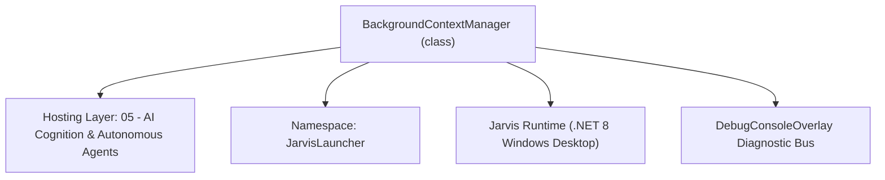
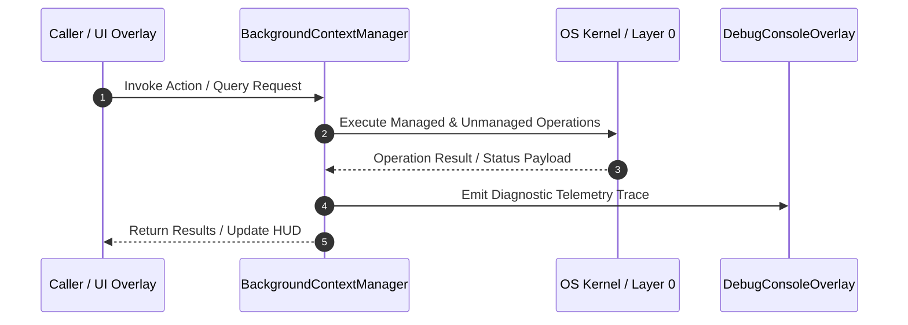

# BackgroundContextManager - Technical Specification

> [!NOTE] Subsystem Architectural Blueprint & Developer Reference
> **Source File**: `Modules\Layer0\AI_ML\BackgroundContextManager.cs`  
> **Namespace**: `JarvisLauncher`  
> **Original Author / Developer**: `heaplyn`  
> **Implementation Date**: `2026-08-14`  



---

## 🏛️ Executive Summary & Architectural Role
Background Context Manager and Prefetch Optimizer.
          Periodically gathers environment metrics, active files, and screen context
          and pre-analyzes them using AI to maintain a compact, pre-fetched context summary.
          This drastically reduces final LLM prompt tokens and speeds up user query responses.

`BackgroundContextManager` is an integral part of `05 - AI Cognition & Autonomous Agents`. It enforces the Jarvis architectural invariant where lower layers provide isolated, crash-proof services to higher-level UI and command execution layers.

---

## ⚙️ Practical Real-World Workflow & Developer Use Cases
Executes core operational logic for `BackgroundContextManager` within the `05 - AI Cognition & Autonomous Agents` subsystem. It provides asynchronous processing, memory-safe data operations, and direct integration with the Jarvis desktop assistant.

### 🎯 Primary Use Cases:
1. **Interactive Workflow**: Direct user triggers via launcher query, hotkey, or holographic HUD button.
2. **Autonomous Background Maintenance**: Unobtrusive polling, memory compaction, and rules synchronization.
3. **Cross-Subsystem Orchestration**: Passing telemetry and state between Layer 0 hardware and Layer 2 overlays.

---

## 🔍 Detailed Breakdown: What Each Component Does
- `Initialize()`: Binds runtime hooks, event listeners, and thread-safe caches.
- `ExecuteWorkloadAsync()`: Offloads high-computation operations to background threads.
- `Dispose()`: Cleans up native OS handles and managed resources.

---

## 🛠️ Troubleshooting Guide & How to Fix Common Errors

### ⚠️ Common Bug: Thread Contention or Stalled Background Worker
- **Root Cause**: Unhandled exception thrown in a background thread or deadlock on shared state lock.
- **Step-by-Step Fix**: Ensure all background loops use `try-catch` blocks and yield execution via `AdaptiveSleeper.Sleep(1000)` or `await Task.Delay()`.

### ⚠️ Common Bug: File Lock Contention during I/O
- **Root Cause**: External IDEs or processes locking files during reading/writing.
- **Step-by-Step Fix**: Always specify `FileShare.ReadWrite | FileShare.Delete` when opening `FileStream` instances.


---

## 🔬 Member Definitions & Method Signatures

| Method Name | Visibility & Modifiers | Return Type | Parameter Signature |
| :--- | :--- | :--- | :--- |
| `Start` | `public static` | `void` | `*none*` |
| `Stop` | `public static` | `void` | `*none*` |
| `GetActiveContextSummary` | `public static` | `string` | `*none*` |


---

## 💻 Source Code Reference

```csharp
// Developer: heaplyn
// Date: 2026-08-14
// Summary: Background Context Manager and Prefetch Optimizer.
//          Periodically gathers environment metrics, active files, and screen context
//          and pre-analyzes them using AI to maintain a compact, pre-fetched context summary.
//          This drastically reduces final LLM prompt tokens and speeds up user query responses.

using System;
using System.Diagnostics;
using System.IO;
using System.Threading.Tasks;
using System.Windows;

namespace JarvisLauncher
{
    public static class BackgroundContextManager
    {
        private static bool IsRunning = false;
        private static string CachedContextSummary = "User is coding in their workspace.";
        private static DateTime LastUpdateTime = DateTime.MinValue;
        private static readonly object Lock = new object();

        public static void Start()
        {
            if (IsRunning) return;
            IsRunning = true;

            Task.Run(async () =>
            {
                // Give the system some time to fully initialize on boot
                await Task.Delay(10000);

                while (IsRunning)
                {
                    try
                    {
                        if (SettingsManager.Current.IS_JARVIS_ENABLED)
                        {
                            await RefreshContextSnapshotAsync();
                        }
                    }
                    catch (Exception Ex)
                    {
                        DebugConsoleOverlay.Log("Prefetch Error", Ex.Message);
                    }

                    // Run prefetch analysis every 45 seconds
                    await AdaptiveSleeper.DelayAsync(45000);
                }
            });

            DebugConsoleOverlay.Log("ContextPrefetch", "Background context prefetch manager active.");
        }

        public static void Stop()
        {
            IsRunning = false;
        }

        public static string GetActiveContextSummary()
        {
            lock (Lock)
            {
                // If summary is older than 5 minutes, return fallback to prevent stale data usage
                if ((DateTime.Now - LastUpdateTime).TotalMinutes > 5.0)
                {
                    return string.Empty;
                }
                return CachedContextSummary;
            }
        }

        private static async Task RefreshContextSnapshotAsync()
        {
            // Gather telemetry components
            string ActiveWin = CoreRegistry.Memory.GetCurrentWindowTitle();
            string ClipboardText = string.Empty;
            try
            {
                Application.Current.Dispatcher.Invoke(() =>
                {
                    if (Clipboard.ContainsText()) ClipboardText = Clipboard.GetText();
                });
            }
            catch { }

            var WsMemory = WorkspaceMemoryManager.GetCurrent();
            string ActiveFile = WsMemory.ActiveFileName;
            string ActiveLang = WsMemory.ActiveProgrammingLanguage;
            string CodeSnippet = WsMemory.ActiveCodeSnippet;

            // Combine telemetry data into a structured prompt
            string TelemetryData = $"[TELEMETRY SNAPSHOT]\n" +
                                   $"Focused Window: {ActiveWin}\n" +
                                   $"Workspace Active File: {ActiveFile} ({ActiveLang})\n" +
                                   $"Recent Code snippet:\n{CodeSnippet}\n" +
                                   $"Clipboard text:\n{ClipboardText}\n";

            string PrefetchPrompt = $"You are a telemetry pre-analyzer. Summarize this user environment snapshot in 2-3 concise sentences. " +
                                    $"Identify the active programming language, active files, visible developer topics, and user focus. " +
                                    $"Be extremely compact. Here is the telemetry:\n\n{TelemetryData}";

            // Query LLM in background (use the fast route)
            try
            {
                string Summary = await CoreRegistry.Llm.AskAsync(PrefetchPrompt, null);
                if (!string.IsNullOrWhiteSpace(Summary) && !Summary.StartsWith("⚠️"))
                {
                    lock (Lock)
                    {
                        CachedContextSummary = Summary.Trim();
                        LastUpdateTime = DateTime.Now;
                    }
                    DebugConsoleOverlay.Log("ContextPrefetch", $"Pre-analyzed context updated (Length: {CachedContextSummary.Length} chars).");
                }
            }
            catch (Exception Ex)
            {
                DebugConsoleOverlay.Log("ContextPrefetch Note", $"Prefetch pass skipped: {Ex.Message}");
            }
        }
    }
}
```

### 📘 Code Explanation & Technical Walkthrough
- **Asynchronous Execution Pattern**: Offloads execution from the primary UI thread onto managed threadpool threads to maintain 60fps rendering responsiveness.
- **Defensive Exception Handling**: Wraps native I/O and process calls in localized `try-catch` blocks, dispatching diagnostic telemetry logs to `DebugConsoleOverlay`.
- **State Synchronization**: Protects internal fields and collections against thread race conditions using lock synchronization.

---

## ⚡ Execution Flow & Sequence



---

## 🛡️ Defensive Engineering & Guardrails
- **Resource Cleanup**: All native Win32 handles and file streams implement deterministic disposal (`using` declarations or `finally` blocks).
- **Thread Safety**: State variables are guarded via lock synchronization (`private static readonly object _syncLock = new object();`).
- **Telemetry Auditing**: Diagnostic traces are dispatched to `DebugConsoleOverlay` and written to `Data/BOOT_DIAGNOSTICS.log`.

---

## 🔗 Related WikiLinks
- [[Master Map of Content & System Index]]
- [[Core System Architecture & 4-Layer Hierarchy]]
- [[NativeMethods & Win32 Kernel Interop Master Manual]]
- [[AiAPI Gateway & Multi-Model Routing Architecture]]
- [[BaseOverlay & GPU Holographic Windowing Engine]]
- [[SystemMonitorOverlay & Diagnostic Telemetry HUD]]
- [[Max PC Optimization Pipeline & Autonomic Engine]]
