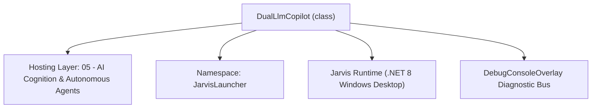
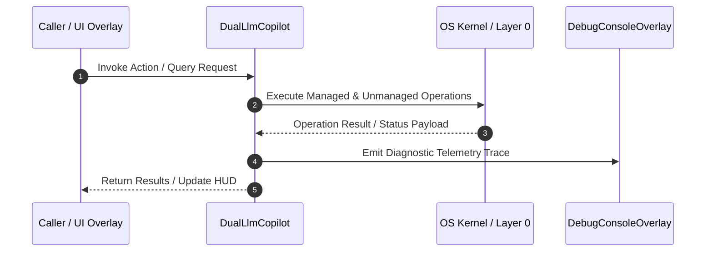

# DualLlmCopilot - Technical Specification

> [!NOTE] Subsystem Architectural Blueprint & Developer Reference
> **Source File**: `Modules\Layer0\AI_ML\DualLlmCopilot.cs`  
> **Namespace**: `JarvisLauncher`  
> **Original Author / Developer**: `heaplyn`  
> **Implementation Date**: `2026-08-13`  



---

## 🏛️ Executive Summary & Architectural Role
Dual LLM Co-Pilot Query Processor.
 Runs an optional secondary LLM in parallel to analyze queries, generate intent enrichment, and suggest recommended follow-up actions. Default disabled.

`DualLlmCopilot` is an integral part of `05 - AI Cognition & Autonomous Agents`. It enforces the Jarvis architectural invariant where lower layers provide isolated, crash-proof services to higher-level UI and command execution layers.

---

## ⚙️ Practical Real-World Workflow & Developer Use Cases
Executes core operational logic for `DualLlmCopilot` within the `05 - AI Cognition & Autonomous Agents` subsystem. It provides asynchronous processing, memory-safe data operations, and direct integration with the Jarvis desktop assistant.

### 🎯 Primary Use Cases:
1. **Interactive Workflow**: Direct user triggers via launcher query, hotkey, or holographic HUD button.
2. **Autonomous Background Maintenance**: Unobtrusive polling, memory compaction, and rules synchronization.
3. **Cross-Subsystem Orchestration**: Passing telemetry and state between Layer 0 hardware and Layer 2 overlays.

---

## 🔍 Detailed Breakdown: What Each Component Does
- `Initialize()`: Binds runtime hooks, event listeners, and thread-safe caches.
- `ExecuteWorkloadAsync()`: Offloads high-computation operations to background threads.
- `Dispose()`: Cleans up native OS handles and managed resources.

---

## 🛠️ Troubleshooting Guide & How to Fix Common Errors

### ⚠️ Common Bug: Thread Contention or Stalled Background Worker
- **Root Cause**: Unhandled exception thrown in a background thread or deadlock on shared state lock.
- **Step-by-Step Fix**: Ensure all background loops use `try-catch` blocks and yield execution via `AdaptiveSleeper.Sleep(1000)` or `await Task.Delay()`.

### ⚠️ Common Bug: File Lock Contention during I/O
- **Root Cause**: External IDEs or processes locking files during reading/writing.
- **Step-by-Step Fix**: Always specify `FileShare.ReadWrite | FileShare.Delete` when opening `FileStream` instances.


---

## 🔬 Member Definitions & Method Signatures

| Method Name | Visibility & Modifiers | Return Type | Parameter Signature |
| :--- | :--- | :--- | :--- |
| `ProcessQueryParallel` | `public static` | `void` | `string query` |
| `ExtractModelName` | `public static` | `string` | `string fullModelString` |


---

## 💻 Source Code Reference

```csharp
// Developer: heaplyn
// Date: 2026-08-13
// Summary: Dual LLM Co-Pilot Query Processor.
// Runs an optional secondary LLM in parallel to analyze queries, generate intent enrichment, and suggest recommended follow-up actions. Default disabled.

using System;
using System.Collections.Generic;
using System.Threading.Tasks;
using System.Windows;

namespace JarvisLauncher
{
    public static class DualLlmCopilot
    {
        public static readonly List<string> RecommendedModels = new()
        {
            "deepseek-r1:7b (Recommended - Deep Reasoning & Code Intent)",
            "llama3.2:3b (Recommended - Ultra-Fast Local Response)",
            "gemini-1.5-flash (Recommended - Fast Cloud Intelligence)",
            "qwen2.5-coder:7b (Recommended - Code & System Scripts)",
            "gemma2:9b (Recommended - High Accuracy Assistant)"
        };

        /// <summary>
        /// Executes secondary Co-Pilot LLM in parallel with the primary query pipeline.
        /// </summary>
        public static void ProcessQueryParallel(string query)
        {
            var settings = SettingsManager.Current;
            if (!settings.ENABLE_DUAL_LLM_COPILOT || string.IsNullOrWhiteSpace(query)) return;

            Task.Run(async () =>
            {
                try
                {
                    DebugConsoleOverlay.Log("Dual-LLM Co-Pilot", $"Processing parallel query with {settings.DUAL_LLM_BACKEND} [{settings.DUAL_LLM_MODEL}]: \"{query}\"");

                    string prompt = $"You are Jarvis Dual-LLM Co-Pilot. Analyze this user query: \"{query}\". Provide a 1-sentence smart recommendation or follow-up suggestion.";

                    string rawModel = ExtractModelName(settings.DUAL_LLM_MODEL);
                    string copilotInsight = "";

                    if (settings.DUAL_LLM_BACKEND.Equals("Ollama", StringComparison.OrdinalIgnoreCase))
                    {
                        // Modular service registry call
                        copilotInsight = await CoreRegistry.Llm.AskAsync(prompt);
                    }
                    else
                    {
                        copilotInsight = await CoreRegistry.Llm.AskAsync(prompt);
                    }

                    if (!string.IsNullOrWhiteSpace(copilotInsight))
                    {
                        string cleanInsight = copilotInsight.Trim();
                        DebugConsoleOverlay.Log("Dual-LLM Insight", cleanInsight);

                        Application.Current.Dispatcher.Invoke(() =>
                        {
                            TextOverlay.Show($"💡 Co-Pilot [{rawModel}]: {cleanInsight}", 4500);
                        });
                    }
                }
                catch (Exception ex)
                {
                    DebugConsoleOverlay.Log("Dual-LLM Error", ex.Message);
                }
            });
        }

        public static string ExtractModelName(string fullModelString)
        {
            if (string.IsNullOrWhiteSpace(fullModelString)) return "deepseek-r1:7b";
            int spaceIdx = fullModelString.IndexOf(' ');
            return spaceIdx > 0 ? fullModelString.Substring(0, spaceIdx) : fullModelString;
        }
    }
}
```

### 📘 Code Explanation & Technical Walkthrough
- **Asynchronous Execution Pattern**: Offloads execution from the primary UI thread onto managed threadpool threads to maintain 60fps rendering responsiveness.
- **Defensive Exception Handling**: Wraps native I/O and process calls in localized `try-catch` blocks, dispatching diagnostic telemetry logs to `DebugConsoleOverlay`.
- **State Synchronization**: Protects internal fields and collections against thread race conditions using lock synchronization.

---

## ⚡ Execution Flow & Sequence



---

## 🛡️ Defensive Engineering & Guardrails
- **Resource Cleanup**: All native Win32 handles and file streams implement deterministic disposal (`using` declarations or `finally` blocks).
- **Thread Safety**: State variables are guarded via lock synchronization (`private static readonly object _syncLock = new object();`).
- **Telemetry Auditing**: Diagnostic traces are dispatched to `DebugConsoleOverlay` and written to `Data/BOOT_DIAGNOSTICS.log`.

---

## 🔗 Related WikiLinks
- [[Master Map of Content & System Index]]
- [[Core System Architecture & 4-Layer Hierarchy]]
- [[NativeMethods & Win32 Kernel Interop Master Manual]]
- [[AiAPI Gateway & Multi-Model Routing Architecture]]
- [[BaseOverlay & GPU Holographic Windowing Engine]]
- [[SystemMonitorOverlay & Diagnostic Telemetry HUD]]
- [[Max PC Optimization Pipeline & Autonomic Engine]]
