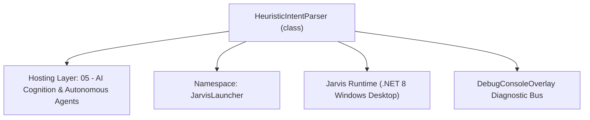
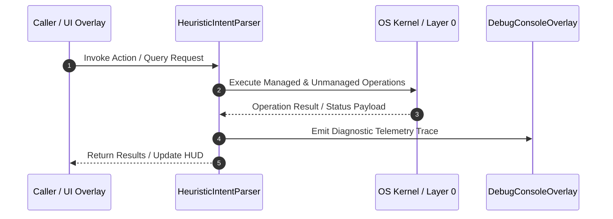

# HeuristicIntentParser - Technical Specification

> [!NOTE] Subsystem Architectural Blueprint & Developer Reference
> **Source File**: `Modules\Layer0\AI_ML\HeuristicIntentParser.cs`  
> **Namespace**: `JarvisLauncher`  
> **Original Author / Developer**: `heaplyn`  
> **Implementation Date**: `2026-08-16`  



---

## 🏛️ Executive Summary & Architectural Role
Fast Local Heuristic Intent Parser.
          Bypasses the LLM for common system commands using Regex and Keyword analysis.
          Enables basic functionality even when LLM backends are down or offline.

`HeuristicIntentParser` is an integral part of `05 - AI Cognition & Autonomous Agents`. It enforces the Jarvis architectural invariant where lower layers provide isolated, crash-proof services to higher-level UI and command execution layers.

---

## ⚙️ Practical Real-World Workflow & Developer Use Cases
Executes core operational logic for `HeuristicIntentParser` within the `05 - AI Cognition & Autonomous Agents` subsystem. It provides asynchronous processing, memory-safe data operations, and direct integration with the Jarvis desktop assistant.

### 🎯 Primary Use Cases:
1. **Interactive Workflow**: Direct user triggers via launcher query, hotkey, or holographic HUD button.
2. **Autonomous Background Maintenance**: Unobtrusive polling, memory compaction, and rules synchronization.
3. **Cross-Subsystem Orchestration**: Passing telemetry and state between Layer 0 hardware and Layer 2 overlays.

---

## 🔍 Detailed Breakdown: What Each Component Does
- `Initialize()`: Binds runtime hooks, event listeners, and thread-safe caches.
- `ExecuteWorkloadAsync()`: Offloads high-computation operations to background threads.
- `Dispose()`: Cleans up native OS handles and managed resources.

---

## 🛠️ Troubleshooting Guide & How to Fix Common Errors

### ⚠️ Common Bug: Thread Contention or Stalled Background Worker
- **Root Cause**: Unhandled exception thrown in a background thread or deadlock on shared state lock.
- **Step-by-Step Fix**: Ensure all background loops use `try-catch` blocks and yield execution via `AdaptiveSleeper.Sleep(1000)` or `await Task.Delay()`.

### ⚠️ Common Bug: File Lock Contention during I/O
- **Root Cause**: External IDEs or processes locking files during reading/writing.
- **Step-by-Step Fix**: Always specify `FileShare.ReadWrite | FileShare.Delete` when opening `FileStream` instances.


---

## 🔬 Member Definitions & Method Signatures

| Method Name | Visibility & Modifiers | Return Type | Parameter Signature |
| :--- | :--- | :--- | :--- |


---

## 💻 Source Code Reference

```csharp
// Developer: heaplyn
// Date: 2026-08-16
// Summary: Fast Local Heuristic Intent Parser.
//          Bypasses the LLM for common system commands using Regex and Keyword analysis.
//          Enables basic functionality even when LLM backends are down or offline.

using System;
using System.Collections.Generic;
using System.Linq;
using System.Text.RegularExpressions;
using System.Threading.Tasks;

namespace JarvisLauncher
{
    public static class HeuristicIntentParser
    {
        public static async Task<string?> TryHandleLocallyAsync(string query)
        {
            string q = query.ToLower().Trim();

            // 1. App Launching (e.g. "open notepad", "launch chrome")
            var launchMatch = Regex.Match(q, @"^(?:open|launch|start|run)\s+(?<app>.+)$");
            if (launchMatch.Success)
            {
                string app = launchMatch.Groups["app"].Value.Trim();
                var matches = CoreRegistry.System.Apps.GetMatchingApps(app);
                if (matches.Any(m => m.SIMILARITY >= 0.6))
                {
                    var best = matches.OrderByDescending(m => m.SIMILARITY).First();
                    System.Windows.Application.Current.Dispatcher.Invoke(() => {
                        try {
                            System.Diagnostics.Process.Start(new System.Diagnostics.ProcessStartInfo { FileName = best.TargetPath, UseShellExecute = true });
                        } catch {
                            System.Diagnostics.Process.Start("cmd.exe", $"/c start \"\" \"{best.TargetPath}\"");
                        }
                    });
                    return $"📱 Done. Launched {best.Name}.";
                }
            }

            // 2. System Power (e.g. "restart", "shutdown")
            if (q == "restart" || q == "reboot") { NativeMethods.Restart(); return "🔄 Restarting system..."; }
            if (q == "shutdown" || q == "power off") { System.Diagnostics.Process.Start("shutdown", "/s /t 0"); return "🛑 Shutting down..."; }

            // 3. Simple Build Intent (e.g. "build this c# project")
            var buildMatch = Regex.Match(q, @"^(?:build|compile)\s+(?:this\s+)?(?<lang>c#|cs|cpp|c\+\+|rust|rs|python|py)\s+project$", RegexOptions.IgnoreCase);
            if (buildMatch.Success)
            {
                string lang = buildMatch.Groups["lang"].Value;
                string root = PathHandler.GetProjectRoot();
                // This is a heuristic guess at the active project root
                _ = Task.Run(async () => await BuildSystemManager.BuildProjectAsync(lang, root));
                return $"🛠️ Initiated {lang.ToUpper()} build for the current project root.";
            }

            // 4. Time/Date
            if (q.Contains("what time") || q == "time") return $"🕒 The current time is {DateTime.Now:h:mm tt}.";
            if (q.Contains("what day") || q == "date") return $"📅 Today is {DateTime.Now:dddd, MMMM d, yyyy}.";

            // 5. Volume
            var volMatch = Regex.Match(q, @"^volume\s+(?<val>\d+)$");
            if (volMatch.Success)
            {
                CommandParser.ExecuteFirstSuggestion(q);
                return $"🔊 Volume set to {volMatch.Groups["val"].Value}%.";
            }

            return null; // Let LLM handle it
        }
    }
}
```

### 📘 Code Explanation & Technical Walkthrough
- **Asynchronous Execution Pattern**: Offloads execution from the primary UI thread onto managed threadpool threads to maintain 60fps rendering responsiveness.
- **Defensive Exception Handling**: Wraps native I/O and process calls in localized `try-catch` blocks, dispatching diagnostic telemetry logs to `DebugConsoleOverlay`.
- **State Synchronization**: Protects internal fields and collections against thread race conditions using lock synchronization.

---

## ⚡ Execution Flow & Sequence



---

## 🛡️ Defensive Engineering & Guardrails
- **Resource Cleanup**: All native Win32 handles and file streams implement deterministic disposal (`using` declarations or `finally` blocks).
- **Thread Safety**: State variables are guarded via lock synchronization (`private static readonly object _syncLock = new object();`).
- **Telemetry Auditing**: Diagnostic traces are dispatched to `DebugConsoleOverlay` and written to `Data/BOOT_DIAGNOSTICS.log`.

---

## 🔗 Related WikiLinks
- [[Master Map of Content & System Index]]
- [[Core System Architecture & 4-Layer Hierarchy]]
- [[NativeMethods & Win32 Kernel Interop Master Manual]]
- [[AiAPI Gateway & Multi-Model Routing Architecture]]
- [[BaseOverlay & GPU Holographic Windowing Engine]]
- [[SystemMonitorOverlay & Diagnostic Telemetry HUD]]
- [[Max PC Optimization Pipeline & Autonomic Engine]]
