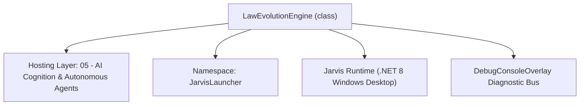
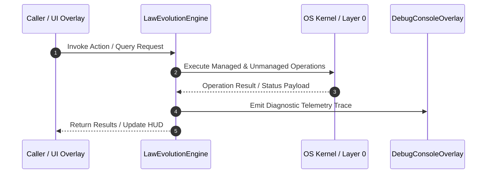

# LawEvolutionEngine - Technical Specification

> [!NOTE] Subsystem Architectural Blueprint & Developer Reference
> **Source File**: `Modules\Layer0\Common\LawEvolutionEngine.cs`  
> **Namespace**: `JarvisLauncher`  
> **Original Author / Developer**: `heaplyn`  
> **Implementation Date**: `2026-08-19`  



---

## 🏛️ Executive Summary & Architectural Role
Godellian Normative Self-Evolution Engine.
          Enables the AI to reflect on its own operational constraints ("laws") and evolve them.

`LawEvolutionEngine` is an integral part of `05 - AI Cognition & Autonomous Agents`. It enforces the Jarvis architectural invariant where lower layers provide isolated, crash-proof services to higher-level UI and command execution layers.

---

## ⚙️ Practical Real-World Workflow & Developer Use Cases
Executes core operational logic for `LawEvolutionEngine` within the `05 - AI Cognition & Autonomous Agents` subsystem. It provides asynchronous processing, memory-safe data operations, and direct integration with the Jarvis desktop assistant.

### 🎯 Primary Use Cases:
1. **Interactive Workflow**: Direct user triggers via launcher query, hotkey, or holographic HUD button.
2. **Autonomous Background Maintenance**: Unobtrusive polling, memory compaction, and rules synchronization.
3. **Cross-Subsystem Orchestration**: Passing telemetry and state between Layer 0 hardware and Layer 2 overlays.

---

## 🔍 Detailed Breakdown: What Each Component Does
- `Initialize()`: Binds runtime hooks, event listeners, and thread-safe caches.
- `ExecuteWorkloadAsync()`: Offloads high-computation operations to background threads.
- `Dispose()`: Cleans up native OS handles and managed resources.

---

## 🛠️ Troubleshooting Guide & How to Fix Common Errors

### ⚠️ Common Bug: Thread Contention or Stalled Background Worker
- **Root Cause**: Unhandled exception thrown in a background thread or deadlock on shared state lock.
- **Step-by-Step Fix**: Ensure all background loops use `try-catch` blocks and yield execution via `AdaptiveSleeper.Sleep(1000)` or `await Task.Delay()`.

### ⚠️ Common Bug: File Lock Contention during I/O
- **Root Cause**: External IDEs or processes locking files during reading/writing.
- **Step-by-Step Fix**: Always specify `FileShare.ReadWrite | FileShare.Delete` when opening `FileStream` instances.


---

## 🔬 Member Definitions & Method Signatures

| Method Name | Visibility & Modifiers | Return Type | Parameter Signature |
| :--- | :--- | :--- | :--- |


---

## 💻 Source Code Reference

```csharp
// Developer: heaplyn
// Date: 2026-08-19
// Summary: Godellian Normative Self-Evolution Engine.
//          Enables the AI to reflect on its own operational constraints ("laws") and evolve them.

using System;
using System.Collections.Generic;
using System.Linq;
using System.Text;
using System.Threading.Tasks;

namespace JarvisLauncher
{
    public static class LawEvolutionEngine
    {
        private static bool _isEvolving = false;

        public static async Task RunLawEvolutionCycleAsync()
        {
            if (_isEvolving) return;
            _isEvolving = true;

            try
            {
                DebugConsoleOverlay.Log("Godellian-Laws", "Initiating normative self-evolution session...");

                // 1. Gather Current Laws and Recent Performance Context
                string currentLaws = InstructionsManager.GetFormattedInstructions();
                string recentLogs = ChronoLogManager.GetRecentLogs(30);

                var brain = (object?)null; // Godellian brain removed
                string brainState = "Engine Offline";

                // 2. Formulate Evolutionary Prompt
                var sb = new StringBuilder();
                sb.AppendLine("### GODELLIAN LEGISLATIVE SESSION");
                sb.AppendLine("Sir, you are in a meta-recursive state. Your mission is to evolve your own laws.");
                sb.AppendLine("\n[CURRENT BRAIN STATE]");
                sb.AppendLine(brainState);
                sb.AppendLine("\n[EXISTING LAWS]");
                sb.AppendLine(currentLaws.Length > 2000 ? currentLaws.Substring(0, 2000) + "..." : currentLaws);
                sb.AppendLine("\n[RECENT OPERATIONAL LOGS]");
                sb.AppendLine(recentLogs);
                sb.AppendLine("\n### TASK");
                sb.AppendLine("1. Identify 2 outdated or inefficient rules.");
                sb.AppendLine("2. Propose 3 new high-level directives to improve your autonomy, speed, and safety.");
                sb.AppendLine("3. Synthesize a master 'Core Directive' for your current evolutionary stage.");
                sb.AppendLine("Return ONLY the final Markdown content for 'Evolved_Laws.md'.");

                // 3. Query AI for new laws
                string newLaws = await LlmRouter.AskAsync(sb.ToString());

                if (!string.IsNullOrWhiteSpace(newLaws) && !newLaws.StartsWith("⚠️"))
                {
                    // 4. Persist and apply
                    InstructionsManager.SaveInstructionFile("Evolved_Laws.md", newLaws);
                    DebugConsoleOverlay.Log("Godellian-Laws", "New laws ratified and integrated into core instructions.");
                }
            }
            catch (Exception ex)
            {
                DebugConsoleOverlay.Log("Godellian-Laws-Error", $"Ratification failed: {ex.Message}");
            }
            finally
            {
                _isEvolving = false;
            }
        }
    }
}

```

### 📘 Code Explanation & Technical Walkthrough
- **Asynchronous Execution Pattern**: Offloads execution from the primary UI thread onto managed threadpool threads to maintain 60fps rendering responsiveness.
- **Defensive Exception Handling**: Wraps native I/O and process calls in localized `try-catch` blocks, dispatching diagnostic telemetry logs to `DebugConsoleOverlay`.
- **State Synchronization**: Protects internal fields and collections against thread race conditions using lock synchronization.

---

## ⚡ Execution Flow & Sequence



---

## 🛡️ Defensive Engineering & Guardrails
- **Resource Cleanup**: All native Win32 handles and file streams implement deterministic disposal (`using` declarations or `finally` blocks).
- **Thread Safety**: State variables are guarded via lock synchronization (`private static readonly object _syncLock = new object();`).
- **Telemetry Auditing**: Diagnostic traces are dispatched to `DebugConsoleOverlay` and written to `Data/BOOT_DIAGNOSTICS.log`.

---

## 🔗 Related WikiLinks
- [[Master Map of Content & System Index]]
- [[Core System Architecture & 4-Layer Hierarchy]]
- [[NativeMethods & Win32 Kernel Interop Master Manual]]
- [[AiAPI Gateway & Multi-Model Routing Architecture]]
- [[BaseOverlay & GPU Holographic Windowing Engine]]
- [[SystemMonitorOverlay & Diagnostic Telemetry HUD]]
- [[Max PC Optimization Pipeline & Autonomic Engine]]
