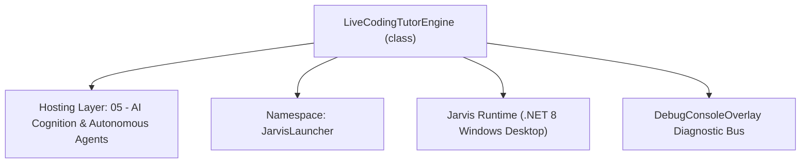
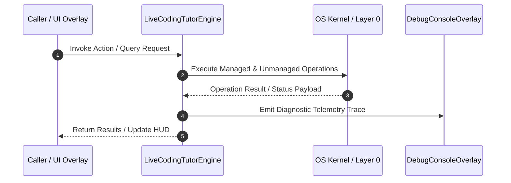

# LiveCodingTutorEngine - Technical Specification

> [!NOTE] Subsystem Architectural Blueprint & Developer Reference
> **Source File**: `Modules\Layer0\AI_ML\LiveCodingTutorEngine.cs`  
> **Namespace**: `JarvisLauncher`  
> **Original Author / Developer**: `heaplyn`  
> **Implementation Date**: `2026-08-15`  



---

## 🏛️ Executive Summary & Architectural Role
Live, ambient AI coding tutor. When Teacher Mode is on and the user is actively coding,
          it watches the screen, detects when they're about to make a mistake or are getting stuck/
          confused, SPEAKS concise guidance aloud, and pops the AI chat (far right) with the full tip.

 Gating & etiquette:
   * Only runs while SettingsManager.Current.IS_TEACHER_MODE_ENABLED is true.
   * Only scans when the foreground window is a known code editor / IDE (never the rest of the time).
   * Cooldown + de-duplication so it advises "along the way" without nagging about the same thing.

`LiveCodingTutorEngine` is an integral part of `05 - AI Cognition & Autonomous Agents`. It enforces the Jarvis architectural invariant where lower layers provide isolated, crash-proof services to higher-level UI and command execution layers.

---

## ⚙️ Practical Real-World Workflow & Developer Use Cases
Executes core operational logic for `LiveCodingTutorEngine` within the `05 - AI Cognition & Autonomous Agents` subsystem. It provides asynchronous processing, memory-safe data operations, and direct integration with the Jarvis desktop assistant.

### 🎯 Primary Use Cases:
1. **Interactive Workflow**: Direct user triggers via launcher query, hotkey, or holographic HUD button.
2. **Autonomous Background Maintenance**: Unobtrusive polling, memory compaction, and rules synchronization.
3. **Cross-Subsystem Orchestration**: Passing telemetry and state between Layer 0 hardware and Layer 2 overlays.

---

## 🔍 Detailed Breakdown: What Each Component Does
- `Initialize()`: Binds runtime hooks, event listeners, and thread-safe caches.
- `ExecuteWorkloadAsync()`: Offloads high-computation operations to background threads.
- `Dispose()`: Cleans up native OS handles and managed resources.

---

## 🛠️ Troubleshooting Guide & How to Fix Common Errors

### ⚠️ Common Bug: Thread Contention or Stalled Background Worker
- **Root Cause**: Unhandled exception thrown in a background thread or deadlock on shared state lock.
- **Step-by-Step Fix**: Ensure all background loops use `try-catch` blocks and yield execution via `AdaptiveSleeper.Sleep(1000)` or `await Task.Delay()`.

### ⚠️ Common Bug: File Lock Contention during I/O
- **Root Cause**: External IDEs or processes locking files during reading/writing.
- **Step-by-Step Fix**: Always specify `FileShare.ReadWrite | FileShare.Delete` when opening `FileStream` instances.


---

## 🔬 Member Definitions & Method Signatures

| Method Name | Visibility & Modifiers | Return Type | Parameter Signature |
| :--- | :--- | :--- | :--- |
| `Start` | `public static` | `void` | `*none*` |
| `IsCodingContext` | `private static` | `bool` | `*none*` |
| `Signature` | `private static` | `string` | `string s` |


---

## 💻 Source Code Reference

```csharp
// Developer: heaplyn
// Summary: Live, ambient AI coding tutor. When Teacher Mode is on and the user is actively coding,
//          it watches the screen, detects when they're about to make a mistake or are getting stuck/
//          confused, SPEAKS concise guidance aloud, and pops the AI chat (far right) with the full tip.
//
// Gating & etiquette:
//   * Only runs while SettingsManager.Current.IS_TEACHER_MODE_ENABLED is true.
//   * Only scans when the foreground window is a known code editor / IDE (never the rest of the time).
//   * Cooldown + de-duplication so it advises "along the way" without nagging about the same thing.

using System;
using System.Linq;
using System.Threading;
using System.Threading.Tasks;
using System.Windows;

namespace JarvisLauncher
{
    public static class LiveCodingTutorEngine
    {
        private static int _started;
        private static volatile bool _busy;

        // Poll cadence (cheap — just a foreground-window check) and how often we actually spend a
        // vision call while coding. Interruptions are throttled separately so we never nag.
        private const int PollMsWhileCoding = 6000;
        private const int PollMsWhileIdle = 10000;
        private static readonly TimeSpan DuplicateWindow = TimeSpan.FromMinutes(4);

        // Cadence knobs are user-configurable in Settings → Offline (clamped to sane bounds).
        private static TimeSpan ScanInterval =>
            TimeSpan.FromSeconds(Math.Clamp(SettingsManager.Current.TEACHER_SCAN_INTERVAL_SEC, 8, 300));
        private static TimeSpan MinBetweenInterruptions =>
            TimeSpan.FromSeconds(Math.Clamp(SettingsManager.Current.TEACHER_TIP_COOLDOWN_SEC, 10, 600));

        private static DateTime _lastScan = DateTime.MinValue;
        private static DateTime _lastInterruption = DateTime.MinValue;
        private static string _lastSignature = string.Empty;
        private static DateTime _lastSignatureTime = DateTime.MinValue;

        // Foreground apps we treat as "coding". Process names (no extension), matched case-insensitively.
        private static readonly string[] EditorProcesses =
        {
            "devenv", "code", "code - insiders", "cursor", "windsurf", "zed", "rider", "rider64",
            "pycharm", "pycharm64", "idea", "idea64", "webstorm", "webstorm64", "clion", "clion64",
            "goland", "goland64", "phpstorm", "rubymine", "datagrip", "sublime_text", "notepad++",
            "atom", "gvim", "vim", "emacs", "robloxstudio", "studiobeta", "godot", "unity", "neovim"
        };

        // Fallback: title cues when the process name is generic (terminals, WSL, remote editors).
        private static readonly string[] TitleCues =
        {
            "visual studio", " - code", "roblox studio", ".cs ", ".py ", ".js ", ".ts ", ".tsx",
            ".lua", ".cpp", ".rs ", ".go ", ".java", ".rb ", ".php", ".html", ".css"
        };

        /// <summary>Idempotent. Starts the ambient tutor loop; safe to call from bootstrap.</summary>
        public static void Start()
        {
            if (Interlocked.CompareExchange(ref _started, 1, 0) != 0) return;
            Task.Run(LoopAsync);
        }

        /// <summary>
        /// Runs one scan right now regardless of the poll timer (used by the Teacher Studio "Test now"
        /// button). Honors the busy flag but bypasses the scan-interval throttle.
        /// </summary>
        public static async Task ForceScanAsync()
        {
            if (_busy) return;
            _lastScan = DateTime.Now;
            await ScanAndAdviseAsync();
        }

        private static async Task LoopAsync()
        {
            while (true)
            {
                bool coding = false;
                try
                {
                    if (SettingsManager.Current.IS_TEACHER_MODE_ENABLED)
                    {
                        coding = IsCodingContext();
                        if (coding && !_busy && DateTime.Now - _lastScan >= ScanInterval)
                        {
                            _lastScan = DateTime.Now;
                            await ScanAndAdviseAsync();
                        }
                    }
                }
                catch { /* never let the ambient loop die */ }

                await Task.Delay(coding ? PollMsWhileCoding : PollMsWhileIdle);
            }
        }

        private static bool IsCodingContext()
        {
            try
            {
                ScreenMonitorEngine.UpdateActiveWindowInfo();
                string proc = (ScreenMonitorEngine.ActiveProcessName ?? "").ToLowerInvariant();
                string title = (ScreenMonitorEngine.ActiveWindowTitle ?? "").ToLowerInvariant();

                // Never treat Jarvis's own windows as a coding target.
                if (proc.Contains("jarvis")) return false;

                if (EditorProcesses.Any(p => proc == p || proc.StartsWith(p))) return true;
                if (TitleCues.Any(c => title.Contains(c))) return true;
            }
            catch { }
            return false;
        }

        private static async Task ScanAndAdviseAsync()
        {
            _busy = true;
            try
            {
                string? b64 = ScreenCaptureUtil.CapturePrimaryScreenToBase64();
                if (string.IsNullOrEmpty(b64)) return;

                string ctxWindow = ScreenMonitorEngine.ActiveWindowTitle ?? "";
                string goalAugment = "";
                try { goalAugment = TeacherGoalContext.BuildPromptAugment(); } catch { }
                string prompt =
                    "You are JARVIS, a calm senior pair-programmer watching over the user's shoulder while they code. " +
                    $"The active editor window is: \"{ctxWindow}\".\n" +
                    (string.IsNullOrWhiteSpace(goalAugment) ? "" : "\n" + goalAugment + "\n") +
                    "Look at this screenshot of their screen and decide whether to gently INTERRUPT. Only interrupt if you " +
                    "see something that will genuinely help RIGHT NOW — e.g. they are about to make a mistake, or they look " +
                    "stuck / confused. Concrete signals: red error squiggles or underlines, an exception or failed build in " +
                    "an output/terminal panel, an obvious bug or typo being typed, a mismatched bracket/quote, an off-by-one, " +
                    "a wrong API usage, repeated undo/retyping of the same line, or a cursor parked on the same broken line.\n" +
                    "Do NOT interrupt for style nitpicks, or when the code simply looks fine or is mid-typing with no problem.\n\n" +
                    "Respond in EXACTLY this format and nothing else:\n" +
                    "VERDICT: TIP | CLEAR\n" +
                    "SPOKEN: <one short spoken sentence, <=18 words, friendly; empty if CLEAR>\n" +
                    "TIP: <2-4 sentences: what you noticed, why it's a problem, and exactly what to do next; empty if CLEAR>";

                string res = await AiAPI.AnalyzeImageBase64Async(prompt, b64, "image/png");
                if (string.IsNullOrWhiteSpace(res)) return;

                var (verdict, spoken, tip) = Parse(res);
                if (verdict != "TIP") return;
                if (string.IsNullOrWhiteSpace(tip) && string.IsNullOrWhiteSpace(spoken)) return;

                // Throttle: don't interrupt too often.
                if (DateTime.Now - _lastInterruption < MinBetweenInterruptions) return;

                // De-duplicate: skip if we just said essentially the same thing.
                string signature = Signature(spoken + " " + tip);
                if (signature == _lastSignature && DateTime.Now - _lastSignatureTime < DuplicateWindow) return;

                _lastInterruption = DateTime.Now;
                _lastSignature = signature;
                _lastSignatureTime = DateTime.Now;

                string say = string.IsNullOrWhiteSpace(spoken) ? "Heads up on your code." : spoken.Trim();
                try { TtsManager.Speak(say); } catch { }

                string body = "🎓 **Teacher — I noticed something**\n\n" +
                              (string.IsNullOrWhiteSpace(tip) ? say : tip.Trim());
                try { ChatOverlay.ShowTeacherTip(body); } catch { }

                try { ChronoLogManager.LogEvent("Teacher", $"Live tip on '{ctxWindow}': {say}"); } catch { }
            }
            finally
            {
                _busy = false;
            }
        }

        private static (string verdict, string spoken, string tip) Parse(string res)
        {
            string verdict = "CLEAR", spoken = "", tip = "";
            var lines = res.Replace("\r", "").Split('\n');
            for (int i = 0; i < lines.Length; i++)
            {
                string line = lines[i];
                string t = line.TrimStart();
                if (t.StartsWith("VERDICT:", StringComparison.OrdinalIgnoreCase))
                {
                    string v = t.Substring("VERDICT:".Length).Trim().ToUpperInvariant();
                    verdict = v.Contains("TIP") ? "TIP" : "CLEAR";
                }
                else if (t.StartsWith("SPOKEN:", StringComparison.OrdinalIgnoreCase))
                {
                    spoken = t.Substring("SPOKEN:".Length).Trim();
                }
                else if (t.StartsWith("TIP:", StringComparison.OrdinalIgnoreCase))
                {
                    // TIP may span the remaining lines.
                    tip = t.Substring("TIP:".Length).Trim();
                    if (i + 1 < lines.Length)
                        tip = (tip + "\n" + string.Join("\n", lines.Skip(i + 1))).Trim();
                    break;
                }
            }
            return (verdict, spoken, tip);
        }

        // Cheap normalized signature so near-identical advice de-dupes.
        private static string Signature(string s)
        {
            var words = new string(s.ToLowerInvariant().Where(c => char.IsLetterOrDigit(c) || c == ' ').ToArray())
                .Split(' ', StringSplitOptions.RemoveEmptyEntries);
            return string.Join(" ", words.Take(12));
        }
    }
}
```

### 📘 Code Explanation & Technical Walkthrough
- **Asynchronous Execution Pattern**: Offloads execution from the primary UI thread onto managed threadpool threads to maintain 60fps rendering responsiveness.
- **Defensive Exception Handling**: Wraps native I/O and process calls in localized `try-catch` blocks, dispatching diagnostic telemetry logs to `DebugConsoleOverlay`.
- **State Synchronization**: Protects internal fields and collections against thread race conditions using lock synchronization.

---

## ⚡ Execution Flow & Sequence



---

## 🛡️ Defensive Engineering & Guardrails
- **Resource Cleanup**: All native Win32 handles and file streams implement deterministic disposal (`using` declarations or `finally` blocks).
- **Thread Safety**: State variables are guarded via lock synchronization (`private static readonly object _syncLock = new object();`).
- **Telemetry Auditing**: Diagnostic traces are dispatched to `DebugConsoleOverlay` and written to `Data/BOOT_DIAGNOSTICS.log`.

---

## 🔗 Related WikiLinks
- [[Master Map of Content & System Index]]
- [[Core System Architecture & 4-Layer Hierarchy]]
- [[NativeMethods & Win32 Kernel Interop Master Manual]]
- [[AiAPI Gateway & Multi-Model Routing Architecture]]
- [[BaseOverlay & GPU Holographic Windowing Engine]]
- [[SystemMonitorOverlay & Diagnostic Telemetry HUD]]
- [[Max PC Optimization Pipeline & Autonomic Engine]]
