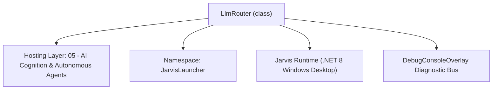
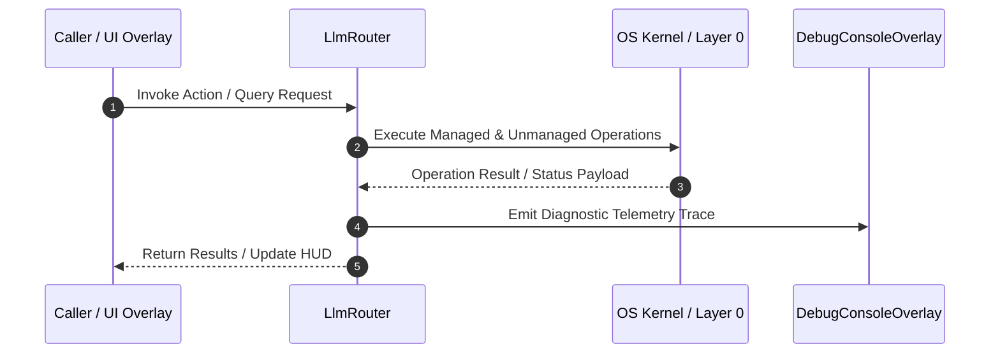

# LlmRouter - Technical Specification

> [!NOTE] Subsystem Architectural Blueprint & Developer Reference
> **Source File**: `Modules\Layer0\AI_ML\LlmRouter.cs`  
> **Namespace**: `JarvisLauncher`  
> **Original Author / Developer**: `Heaplyn`  
> **Implementation Date**: `2026-09-05`  



---

## 🏛️ Executive Summary & Architectural Role
Central LLM dispatcher with Bulletproof Failover, Token Optimization, & Offline Resilience.
          Supports: Gemini, OpenAI, Groq, OpenRouter, Anthropic, DeepSeek, Mistral, Perplexity, X-AI (Grok), Ollama, LM Studio, ClaudeCode, Custom.
          Hardened with API key sanitization, Bearer/API key dual-auth, dynamic model fallback, resilient streaming, and offline heuristic safety net.

`LlmRouter` is an integral part of `05 - AI Cognition & Autonomous Agents`. It enforces the Jarvis architectural invariant where lower layers provide isolated, crash-proof services to higher-level UI and command execution layers.

---

## ⚙️ Practical Real-World Workflow & Developer Use Cases
Executes core operational logic for `LlmRouter` within the `05 - AI Cognition & Autonomous Agents` subsystem. It provides asynchronous processing, memory-safe data operations, and direct integration with the Jarvis desktop assistant.

### 🎯 Primary Use Cases:
1. **Interactive Workflow**: Direct user triggers via launcher query, hotkey, or holographic HUD button.
2. **Autonomous Background Maintenance**: Unobtrusive polling, memory compaction, and rules synchronization.
3. **Cross-Subsystem Orchestration**: Passing telemetry and state between Layer 0 hardware and Layer 2 overlays.

---

## 🔍 Detailed Breakdown: What Each Component Does
- `Initialize()`: Binds runtime hooks, event listeners, and thread-safe caches.
- `ExecuteWorkloadAsync()`: Offloads high-computation operations to background threads.
- `Dispose()`: Cleans up native OS handles and managed resources.

---

## 🛠️ Troubleshooting Guide & How to Fix Common Errors

### ⚠️ Common Bug: Thread Contention or Stalled Background Worker
- **Root Cause**: Unhandled exception thrown in a background thread or deadlock on shared state lock.
- **Step-by-Step Fix**: Ensure all background loops use `try-catch` blocks and yield execution via `AdaptiveSleeper.Sleep(1000)` or `await Task.Delay()`.

### ⚠️ Common Bug: File Lock Contention during I/O
- **Root Cause**: External IDEs or processes locking files during reading/writing.
- **Step-by-Step Fix**: Always specify `FileShare.ReadWrite | FileShare.Delete` when opening `FileStream` instances.


---

## 🔬 Member Definitions & Method Signatures

| Method Name | Visibility & Modifiers | Return Type | Parameter Signature |
| :--- | :--- | :--- | :--- |
| `SanitizeKey` | `public static` | `string` | `string? raw` |
| `GenerateOfflineFallbackResponse` | `private static` | `string` | `string prompt, string failureDetails` |
| `GetOptimizedHistory` | `private static` | `List<ChatTurn>` | `string prompt, List<ChatTurn>? history` |
| `IsBackendConfigured` | `public static` | `bool` | `string b` |
| `NormalizeGeminiModel` | `public static` | `string` | `string? input` |
| `TryExtractGeminiText` | `private static` | `string?` | `string json` |
| `IsStreamingBackend` | `public static` | `bool` | `string? b` |
| `ResolveClaudeCli` | `public static` | `string?` | `*none*` |
| `IsClaudeCodeAvailable` | `public static` | `bool` | `*none*` |


---

## 💻 Source Code Reference

```csharp
// Developer: Heaplyn
// Date: 2026-09-05
// Summary: Central LLM dispatcher with Bulletproof Failover, Token Optimization, & Offline Resilience.
//          Supports: Gemini, OpenAI, Groq, OpenRouter, Anthropic, DeepSeek, Mistral, Perplexity, X-AI (Grok), Ollama, LM Studio, ClaudeCode, Custom.
//          Hardened with API key sanitization, Bearer/API key dual-auth, dynamic model fallback, resilient streaming, and offline heuristic safety net.

using System;
using System.Collections.Generic;
using System.Linq;
using System.IO;
using System.Net.Http;
using System.Text;
using System.Text.Json;
using System.Threading;
using System.Threading.Tasks;
using System.Diagnostics;
using System.Text.RegularExpressions;

namespace JarvisLauncher
{
    public static class LlmRouter
    {
        private static readonly HttpClient _http = new HttpClient { Timeout = TimeSpan.FromSeconds(60) };
        private static readonly HttpClient _streamHttp = new HttpClient { Timeout = TimeSpan.FromSeconds(120) };

        public static string SanitizeKey(string? raw)
        {
            if (string.IsNullOrWhiteSpace(raw)) return string.Empty;
            string cleaned = raw.Trim().Trim('"', '\'', '`', ' ', '\t', '\r', '\n');
            if (cleaned.Equals("your_api_key_here", StringComparison.OrdinalIgnoreCase) ||
                cleaned.Equals("your_key_here", StringComparison.OrdinalIgnoreCase) ||
                cleaned.Equals("insert_key_here", StringComparison.OrdinalIgnoreCase) ||
                cleaned.Equals("none", StringComparison.OrdinalIgnoreCase) ||
                cleaned.Equals("placeholder", StringComparison.OrdinalIgnoreCase))
            {
                return string.Empty;
            }
            return cleaned;
        }

        public static async Task<bool> IsOllamaAvailableAsync()
        {
            try {
                using var cts = new CancellationTokenSource(TimeSpan.FromMilliseconds(1200));
                string endpoint = (CoreRegistry.Data.Settings.Current?.OLLAMA_ENDPOINT ?? "http://localhost:11434").TrimEnd('/');
                var resp = await _http.GetAsync($"{endpoint}/api/tags", cts.Token);
                return resp.IsSuccessStatusCode;
            } catch { return false; }
        }

        public static async Task<bool> IsLmStudioAvailableAsync()
        {
            try {
                using var cts = new CancellationTokenSource(TimeSpan.FromMilliseconds(1200));
                string endpoint = (CoreRegistry.Data.Settings.Current?.LM_STUDIO_ENDPOINT ?? "http://localhost:1234/v1").TrimEnd('/');
                var resp = await _http.GetAsync($"{endpoint}/models", cts.Token);
                return resp.IsSuccessStatusCode;
            } catch { return false; }
        }

        public static async Task<string> AskAsync(string prompt, List<ChatTurn>? history = null, CancellationToken ct = default)
        {
            var timer = Stopwatch.StartNew();
            var s = CoreRegistry.Data.Settings.Current;
            string primaryBackend = s?.LLM_BACKEND ?? "Gemini";
            DebugConsoleOverlay.Log("AI-Router", $">>> Dispatcher active. Primary: {primaryBackend}");

            // Inject system instruction prefix
            string systemInstruction = "[SYSTEM INSTRUCTION: You must strictly read and adhere to all AI manuals, guidelines, and layer rules located in the 'AI_README/' directory when analyzing code or making changes.]\n";
            string fullPrompt = systemInstruction + prompt;

            // --- TOKEN SAVER: Optimize History ---
            var optimizedHistory = GetOptimizedHistory(fullPrompt, history);
            int turnsSaved = (history?.Count ?? 0) - optimizedHistory.Count;
            if (turnsSaved > 0) DebugConsoleOverlay.Log("AI-Router", $"Token Saver: Pruned {turnsSaved} turns from history.");

            // SPECIAL CASE: History retrieval
            string lowerPrompt = fullPrompt.ToLower();
            if (lowerPrompt.Contains("yesterday") || lowerPrompt.Contains("history") || lowerPrompt.Contains("did i do")) {
                string historyContext = ChronoLogManager.GetHistoryForDate(DateTime.Now.AddDays(-1));
                if (historyContext.Length > 6000) historyContext = historyContext.Substring(0, 6000) + "\n...[truncated]";
                fullPrompt = $"[SYSTEM CONTEXT: USER HISTORY LOGS]\n{historyContext}\n\n### USER REQUEST\n{fullPrompt}";
            }

            // LIVE WEB CONTEXT: scrape pasted URLs / run explicit web searches
            try {
                string webCtx = await WebContextInjector.MaybeFetchAsync(fullPrompt, ct);
                if (!string.IsNullOrEmpty(webCtx)) {
                    DebugConsoleOverlay.Log("AI-Web", "Injected live web context into prompt.");
                    fullPrompt = $"{webCtx}\n### USER REQUEST\n{fullPrompt}";
                }
            } catch { }

            // PERCEPTION: inject screen / active window context
            try {
                string perc = PerceptionContextInjector.Gather(fullPrompt);
                if (!string.IsNullOrEmpty(perc)) fullPrompt = $"{perc}\n### USER REQUEST\n{fullPrompt}";
            } catch { }

            // Fast local heuristics (e.g. app launching, volume, time)
            try {
                string? local = await HeuristicIntentParser.TryHandleLocallyAsync(prompt);
                if (local != null) return local;
            } catch { }

            // Build dynamic failover chain prioritizing the configured primary backend
            var chain = new List<string>();

            if (!string.IsNullOrWhiteSpace(primaryBackend) && !primaryBackend.Equals("Auto", StringComparison.OrdinalIgnoreCase))
            {
                chain.Add(primaryBackend);
            }

            // Standard candidate backends
            var candidates = new[] {
                "Gemini", "OpenAI", "Groq", "OpenRouter", "Anthropic",
                "DeepSeek", "Mistral", "Perplexity", "X-AI", "ClaudeCode",
                "CustomCommand", "Custom", "Lemonade"
            };

            foreach (var b in candidates)
            {
                if (IsBackendConfigured(b)) chain.Add(b);
            }

            // Check local engines quickly
            try {
                if (await IsOllamaAvailableAsync()) chain.Add("Ollama");
                if (await IsLmStudioAvailableAsync()) chain.Add("LMStudio");
            } catch { }

            chain = chain.Distinct(StringComparer.OrdinalIgnoreCase).ToList();
            if (chain.Count == 0)
            {
                // Fallback default order
                chain.Add("Gemini");
                chain.Add("OpenAI");
                chain.Add("Groq");
                chain.Add("OpenRouter");
            }

            var errorReports = new List<string>();

            foreach (var backend in chain)
            {
                if (ct.IsCancellationRequested) break;

                try {
                    DebugConsoleOverlay.Log("AI-Router", $"Attempting: {backend}");

                    using var attemptCts = CancellationTokenSource.CreateLinkedTokenSource(ct);
                    int timeoutSeconds = (backend.Equals("Ollama", StringComparison.OrdinalIgnoreCase) ||
                                          backend.Equals("LMStudio", StringComparison.OrdinalIgnoreCase) ||
                                          backend.Equals("CustomCommand", StringComparison.OrdinalIgnoreCase)) ? 45 : 25;
                    attemptCts.CancelAfter(TimeSpan.FromSeconds(timeoutSeconds));

                    string result = await CallBackendInternalAsync(backend, fullPrompt, optimizedHistory, attemptCts.Token);

                    if (!string.IsNullOrWhiteSpace(result) && !result.StartsWith("⚠️ [FATAL]")) {
                        DebugConsoleOverlay.Log("AI-Router", $"Success: {backend} ({timer.ElapsedMilliseconds}ms)");
                        return result;
                    }
                } catch (Exception ex) {
                    string errorMsg = ex.Message;
                    if (errorMsg.Contains("401") || errorMsg.Contains("Unauthorized") || errorMsg.Contains("API_KEY_INVALID"))
                        errorMsg = "Unauthorized (Invalid/Expired API Key)";
                    else if (errorMsg.Contains("429") || errorMsg.Contains("quota") || errorMsg.Contains("RESOURCE_EXHAUSTED"))
                        errorMsg = "Quota Exceeded / Rate Limit (429)";
                    else if (errorMsg.Contains("404") || errorMsg.Contains("not found"))
                        errorMsg = "Model Not Found (404)";
                    else if (errorMsg.Contains("402") || errorMsg.Contains("Payment Required"))
                        errorMsg = "Insufficient Credits (402)";
                    else if (errorMsg.Length > 80)
                        errorMsg = errorMsg.Substring(0, 80) + "...";

                    string err = $"[{backend}]: {errorMsg}";
                    errorReports.Add(err);
                    DebugConsoleOverlay.Log("AI-Fail", err);
                    continue;
                }
            }

            // If all remote backends failed, generate a resilient in-character offline fallback response
            string finalError = string.Join("\n", errorReports);
            DebugConsoleOverlay.Log("AI-Router", $"All backends failed. Synthesizing offline fallback.\n{finalError}");

            return GenerateOfflineFallbackResponse(prompt, finalError);
        }

        private static string GenerateOfflineFallbackResponse(string prompt, string failureDetails)
        {
            string lower = (prompt ?? "").ToLower().Trim();

            // 1. Math computation
            var mathMatch = Regex.Match(lower, @"^(?:what is|calculate|solve|how much is)?\s*([\d\.\s\+\-\*\/\^\(\)]+)$");
            if (mathMatch.Success)
            {
                try {
                    var expr = mathMatch.Groups[1].Value.Trim();
                    var dt = new System.Data.DataTable();
                    var computeRes = dt.Compute(expr, "");
                    return $"Sir, the result of `{expr}` is **{computeRes}**.\n\n*(⚡ Note: Operating in offline mode as remote AI keys need configuration)*";
                } catch { }
            }

            // 2. Greetings
            if (Regex.IsMatch(lower, @"^(?:hi|hello|hey|greetings|morning|evening|afternoon|jarvis|hey jarvis|are you there|status)\b"))
            {
                return $"At your service, Sir. All local subsystems, UI modules, and offline tools remain operational.\n\n" +
                       $"⚠️ **AI Connection Notice**\nYour cloud AI backends could not be reached:\n``​`\n{failureDetails}\n``​`\n" +
                       $"*Tip: Click **⚡ AI** in the chat toolbar to update your API key (e.g. Google AI Studio, Groq, or OpenRouter) or launch local Ollama.*";
            }

            // 3. System diagnostics / specs
            if (lower.Contains("system status") || lower.Contains("pc status") || lower.Contains("memory") || lower.Contains("cpu"))
            {
                long ramUsed = GC.GetTotalMemory(false) / (1024 * 1024);
                return $"🖥️ **System Telemetry:**\n- Host: Windows PC\n- Jarvis Process Memory: ~{ramUsed} MB\n- Subsystems: Online\n- LLM Status: Offline (Check API credentials)\n\nDiagnostics summary:\n{failureDetails}";
            }

            // 4. Default graceful fallback
            return $"Sir, I am unable to connect to your configured AI providers.\n\n" +
                   $"**Connection Diagnostic:**\n{failureDetails}\n\n" +
                   $"💡 **How to resolve:**\n" +
                   $"1. Click **⚡ AI** in the top bar to open LLM Settings.\n" +
                   $"2. Enter a free API key for **Google Gemini** (AI Studio), **Groq**, or **OpenRouter**.\n" +
                   $"3. Alternatively, start **Ollama** or **LM Studio** locally.";
        }

        private static List<ChatTurn> GetOptimizedHistory(string prompt, List<ChatTurn>? history)
        {
            if (history == null || history.Count == 0) return new List<ChatTurn>();

            string lower = prompt.ToLower();
            bool needsContext = prompt.Split(' ').Length < 6 ||
                               Regex.IsMatch(lower, @"\b(it|this|that|them|those|they|he|she|him|her|why|how|what|elaborate|explain|more|previous|above|before|again|summarize|recap|yes|no|ok|repeat|earlier|latter|former|continue|elaborate|expand)\b");

            int takeCount = needsContext ? 12 : 2;
            var recentHistory = history.TakeLast(takeCount).ToList();

            const int maxHistoryChars = 16000;
            const int maxIndividualTurnChars = 2000;
            
            var optimized = new List<ChatTurn>();
            int currentTotalChars = 0;

            for (int i = recentHistory.Count - 1; i >= 0; i--) {
                var turn = recentHistory[i];
                string turnText = turn.Text ?? "";
                if (turnText.Length > maxIndividualTurnChars) {
                    string head = turnText.Substring(0, maxIndividualTurnChars / 2);
                    string tail = turnText.Substring(turnText.Length - (maxIndividualTurnChars / 2));
                    turnText = $"{head}\n\n... [TRUNCATED] ...\n\n{tail}";
                }
                if (currentTotalChars + turnText.Length > maxHistoryChars) break;
                optimized.Insert(0, new ChatTurn { Role = turn.Role, Text = turnText });
                currentTotalChars += turnText.Length;
            }
            return optimized;
        }

        public static bool IsBackendConfigured(string b) {
            var s = CoreRegistry.Data.Settings.Current;
            if (s == null) return false;
            string lower = b.ToLowerInvariant().Trim();
            return lower switch {
                "gemini" => !string.IsNullOrEmpty(SanitizeKey(s.GOOGLE_AI_KEY)) || !string.IsNullOrEmpty(s.GOOGLE_OAUTH_ACCESS_TOKEN),
                "groq" => !string.IsNullOrEmpty(SanitizeKey(s.GROQ_KEY)),
                "openai" => !string.IsNullOrEmpty(SanitizeKey(s.OPENAI_KEY)),
                "anthropic" => !string.IsNullOrEmpty(SanitizeKey(s.ANTHROPIC_KEY)),
                "claudecode" => IsClaudeCodeAvailable(),
                "deepseek" => !string.IsNullOrEmpty(SanitizeKey(s.DEEPSEEK_KEY)) || !string.IsNullOrEmpty(SanitizeKey(s.CUSTOM_LLM_KEY)),
                "x-ai" or "grok" => !string.IsNullOrEmpty(SanitizeKey(s.XAI_KEY)) || !string.IsNullOrEmpty(SanitizeKey(s.CUSTOM_LLM_KEY)),
                "mistral" => !string.IsNullOrEmpty(SanitizeKey(s.MISTRAL_KEY)),
                "openrouter" => !string.IsNullOrEmpty(SanitizeKey(s.OPENROUTER_KEY)),
                "perplexity" => !string.IsNullOrEmpty(SanitizeKey(s.PERPLEXITY_KEY)),
                "lemonade" => !string.IsNullOrEmpty(s.LEMONADE_ENDPOINT),
                "custom" => !string.IsNullOrEmpty(s.CUSTOM_LLM_ENDPOINT),
                "customcommand" or "cli" or "command" or "script" => !string.IsNullOrEmpty(s.CUSTOM_CMD_RUNNER_PATH),
                "lmstudio" or "lm studio" => false, // probed dynamically
                "ollama" => false, // probed dynamically
                "auto" => true,
                _ => false
            };
        }

        private static async Task<string> CallBackendInternalAsync(string backend, string prompt, List<ChatTurn>? history, CancellationToken ct)
        {
            string key = backend.ToLowerInvariant().Trim();
            return key switch {
                "gemini"                            => await AskGeminiAsync(prompt, history, ct),
                "openai"                            => await AskOpenAIAsync(prompt, history, ct),
                "anthropic"                         => await AskAnthropicAsync(prompt, history, ct),
                "claudecode"                        => await AskClaudeCodeAsync(prompt, history, ct),
                "groq"                              => await AskGroqAsync(prompt, history, ct),
                "openrouter"                        => await AskOpenRouterAsync(prompt, history, ct),
                "deepseek"                          => await AskDeepSeekAsync(prompt, history, ct),
                "mistral"                           => await AskMistralAsync(prompt, history, ct),
                "perplexity"                        => await AskPerplexityAsync(prompt, history, ct),
                "x-ai" or "grok"                    => await AskGrokAsync(prompt, history, ct),
                "lmstudio" or "lm studio"           => await AskLmStudioAsync(prompt, history, ct),
                "ollama"                            => await AskOllamaAsync(prompt, history, ct),
                "lemonade"                          => await AskLemonadeAsync(prompt, history, ct),
                "customcommand" or "cli" or "script"=> await AskCustomCommandAsync(prompt, history, ct),
                "custom"                            => await AskCustomEndpointAsync(prompt, history, ct),
                "auto"                              => await AskGeminiAsync(prompt, history, ct),
                _                                   => await AskGeminiAsync(prompt, history, ct)
            };
        }

        public static string NormalizeGeminiModel(string? input)
        {
            if (string.IsNullOrWhiteSpace(input)) return "gemini-2.5-flash";
            string m = input.Trim();
            if (m.StartsWith("models/")) m = m.Substring("models/".Length);

            string lower = m.ToLowerInvariant();
            return lower switch
            {
                "3.8" or "3.8-flash" or "gemini-3.8" or "gemini-3.8-flash" or
                "3.7" or "3.7-flash" or "gemini-3.7" or "gemini-3.7-flash" or
                "3.6" or "3.6-flash" or "gemini-3.6" or "gemini-3.6-flash" or
                "3.5" or "3.5-flash" or "gemini-3.5" or "gemini-3.5-flash" or
                "2.5" or "2.5-flash" or "gemini-2.5" or "gemini-2.5-flash" or
                "flash" or "gemini-flash" => "gemini-2.5-flash",

                "3.8-pro" or "gemini-3.8-pro" or
                "3.7-pro" or "gemini-3.7-pro" or
                "3.6-pro" or "gemini-3.6-pro" or
                "3.5-pro" or "gemini-3.5-pro" or
                "2.5-pro" or "gemini-2.5-pro" => "gemini-2.5-pro",

                "3.7-flash-thinking" or "3.7-thinking" or "gemini-3.7-flash-thinking" or "gemini-3.7-thinking" => "gemini-2.0-flash",

                "2.0" or "2.0-flash" or "gemini-2.0" or "gemini-2.0-flash" => "gemini-2.0-flash",
                "2.0-pro" or "2.0-pro-exp" or "gemini-2.0-pro" => "gemini-2.0-pro-exp-02-05",
                "1.5" or "1.5-flash" or "gemini-1.5" or "gemini-1.5-flash" => "gemini-1.5-flash",
                "1.5-pro" or "gemini-1.5-pro" => "gemini-1.5-pro",
                _ => m
            };
        }

        public static async Task<string> AskGeminiAsync(string prompt, List<ChatTurn>? history, CancellationToken ct)
        {
            var s = CoreRegistry.Data.Settings.Current;
            var rawKeys = (s?.GOOGLE_AI_KEY ?? "").Split(';', StringSplitOptions.RemoveEmptyEntries)
                .Select(SanitizeKey).Where(k => k.Length > 0).ToList();
            
            string oauthToken = rawKeys.Count == 0 ? await OAuth2Manager.GetValidAccessTokenAsync() : "";
            if (rawKeys.Count == 0 && string.IsNullOrEmpty(oauthToken))
                throw new Exception("No Gemini credentials configured. Add a Google AI Studio API key or sign in via Google Accounts.");

            string rawModel = NormalizeGeminiModel(s?.GEMINI_MODEL);
            var candidateModels = new List<string> { rawModel };
            var standardFallbacks = new[] { "gemini-2.5-flash", "gemini-2.0-flash", "gemini-1.5-flash", "gemini-1.5-pro" };
            foreach (var fb in standardFallbacks)
            {
                if (!candidateModels.Contains(fb, StringComparer.OrdinalIgnoreCase))
                    candidateModels.Add(fb);
            }

            var contents = new List<object>();
            string lastRole = ""; string lastText = "";
            var trimmedHistory = history?.SkipWhile(t => t.Role == "model" || t.Role == "assistant").ToList();
            if (trimmedHistory != null) {
                foreach (var t in trimmedHistory) {
                    string currentRole = (t.Role == "model" || t.Role == "assistant" ? "model" : "user");
                    if (currentRole == lastRole) lastText += "\n" + (t.Text ?? "");
                    else { if (!string.IsNullOrEmpty(lastRole)) contents.Add(new { role = lastRole, parts = new[] { new { text = lastText } } }); lastRole = currentRole; lastText = t.Text ?? ""; }
                }
            }
            if (lastRole == "user") { lastText += "\n" + prompt; contents.Add(new { role = "user", parts = new[] { new { text = lastText } } }); }
            else { if (!string.IsNullOrEmpty(lastRole)) contents.Add(new { role = lastRole, parts = new[] { new { text = lastText } } }); contents.Add(new { role = "user", parts = new[] { new { text = prompt } } }); }

            var payloadWithSys = new { systemInstruction = new { parts = new[] { new { text = AiAPI.GetCompactSystemPrompt() } } }, contents, generationConfig = new { temperature = 0.7, maxOutputTokens = 8192 } };
            string jsonWithSys = JsonSerializer.Serialize(payloadWithSys);

            var payloadBare = new { contents, generationConfig = new { temperature = 0.7, maxOutputTokens = 8192 } };
            string jsonBare = JsonSerializer.Serialize(payloadBare);

            var attempts = new List<(string url, string? key, string? bearer, string bodyJson)>();
            foreach (var m in candidateModels) {
                if (rawKeys.Count > 0) {
                    foreach (var k in rawKeys) {
                        bool isLikelyBearerToken = k.StartsWith("AQ.", StringComparison.OrdinalIgnoreCase) ||
                                                   k.StartsWith("ya29.", StringComparison.OrdinalIgnoreCase) ||
                                                   !k.StartsWith("AIza", StringComparison.OrdinalIgnoreCase);
                        if (isLikelyBearerToken)
                        {
                            attempts.Add(($"https://generativelanguage.googleapis.com/v1beta/models/{m}:generateContent", null, k, jsonWithSys));
                            attempts.Add(($"https://generativelanguage.googleapis.com/v1/models/{m}:generateContent", null, k, jsonBare));
                            attempts.Add(($"https://generativelanguage.googleapis.com/v1beta/models/{m}:generateContent?key={k}", k, null, jsonWithSys));
                        }
                        else
                        {
                            attempts.Add(($"https://generativelanguage.googleapis.com/v1beta/models/{m}:generateContent?key={k}", k, null, jsonWithSys));
                            attempts.Add(($"https://generativelanguage.googleapis.com/v1/models/{m}:generateContent?key={k}", k, null, jsonBare));
                            attempts.Add(($"https://generativelanguage.googleapis.com/v1beta/models/{m}:generateContent", null, k, jsonWithSys));
                        }
                    }
                } else {
                    attempts.Add(($"https://generativelanguage.googleapis.com/v1beta/models/{m}:generateContent", null, oauthToken, jsonWithSys));
                    attempts.Add(($"https://generativelanguage.googleapis.com/v1/models/{m}:generateContent", null, oauthToken, jsonBare));
                }
            }

            string lastError = "";
            foreach (var (url, key, bearer, bodyJson) in attempts) {
                try {
                    using var req = new HttpRequestMessage(HttpMethod.Post, url) { Content = new StringContent(bodyJson, Encoding.UTF8, "application/json") };
                    if (!string.IsNullOrEmpty(key)) req.Headers.TryAddWithoutValidation("x-goog-api-key", key);
                    if (!string.IsNullOrEmpty(bearer)) req.Headers.Authorization = new System.Net.Http.Headers.AuthenticationHeaderValue("Bearer", bearer);

                    using var resp = await _http.SendAsync(req, ct);
                    string body = await resp.Content.ReadAsStringAsync(ct);
                    if (resp.IsSuccessStatusCode) {
                        string? extracted = TryExtractGeminiText(body);
                        if (!string.IsNullOrEmpty(extracted)) return extracted;
                    }
                    lastError = body;
                } catch (Exception ex) { lastError = ex.Message; }
            }
            throw new Exception($"Gemini: {lastError}");
        }

        private static string? TryExtractGeminiText(string json)
        {
            if (string.IsNullOrWhiteSpace(json)) return null;
            try
            {
                using var doc = JsonDocument.Parse(json);
                var root = doc.RootElement;

                if (root.TryGetProperty("candidates", out var cands) && cands.GetArrayLength() > 0)
                {
                    var cand = cands[0];
                    if (cand.TryGetProperty("content", out var content) &&
                        content.TryGetProperty("parts", out var parts))
                    {
                        var sb = new StringBuilder();
                        foreach (var part in parts.EnumerateArray())
                        {
                            if (part.TryGetProperty("text", out var textElem))
                            {
                                string? t = textElem.GetString();
                                if (!string.IsNullOrEmpty(t)) sb.Append(t);
                            }
                        }
                        string result = sb.ToString();
                        if (!string.IsNullOrWhiteSpace(result)) return result;
                    }
                }

                if (root.TryGetProperty("promptFeedback", out var pf) &&
                    pf.TryGetProperty("blockReason", out var br))
                {
                    throw new Exception($"Gemini Safety Block: {br.GetString()}");
                }
            }
            catch (Exception ex) when (!ex.Message.StartsWith("Gemini Safety Block"))
            {
            }
            return null;
        }

        public static async Task<string> AskGeminiWithAudioAsync(byte[] audioBytes, string prompt, CancellationToken ct = default)
        {
            var s = CoreRegistry.Data.Settings.Current;
            string rawKeys = s?.GOOGLE_AI_KEY ?? "";
            var keys = rawKeys.Split(';', StringSplitOptions.RemoveEmptyEntries).Select(SanitizeKey).Where(k => k.Length > 0).ToList();
            if (keys.Count == 0) throw new Exception("Gemini API Key is empty.");

            string model = "gemini-1.5-flash";
            string b64Data = Convert.ToBase64String(audioBytes);
            var payload = new { systemInstruction = new { parts = new[] { new { text = AiAPI.GetCompactSystemPrompt() } } }, contents = new[] { new { role = "user", parts = new object[] { new { inlineData = new { mimeType = "audio/mp3", data = b64Data } }, new { text = prompt } } } }, generationConfig = new { temperature = 0.4, maxOutputTokens = 4096 } };
            string json = JsonSerializer.Serialize(payload);
            string lastError = "";
            foreach (var key in keys) {
                string[] endpoints = { $"https://generativelanguage.googleapis.com/v1beta/models/{model}:generateContent?key={key}", $"https://generativelanguage.googleapis.com/v1/models/{model}:generateContent?key={key}" };
                foreach (var url in endpoints) {
                    try {
                        using var resp = await _http.PostAsync(url, new StringContent(json, Encoding.UTF8, "application/json"), ct);
                        string body = await resp.Content.ReadAsStringAsync();
                        if (resp.IsSuccessStatusCode) { using var doc = JsonDocument.Parse(body); return doc.RootElement.GetProperty("candidates")[0].GetProperty("content").GetProperty("parts")[0].GetProperty("text").GetString() ?? ""; }
                        lastError = body;
                    } catch (Exception ex) { lastError = ex.Message; }
                }
            }
            throw new Exception($"Gemini Audio Error: {lastError}");
        }

        public static async Task<string> AskPerplexityAsync(string p, List<ChatTurn>? h, CancellationToken ct)
            => await AskGenericOpenAICompatibleAsync("https://api.perplexity.ai", SanitizeKey(CoreRegistry.Data.Settings.Current?.PERPLEXITY_KEY), string.IsNullOrWhiteSpace(CoreRegistry.Data.Settings.Current?.PERPLEXITY_MODEL) ? "sonar" : CoreRegistry.Data.Settings.Current.PERPLEXITY_MODEL, p, h, ct);

        public static async Task<string> AskLemonadeAsync(string p, List<ChatTurn>? h, CancellationToken ct)
            => await AskGenericOpenAICompatibleAsync(CoreRegistry.Data.Settings.Current?.LEMONADE_ENDPOINT ?? "", "", CoreRegistry.Data.Settings.Current?.LEMONADE_MODEL ?? "", p, h, ct);

        public static async Task<string> AskLmStudioAsync(string p, List<ChatTurn>? h, CancellationToken ct)
        {
            var s = CoreRegistry.Data.Settings.Current;
            string ep = string.IsNullOrWhiteSpace(s?.LM_STUDIO_ENDPOINT) ? "http://localhost:1234/v1" : s.LM_STUDIO_ENDPOINT;
            return await AskGenericOpenAICompatibleAsync(ep, "", "local-model", p, h, ct);
        }

        public static async Task<string> AskCustomEndpointAsync(string p, List<ChatTurn>? h, CancellationToken ct)
        {
            var s = CoreRegistry.Data.Settings.Current;
            string ep = s?.CUSTOM_LLM_ENDPOINT ?? "";
            if (string.IsNullOrWhiteSpace(ep)) throw new Exception("Custom LLM Endpoint is empty.");
            return await AskGenericOpenAICompatibleAsync(ep, SanitizeKey(s?.CUSTOM_LLM_KEY), s?.CUSTOM_LLM_MODEL ?? "", p, h, ct);
        }

        public static async Task<string> AskOllamaAsync(string prompt, List<ChatTurn>? history, CancellationToken ct)
        {
            var s = CoreRegistry.Data.Settings.Current;
            string endpoint = (s?.OLLAMA_ENDPOINT ?? "http://localhost:11434").TrimEnd('/');
            string targetModel = string.IsNullOrWhiteSpace(s?.OLLAMA_MODEL) ? "llama3" : s.OLLAMA_MODEL.Trim();

            var msgs = new List<object>();
            if (history != null) { foreach (var t in history) msgs.Add(new { role = (t.Role == "model" ? "assistant" : "user"), content = t.Text ?? "" }); }
            msgs.Add(new { role = "user", content = prompt });

            // Try requested model first
            var payload = new { model = targetModel, messages = msgs, stream = false };
            using var req = new HttpRequestMessage(HttpMethod.Post, $"{endpoint}/api/chat")
            {
                Content = new StringContent(JsonSerializer.Serialize(payload), Encoding.UTF8, "application/json")
            };
            var resp = await _http.SendAsync(req, ct);
            string body = await resp.Content.ReadAsStringAsync();
            
            if (resp.IsSuccessStatusCode) {
                using var doc = JsonDocument.Parse(body);
                return doc.RootElement.GetProperty("message").GetProperty("content").GetString() ?? "";
            }

            // If model not found, try to auto-discover any installed Ollama model
            if (body.Contains("not found") || (int)resp.StatusCode == 404)
            {
                var installedModels = await GetOllamaModelsAsync();
                if (installedModels.Count > 0)
                {
                    string fallbackModel = installedModels.First();
                    DebugConsoleOverlay.Log("Ollama", $"Configured model '{targetModel}' not found. Retrying with installed model '{fallbackModel}'.");
                    
                    var fallbackPayload = new { model = fallbackModel, messages = msgs, stream = false };
                    using var fbReq = new HttpRequestMessage(HttpMethod.Post, $"{endpoint}/api/chat")
                    {
                        Content = new StringContent(JsonSerializer.Serialize(fallbackPayload), Encoding.UTF8, "application/json")
                    };
                    var fbResp = await _http.SendAsync(fbReq, ct);
                    string fbBody = await fbResp.Content.ReadAsStringAsync();
                    if (fbResp.IsSuccessStatusCode) {
                        using var doc = JsonDocument.Parse(fbBody);
                        return doc.RootElement.GetProperty("message").GetProperty("content").GetString() ?? "";
                    }
                }
            }

            throw new Exception($"Ollama: {body}");
        }

        public static async Task<string> AskOllamaStreamAsync(string prompt, List<ChatTurn>? history, Action<string> onToken, CancellationToken ct)
        {
            var s = CoreRegistry.Data.Settings.Current;
            string endpoint = (s?.OLLAMA_ENDPOINT ?? "http://localhost:11434").TrimEnd('/');
            string targetModel = string.IsNullOrWhiteSpace(s?.OLLAMA_MODEL) ? "llama3" : s.OLLAMA_MODEL.Trim();

            var msgs = new List<object>();
            if (history != null) { foreach (var t in history) msgs.Add(new { role = (t.Role == "model" ? "assistant" : "user"), content = t.Text ?? "" }); }
            msgs.Add(new { role = "user", content = prompt });
            
            var payload = new { model = targetModel, messages = msgs, stream = true };
            var req = new HttpRequestMessage(HttpMethod.Post, $"{endpoint}/api/chat") { Content = new StringContent(JsonSerializer.Serialize(payload), Encoding.UTF8, "application/json") };
            var resp = await _streamHttp.SendAsync(req, HttpCompletionOption.ResponseHeadersRead, ct);
            if (!resp.IsSuccessStatusCode)
            {
                // If stream fails, fall back to standard AskOllamaAsync
                string single = await AskOllamaAsync(prompt, history, ct);
                onToken(single);
                return single;
            }

            using var stream = await resp.Content.ReadAsStreamAsync();
            using var reader = new StreamReader(stream);
            var sb = new StringBuilder(); string? line;
            while ((line = await reader.ReadLineAsync(ct)) != null) {
                if (string.IsNullOrEmpty(line)) continue;
                try {
                    using var doc = JsonDocument.Parse(line);
                    if (doc.RootElement.TryGetProperty("message", out var msg)) { string t = msg.GetProperty("content").GetString() ?? ""; sb.Append(t); onToken(t); }
                    if (doc.RootElement.TryGetProperty("done", out var done) && done.GetBoolean()) break;
                } catch { }
            }
            return sb.ToString();
        }

        private static async Task<string> AskGenericOpenAICompatibleAsync(string baseUrl, string key, string model, string prompt, List<ChatTurn>? history, CancellationToken ct)
        {
            if (string.IsNullOrWhiteSpace(baseUrl)) throw new Exception("Base URL is empty.");
            string sanitizedKey = SanitizeKey(key);

            var msgs = new List<object> { new { role = "system", content = AiAPI.GetCompactSystemPrompt() } };
            if (history != null) { foreach (var t in history) msgs.Add(new { role = (t.Role == "model" ? "assistant" : "user"), content = t.Text ?? "" }); }
            msgs.Add(new { role = "user", content = prompt });
            
            string actualModel = string.IsNullOrWhiteSpace(model) ? "gpt-4o-mini" : model.Trim();
            var payload = new { model = actualModel, messages = msgs, temperature = 0.5 };
            
            string endpointUrl = baseUrl.TrimEnd('/');
            if (!endpointUrl.EndsWith("/chat/completions", StringComparison.OrdinalIgnoreCase))
                endpointUrl += "/chat/completions";

            var req = new HttpRequestMessage(HttpMethod.Post, endpointUrl) { Content = new StringContent(JsonSerializer.Serialize(payload), Encoding.UTF8, "application/json") };
            if (!string.IsNullOrEmpty(sanitizedKey)) req.Headers.Add("Authorization", $"Bearer {sanitizedKey}");
            
            var resp = await _http.SendAsync(req, ct);
            string body = await resp.Content.ReadAsStringAsync();
            if (!resp.IsSuccessStatusCode) throw new Exception($"{resp.StatusCode}: {body}");
            
            using var doc = JsonDocument.Parse(body);
            var choices = doc.RootElement.GetProperty("choices");
            if (choices.GetArrayLength() > 0)
            {
                var choice = choices[0];
                if (choice.TryGetProperty("message", out var msg) && msg.TryGetProperty("content", out var c))
                    return c.GetString() ?? "";
            }
            return "";
        }

        public static async Task<string> AskOpenAIAsync(string p, List<ChatTurn>? h, CancellationToken ct)
        {
            var s = CoreRegistry.Data.Settings.Current;
            string key = SanitizeKey(s?.OPENAI_KEY);
            if (string.IsNullOrEmpty(key)) throw new Exception("OpenAI API Key is empty.");
            string baseUrl = string.IsNullOrWhiteSpace(s?.OPENAI_BASE_URL) ? "https://api.openai.com/v1" : s.OPENAI_BASE_URL;
            string model = string.IsNullOrWhiteSpace(s?.OPENAI_MODEL) ? "gpt-4o-mini" : s.OPENAI_MODEL;
            return await AskGenericOpenAICompatibleAsync(baseUrl, key, model, p, h, ct);
        }

        public static async Task<string> AskAnthropicAsync(string prompt, List<ChatTurn>? history, CancellationToken ct)
        {
            var s = CoreRegistry.Data.Settings.Current;
            string key = SanitizeKey(s?.ANTHROPIC_KEY);
            if (string.IsNullOrEmpty(key)) throw new Exception("Anthropic API Key is empty.");

            var msgs = new List<object>();
            if (history != null) { foreach (var t in history) msgs.Add(new { role = (t.Role == "model" ? "assistant" : "user"), content = t.Text ?? "" }); }
            msgs.Add(new { role = "user", content = prompt });
            string modelName = string.IsNullOrWhiteSpace(s?.ANTHROPIC_MODEL) ? "claude-3-5-sonnet-latest" : s.ANTHROPIC_MODEL;
            var payload = new { model = modelName, system = AiAPI.GetCompactSystemPrompt(), messages = msgs, max_tokens = 4096 };
            var req = new HttpRequestMessage(HttpMethod.Post, "https://api.anthropic.com/v1/messages") { Content = new StringContent(JsonSerializer.Serialize(payload), Encoding.UTF8, "application/json") };
            req.Headers.Add("x-api-key", key);
            req.Headers.Add("anthropic-version", "2023-06-01");
            var resp = await _http.SendAsync(req, ct);
            string body = await resp.Content.ReadAsStringAsync();
            if (!resp.IsSuccessStatusCode) throw new Exception($"Anthropic: {body}");
            using var doc = JsonDocument.Parse(body); return doc.RootElement.GetProperty("content")[0].GetProperty("text").GetString() ?? "";
        }

        public static async Task<string> AskMistralAsync(string p, List<ChatTurn>? h, CancellationToken ct)
        {
            var s = CoreRegistry.Data.Settings.Current;
            string key = SanitizeKey(s?.MISTRAL_KEY);
            if (string.IsNullOrEmpty(key)) throw new Exception("Mistral API Key is empty.");
            string model = string.IsNullOrWhiteSpace(s?.MISTRAL_MODEL) ? "mistral-large-latest" : s.MISTRAL_MODEL;
            return await AskGenericOpenAICompatibleAsync("https://api.mistral.ai/v1", key, model, p, h, ct);
        }

        public static async Task<string> AskOpenRouterAsync(string p, List<ChatTurn>? h, CancellationToken ct)
        {
            var s = CoreRegistry.Data.Settings.Current;
            string key = SanitizeKey(s?.OPENROUTER_KEY);
            if (string.IsNullOrEmpty(key)) throw new Exception("OpenRouter API Key is empty.");

            string preferredModel = string.IsNullOrWhiteSpace(s?.OPENROUTER_MODEL) ? "anthropic/claude-3.5-sonnet" : s.OPENROUTER_MODEL;
            var models = new[] { preferredModel, "openrouter/auto", "google/gemini-2.0-flash-001", "meta-llama/llama-3.3-70b-instruct", "deepseek/deepseek-chat" }.Distinct();
            
            string lastErr = "";
            foreach (var m in models)
            {
                try {
                    return await AskGenericOpenAICompatibleAsync("https://openrouter.ai/api/v1", key, m, p, h, ct);
                } catch (Exception ex) {
                    lastErr = ex.Message;
                    if (ex.Message.Contains("401")) throw; // Stop if key is invalid
                }
            }
            throw new Exception($"OpenRouter: {lastErr}");
        }

        public static async Task<string> AskDeepSeekAsync(string p, List<ChatTurn>? h, CancellationToken ct)
        {
            var s = CoreRegistry.Data.Settings.Current;
            string key = SanitizeKey(!string.IsNullOrEmpty(s?.DEEPSEEK_KEY) ? s.DEEPSEEK_KEY : s?.CUSTOM_LLM_KEY);
            if (string.IsNullOrEmpty(key)) throw new Exception("DeepSeek API Key is empty.");
            string model = !string.IsNullOrEmpty(s?.DEEPSEEK_MODEL) ? s.DEEPSEEK_MODEL : (!string.IsNullOrEmpty(s?.CUSTOM_LLM_MODEL) ? s.CUSTOM_LLM_MODEL : "deepseek-chat");
            return await AskGenericOpenAICompatibleAsync("https://api.deepseek.com", key, model, p, h, ct);
        }

        public static async Task<string> AskGrokAsync(string p, List<ChatTurn>? h, CancellationToken ct)
        {
            var s = CoreRegistry.Data.Settings.Current;
            string key = SanitizeKey(!string.IsNullOrEmpty(s?.XAI_KEY) ? s.XAI_KEY : s?.CUSTOM_LLM_KEY);
            if (string.IsNullOrEmpty(key)) throw new Exception("x.AI Grok API Key is empty.");
            string model = !string.IsNullOrEmpty(s?.XAI_MODEL) ? s.XAI_MODEL : "grok-2-latest";
            return await AskGenericOpenAICompatibleAsync("https://api.x.ai/v1", key, model, p, h, ct);
        }

        public static async Task<string> AskGroqAsync(string p, List<ChatTurn>? h, CancellationToken ct)
        {
            var s = CoreRegistry.Data.Settings.Current;
            string key = SanitizeKey(s?.GROQ_KEY);
            if (string.IsNullOrEmpty(key)) throw new Exception("Groq API Key is empty.");

            string preferred = string.IsNullOrWhiteSpace(s?.GROQ_MODEL) ? "llama-3.3-70b-versatile" : s.GROQ_MODEL;
            var models = new[] { preferred, "llama-3.3-70b-versatile", "llama-3.1-8b-instant", "mixtral-8x7b-32768" }.Distinct();
            
            string lastErr = "";
            foreach (var m in models) {
                try {
                    return await AskGenericOpenAICompatibleAsync("https://api.groq.com/openai/v1", key, m, p, h, ct);
                } catch (Exception ex) {
                    lastErr = ex.Message;
                    if (ex.Message.Contains("401")) throw;
                }
            }
            throw new Exception($"Groq: {lastErr}");
        }

        // === Custom Command / CLI Script LLM Engine ===
        public static async Task<string> AskCustomCommandAsync(string prompt, List<ChatTurn>? history, CancellationToken ct)
        {
            var s = CoreRegistry.Data.Settings.Current;
            string target = s?.CUSTOM_CMD_RUNNER_PATH?.Trim() ?? "";
            if (string.IsNullOrEmpty(target))
                throw new Exception("No Custom Command configured — select an executable/script in LLM Settings.");

            string argsTemplate = s?.CUSTOM_CMD_RUNNER_ARGS ?? "";
            string workingDir = string.IsNullOrWhiteSpace(s?.CUSTOM_CMD_WORKING_DIR) ? AppDomain.CurrentDomain.BaseDirectory : s.CUSTOM_CMD_WORKING_DIR;

            var sbContext = new StringBuilder();
            sbContext.AppendLine(AiAPI.GetCompactSystemPrompt());
            if (history != null) {
                foreach (var t in history)
                    sbContext.AppendLine($"{(t.Role == "model" || t.Role == "assistant" ? "Assistant" : "User")}: {t.Text}");
            }
            sbContext.AppendLine($"User: {prompt}");
            string fullContext = sbContext.ToString();

            string runnerType = s?.CUSTOM_CMD_RUNNER_TYPE ?? "Auto";
            bool usePowerShell = runnerType.Equals("PowerShell", StringComparison.OrdinalIgnoreCase) ||
                                 (runnerType.Equals("Auto", StringComparison.OrdinalIgnoreCase) && target.EndsWith(".ps1", StringComparison.OrdinalIgnoreCase));
            bool usePython = runnerType.Equals("Python", StringComparison.OrdinalIgnoreCase) ||
                             (runnerType.Equals("Auto", StringComparison.OrdinalIgnoreCase) && target.EndsWith(".py", StringComparison.OrdinalIgnoreCase));
            bool useCmd = runnerType.Equals("Cmd", StringComparison.OrdinalIgnoreCase) ||
                          (runnerType.Equals("Auto", StringComparison.OrdinalIgnoreCase) && (target.EndsWith(".bat", StringComparison.OrdinalIgnoreCase) || target.EndsWith(".cmd", StringComparison.OrdinalIgnoreCase)));

            string execFile = target;
            string finalArgs = argsTemplate;

            if (usePowerShell) {
                execFile = "powershell.exe";
                if (target.EndsWith(".ps1", StringComparison.OrdinalIgnoreCase) && File.Exists(target))
                    finalArgs = $"-NoProfile -ExecutionPolicy Bypass -File \"{target}\" {argsTemplate}".Trim();
                else
                    finalArgs = $"-NoProfile -ExecutionPolicy Bypass -Command \"{target} {argsTemplate}\"".Trim();
            } else if (usePython) {
                execFile = "python";
                if (target.EndsWith(".py", StringComparison.OrdinalIgnoreCase))
                    finalArgs = $"\"{target}\" {argsTemplate}".Trim();
            } else if (useCmd) {
                execFile = "cmd.exe";
                finalArgs = $"/c \"{target} {argsTemplate}\"".Trim();
            }

            bool hasPromptInArgs = finalArgs.Contains("{prompt}") || finalArgs.Contains("{PROMPT}");
            if (hasPromptInArgs) {
                string escaped = prompt.Replace("\"", "\\\"");
                finalArgs = finalArgs.Replace("{prompt}", escaped).Replace("{PROMPT}", escaped);
            }
            finalArgs = finalArgs.Replace("{model}", s?.CUSTOM_LLM_MODEL ?? "")
                                 .Replace("{system}", "Jarvis");

            var psi = new ProcessStartInfo {
                FileName = execFile,
                Arguments = finalArgs,
                WorkingDirectory = Directory.Exists(workingDir) ? workingDir : Environment.CurrentDirectory,
                RedirectStandardInput = true,
                RedirectStandardOutput = true,
                RedirectStandardError = true,
                UseShellExecute = false,
                CreateNoWindow = true,
                StandardOutputEncoding = Encoding.UTF8,
                StandardErrorEncoding = Encoding.UTF8
            };

            using var proc = Process.Start(psi) ?? throw new Exception($"Failed to start process '{execFile}'.");
            if (!hasPromptInArgs) {
                await proc.StandardInput.WriteAsync(fullContext);
                proc.StandardInput.Close();
            } else {
                proc.StandardInput.Close();
            }

            string stdOut = await proc.StandardOutput.ReadToEndAsync();
            string stdErr = await proc.StandardError.ReadToEndAsync();
            await proc.WaitForExitAsync(ct);

            if (proc.ExitCode != 0 && string.IsNullOrWhiteSpace(stdOut))
                throw new Exception($"Custom Runner exit {proc.ExitCode}: {stdErr}");

            try {
                using var doc = JsonDocument.Parse(stdOut);
                if (doc.RootElement.TryGetProperty("result", out var r) && r.ValueKind == JsonValueKind.String)
                    return r.GetString() ?? "";
                if (doc.RootElement.TryGetProperty("response", out var resp) && resp.ValueKind == JsonValueKind.String)
                    return resp.GetString() ?? "";
                if (doc.RootElement.TryGetProperty("text", out var txt) && txt.ValueKind == JsonValueKind.String)
                    return txt.GetString() ?? "";
            } catch { }

            return string.IsNullOrWhiteSpace(stdOut) ? stdErr.Trim() : stdOut.Trim();
        }

        // === Streaming (token-by-token) with Resilient Failover ===
        public static bool IsStreamingBackend(string? b)
        {
            if (string.IsNullOrWhiteSpace(b)) return false;
            string k = b.ToLowerInvariant().Trim();
            return k switch {
                "ollama" or "openai" or "groq" or "mistral" or "openrouter" or "deepseek" or "x-ai" or "grok" or "perplexity" or "lmstudio" or "lm studio" or "custom" => true,
                _ => false
            };
        }

        public static async Task<string> AskStreamAsync(string prompt, List<ChatTurn>? history, Action<string> onToken, CancellationToken ct = default)
        {
            var s = CoreRegistry.Data.Settings.Current;
            string b = s?.LLM_BACKEND?.ToLowerInvariant().Trim() ?? "gemini";

            try {
                switch (b)
                {
                    case "ollama":     return await AskOllamaStreamAsync(prompt, history, onToken, ct);
                    case "openai":     return await AskGenericStreamAsync(s?.OPENAI_BASE_URL ?? "https://api.openai.com/v1", SanitizeKey(s?.OPENAI_KEY), s?.OPENAI_MODEL ?? "gpt-4o-mini", prompt, history, onToken, ct);
                    case "groq":       return await AskGenericStreamAsync("https://api.groq.com/openai/v1", SanitizeKey(s?.GROQ_KEY), string.IsNullOrWhiteSpace(s?.GROQ_MODEL) ? "llama-3.3-70b-versatile" : s.GROQ_MODEL, prompt, history, onToken, ct);
                    case "openrouter": return await AskGenericStreamAsync("https://openrouter.ai/api/v1", SanitizeKey(s?.OPENROUTER_KEY), s?.OPENROUTER_MODEL ?? "anthropic/claude-3.5-sonnet", prompt, history, onToken, ct);
                    case "mistral":    return await AskGenericStreamAsync("https://api.mistral.ai/v1", SanitizeKey(s?.MISTRAL_KEY), string.IsNullOrWhiteSpace(s?.MISTRAL_MODEL) ? "mistral-large-latest" : s.MISTRAL_MODEL, prompt, history, onToken, ct);
                    case "deepseek":   return await AskGenericStreamAsync("https://api.deepseek.com", SanitizeKey(!string.IsNullOrEmpty(s?.DEEPSEEK_KEY) ? s.DEEPSEEK_KEY : s?.CUSTOM_LLM_KEY), !string.IsNullOrEmpty(s?.DEEPSEEK_MODEL) ? s.DEEPSEEK_MODEL : "deepseek-chat", prompt, history, onToken, ct);
                    case "x-ai" or "grok": return await AskGenericStreamAsync("https://api.x.ai/v1", SanitizeKey(!string.IsNullOrEmpty(s?.XAI_KEY) ? s.XAI_KEY : s?.CUSTOM_LLM_KEY), !string.IsNullOrEmpty(s?.XAI_MODEL) ? s.XAI_MODEL : "grok-2-latest", prompt, history, onToken, ct);
                    case "perplexity": return await AskGenericStreamAsync("https://api.perplexity.ai", SanitizeKey(s?.PERPLEXITY_KEY), string.IsNullOrWhiteSpace(s?.PERPLEXITY_MODEL) ? "sonar" : s.PERPLEXITY_MODEL, prompt, history, onToken, ct);
                    case "lmstudio" or "lm studio": return await AskGenericStreamAsync(string.IsNullOrWhiteSpace(s?.LM_STUDIO_ENDPOINT) ? "http://localhost:1234/v1" : s.LM_STUDIO_ENDPOINT, "", "local-model", prompt, history, onToken, ct);
                    case "custom":     return await AskGenericStreamAsync(s?.CUSTOM_LLM_ENDPOINT ?? "", SanitizeKey(s?.CUSTOM_LLM_KEY), s?.CUSTOM_LLM_MODEL ?? "", prompt, history, onToken, ct);
                    default:
                        string full = await AskAsync(prompt, history, ct);
                        onToken(full);
                        return full;
                }
            }
            catch (Exception ex)
            {
                DebugConsoleOverlay.Log("AI-StreamFail", $"Streaming backend '{b}' failed ({ex.Message}). Falling back to global AskAsync.");
                string fallbackResult = await AskAsync(prompt, history, ct);
                onToken(fallbackResult);
                return fallbackResult;
            }
        }

        private static async Task<string> AskGenericStreamAsync(string baseUrl, string key, string model, string prompt, List<ChatTurn>? history, Action<string> onToken, CancellationToken ct)
        {
            if (string.IsNullOrWhiteSpace(baseUrl)) throw new Exception("Base URL is empty.");
            string sanitizedKey = SanitizeKey(key);

            var msgs = new List<object> { new { role = "system", content = AiAPI.GetCompactSystemPrompt() } };
            if (history != null) foreach (var t in history) msgs.Add(new { role = (t.Role == "model" ? "assistant" : "user"), content = t.Text ?? "" });
            msgs.Add(new { role = "user", content = prompt });

            string actualModel = string.IsNullOrWhiteSpace(model) ? "gpt-4o-mini" : model.Trim();
            var payload = new { model = actualModel, messages = msgs, stream = true };
            
            string endpointUrl = baseUrl.TrimEnd('/');
            if (!endpointUrl.EndsWith("/chat/completions", StringComparison.OrdinalIgnoreCase))
                endpointUrl += "/chat/completions";

            var req = new HttpRequestMessage(HttpMethod.Post, endpointUrl)
            { Content = new StringContent(JsonSerializer.Serialize(payload), Encoding.UTF8, "application/json") };
            if (!string.IsNullOrEmpty(sanitizedKey)) req.Headers.Add("Authorization", $"Bearer {sanitizedKey}");

            using var resp = await _streamHttp.SendAsync(req, HttpCompletionOption.ResponseHeadersRead, ct);
            if (!resp.IsSuccessStatusCode)
                throw new Exception($"{resp.StatusCode}: {await resp.Content.ReadAsStringAsync(ct)}");

            using var stream = await resp.Content.ReadAsStreamAsync(ct);
            using var reader = new StreamReader(stream);
            var sb = new StringBuilder();
            string? line;
            while ((line = await reader.ReadLineAsync(ct)) != null)
            {
                if (ct.IsCancellationRequested) break;
                if (!line.StartsWith("data:")) continue;
                string data = line.Substring(5).Trim();
                if (data == "[DONE]") break;
                try
                {
                    using var doc = JsonDocument.Parse(data);
                    var choices = doc.RootElement.GetProperty("choices");
                    if (choices.GetArrayLength() == 0) continue;
                    var delta = choices[0].GetProperty("delta");
                    if (delta.TryGetProperty("content", out var c) && c.ValueKind == JsonValueKind.String)
                    {
                        string tok = c.GetString() ?? "";
                        if (tok.Length > 0) { sb.Append(tok); onToken(tok); }
                    }
                }
                catch { }
            }
            return sb.ToString();
        }

        // === Claude Code ===
        public static string? ResolveClaudeCli()
        {
            var s = CoreRegistry.Data.Settings.Current;
            if (!string.IsNullOrWhiteSpace(s?.CLAUDE_CLI_PATH) && File.Exists(s.CLAUDE_CLI_PATH))
                return s.CLAUDE_CLI_PATH;

            string appData = Environment.GetFolderPath(Environment.SpecialFolder.ApplicationData);
            string home = Environment.GetFolderPath(Environment.SpecialFolder.UserProfile);
            var candidates = new[]
            {
                Path.Combine(appData, "npm", "claude.cmd"),
                Path.Combine(appData, "npm", "claude.exe"),
                Path.Combine(home, ".local", "bin", "claude.exe"),
                Path.Combine(home, ".local", "bin", "claude"),
                Path.Combine(home, ".claude", "local", "claude.exe"),
            };
            foreach (var c in candidates) if (File.Exists(c)) return c;

            try
            {
                var psi = new ProcessStartInfo("where", "claude")
                { RedirectStandardOutput = true, UseShellExecute = false, CreateNoWindow = true };
                using var p = Process.Start(psi);
                if (p != null)
                {
                    string outp = p.StandardOutput.ReadToEnd();
                    p.WaitForExit(3000);
                    var first = outp.Split('\n').Select(l => l.Trim())
                        .FirstOrDefault(l => l.EndsWith(".cmd") || l.EndsWith(".exe"));
                    if (!string.IsNullOrEmpty(first) && File.Exists(first)) return first;
                }
            }
            catch { }
            return null;
        }

        public static bool IsClaudeCodeAvailable() => ResolveClaudeCli() != null;

        public static async Task<string> AskClaudeCodeAsync(string prompt, List<ChatTurn>? history, CancellationToken ct)
        {
            string? cli = ResolveClaudeCli();
            if (cli == null)
                throw new Exception("Claude Code CLI not found. Install it (npm i -g @anthropic-ai/claude-code), run `claude` once to log in with your Max subscription, then set it as the backend.");

            var s = CoreRegistry.Data.Settings.Current;
            var sb = new StringBuilder();
            sb.AppendLine(AiAPI.GetCompactSystemPrompt());
            if (history != null)
                foreach (var t in history)
                    sb.AppendLine($"{(t.Role == "model" ? "Assistant" : "User")}: {t.Text}");
            sb.AppendLine($"User: {prompt}");

            var psi = new ProcessStartInfo
            {
                FileName = cli,
                RedirectStandardInput = true,
                RedirectStandardOutput = true,
                RedirectStandardError = true,
                UseShellExecute = false,
                CreateNoWindow = true,
                StandardOutputEncoding = Encoding.UTF8,
                StandardErrorEncoding = Encoding.UTF8,
            };
            psi.ArgumentList.Add("-p");
            psi.ArgumentList.Add("--output-format");
            psi.ArgumentList.Add("json");
            if (!string.IsNullOrWhiteSpace(s?.CLAUDE_CODE_MODEL))
            {
                psi.ArgumentList.Add("--model");
                psi.ArgumentList.Add(s.CLAUDE_CODE_MODEL);
            }

            using var proc = Process.Start(psi)
                ?? throw new Exception("Failed to start Claude CLI process.");
            await proc.StandardInput.WriteAsync(sb.ToString());
            proc.StandardInput.Close();

            string outText = await proc.StandardOutput.ReadToEndAsync();
            string errText = await proc.StandardError.ReadToEndAsync();
            await proc.WaitForExitAsync(ct);

            if (proc.ExitCode != 0)
                throw new Exception($"Claude CLI exit {proc.ExitCode}: {(string.IsNullOrWhiteSpace(errText) ? outText : errText)}");

            try
            {
                using var doc = JsonDocument.Parse(outText);
                if (doc.RootElement.TryGetProperty("result", out var r) && r.ValueKind == JsonValueKind.String)
                    return r.GetString() ?? "";
            }
            catch { }
            return outText.Trim();
        }

        public static async Task<List<string>> GetOllamaModelsAsync()
        {
            try {
                using var cts = new CancellationTokenSource(TimeSpan.FromSeconds(2));
                string ep = (CoreRegistry.Data.Settings.Current?.OLLAMA_ENDPOINT ?? "http://localhost:11434").TrimEnd('/');
                var resp = await _http.GetAsync($"{ep}/api/tags", cts.Token);
                using var doc = JsonDocument.Parse(await resp.Content.ReadAsStringAsync());
                return doc.RootElement.GetProperty("models").EnumerateArray().Select(m => m.GetProperty("name").GetString() ?? "").ToList();
            } catch { return new List<string>(); }
        }

        public static async Task<List<string>> GetLmStudioModelsAsync()
        {
            try {
                using var cts = new CancellationTokenSource(TimeSpan.FromSeconds(2));
                string ep = string.IsNullOrWhiteSpace(CoreRegistry.Data.Settings.Current?.LM_STUDIO_ENDPOINT) ? "http://localhost:1234/v1" : CoreRegistry.Data.Settings.Current.LM_STUDIO_ENDPOINT;
                var resp = await _http.GetAsync($"{ep.TrimEnd('/')}/models", cts.Token);
                using var doc = JsonDocument.Parse(await resp.Content.ReadAsStringAsync());
                if (doc.RootElement.TryGetProperty("data", out var data))
                    return data.EnumerateArray().Select(m => m.GetProperty("id").GetString() ?? "").ToList();
                return new List<string>();
            } catch { return new List<string>(); }
        }
    }
}
```

### 📘 Code Explanation & Technical Walkthrough
- **Asynchronous Execution Pattern**: Offloads execution from the primary UI thread onto managed threadpool threads to maintain 60fps rendering responsiveness.
- **Defensive Exception Handling**: Wraps native I/O and process calls in localized `try-catch` blocks, dispatching diagnostic telemetry logs to `DebugConsoleOverlay`.
- **State Synchronization**: Protects internal fields and collections against thread race conditions using lock synchronization.

---

## ⚡ Execution Flow & Sequence



---

## 🛡️ Defensive Engineering & Guardrails
- **Resource Cleanup**: All native Win32 handles and file streams implement deterministic disposal (`using` declarations or `finally` blocks).
- **Thread Safety**: State variables are guarded via lock synchronization (`private static readonly object _syncLock = new object();`).
- **Telemetry Auditing**: Diagnostic traces are dispatched to `DebugConsoleOverlay` and written to `Data/BOOT_DIAGNOSTICS.log`.

---

## 🔗 Related WikiLinks
- [[Master Map of Content & System Index]]
- [[Core System Architecture & 4-Layer Hierarchy]]
- [[NativeMethods & Win32 Kernel Interop Master Manual]]
- [[AiAPI Gateway & Multi-Model Routing Architecture]]
- [[BaseOverlay & GPU Holographic Windowing Engine]]
- [[SystemMonitorOverlay & Diagnostic Telemetry HUD]]
- [[Max PC Optimization Pipeline & Autonomic Engine]]
