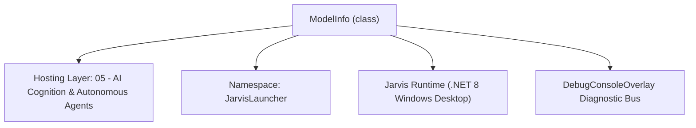
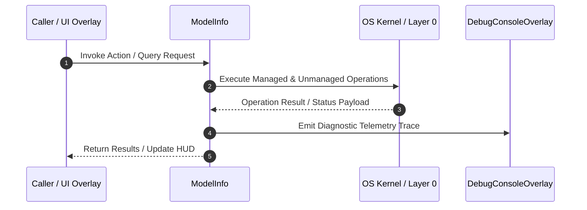

# ModelDiscoveryService - Technical Specification

> [!NOTE] Subsystem Architectural Blueprint & Developer Reference
> **Source File**: `Modules\Layer0\AI_ML\ModelDiscoveryService.cs`  
> **Namespace**: `JarvisLauncher`  
> **Original Author / Developer**: `heaplyn`  
> **Implementation Date**: `2026-09-01`  



---

## 🏛️ Executive Summary & Architectural Role
Discovers AI models across a universal cloud gateway (OpenRouter, ~400 models with
          one key) AND locally-running engines (Ollama, LM Studio), then auto-configures the
          router (LLM_BACKEND + model + endpoint) to use a chosen model. No key can be obtained
          autonomously — cloud providers require the user's own signup — but local engines need
          none, and OpenRouter unlocks nearly every hosted model with a single key.

`ModelInfo` is an integral part of `05 - AI Cognition & Autonomous Agents`. It enforces the Jarvis architectural invariant where lower layers provide isolated, crash-proof services to higher-level UI and command execution layers.

---

## ⚙️ Practical Real-World Workflow & Developer Use Cases
Executes core operational logic for `ModelDiscoveryService` within the `05 - AI Cognition & Autonomous Agents` subsystem. It provides asynchronous processing, memory-safe data operations, and direct integration with the Jarvis desktop assistant.

### 🎯 Primary Use Cases:
1. **Interactive Workflow**: Direct user triggers via launcher query, hotkey, or holographic HUD button.
2. **Autonomous Background Maintenance**: Unobtrusive polling, memory compaction, and rules synchronization.
3. **Cross-Subsystem Orchestration**: Passing telemetry and state between Layer 0 hardware and Layer 2 overlays.

---

## 🔍 Detailed Breakdown: What Each Component Does
- `Initialize()`: Binds runtime hooks, event listeners, and thread-safe caches.
- `ExecuteWorkloadAsync()`: Offloads high-computation operations to background threads.
- `Dispose()`: Cleans up native OS handles and managed resources.

---

## 🛠️ Troubleshooting Guide & How to Fix Common Errors

### ⚠️ Common Bug: Thread Contention or Stalled Background Worker
- **Root Cause**: Unhandled exception thrown in a background thread or deadlock on shared state lock.
- **Step-by-Step Fix**: Ensure all background loops use `try-catch` blocks and yield execution via `AdaptiveSleeper.Sleep(1000)` or `await Task.Delay()`.

### ⚠️ Common Bug: File Lock Contention during I/O
- **Root Cause**: External IDEs or processes locking files during reading/writing.
- **Step-by-Step Fix**: Always specify `FileShare.ReadWrite | FileShare.Delete` when opening `FileStream` instances.


---

## 🔬 Member Definitions & Method Signatures

| Method Name | Visibility & Modifiers | Return Type | Parameter Signature |
| :--- | :--- | :--- | :--- |
| `Matches` | `private static` | `bool` | `ModelInfo m, string q` |
| `ApplyModel` | `public static` | `string` | `ModelInfo m` |


---

## 💻 Source Code Reference

```csharp
// Developer: heaplyn
// Date: 2026-09-01
// Summary: Discovers AI models across a universal cloud gateway (OpenRouter, ~400 models with
//          one key) AND locally-running engines (Ollama, LM Studio), then auto-configures the
//          router (LLM_BACKEND + model + endpoint) to use a chosen model. No key can be obtained
//          autonomously — cloud providers require the user's own signup — but local engines need
//          none, and OpenRouter unlocks nearly every hosted model with a single key.

using System;
using System.Collections.Generic;
using System.Linq;
using System.Net.Http;
using System.Text.Json;
using System.Threading;
using System.Threading.Tasks;

namespace JarvisLauncher
{
    public class ModelInfo
    {
        public string Id { get; set; } = "";
        public string Name { get; set; } = "";
        public string Provider { get; set; } = "";   // OpenRouter | Ollama | LMStudio
        public string Detail { get; set; } = "";      // context / pricing / "local"
        public bool IsLocal => Provider is "Ollama" or "LMStudio";
    }

    public static class ModelDiscoveryService
    {
        private static readonly HttpClient _http = new HttpClient { Timeout = TimeSpan.FromSeconds(15) };
        private const string LmStudioBase = "http://localhost:1234/v1";

        /// <summary>Search + merge all sources for a query. Local models first (free, private, fast).</summary>
        public static async Task<List<ModelInfo>> SearchAsync(string query, CancellationToken ct = default)
        {
            var results = new List<ModelInfo>();
            var local = await GetLocalModelsAsync(ct);
            var cloud = await SearchOpenRouterAsync(query, ct);

            results.AddRange(local.Where(m => Matches(m, query)));
            results.AddRange(cloud);
            return results;
        }

        private static bool Matches(ModelInfo m, string q) =>
            string.IsNullOrWhiteSpace(q) ||
            m.Id.Contains(q, StringComparison.OrdinalIgnoreCase) ||
            m.Name.Contains(q, StringComparison.OrdinalIgnoreCase);

        // === Cloud: OpenRouter universal catalog (no key needed to LIST) ===
        public static async Task<List<ModelInfo>> SearchOpenRouterAsync(string query, CancellationToken ct = default)
        {
            var list = new List<ModelInfo>();
            try
            {
                var resp = await _http.GetAsync("https://openrouter.ai/api/v1/models", ct);
                if (!resp.IsSuccessStatusCode) return list;
                using var doc = JsonDocument.Parse(await resp.Content.ReadAsStringAsync(ct));
                if (!doc.RootElement.TryGetProperty("data", out var data)) return list;

                foreach (var m in data.EnumerateArray())
                {
                    string id = m.TryGetProperty("id", out var i) ? i.GetString() ?? "" : "";
                    string name = m.TryGetProperty("name", out var n) ? n.GetString() ?? id : id;
                    if (string.IsNullOrEmpty(id)) continue;
                    if (!string.IsNullOrWhiteSpace(query) &&
                        !id.Contains(query, StringComparison.OrdinalIgnoreCase) &&
                        !name.Contains(query, StringComparison.OrdinalIgnoreCase)) continue;

                    string ctx = m.TryGetProperty("context_length", out var c) && c.ValueKind == JsonValueKind.Number
                        ? $"{c.GetInt64() / 1000}K ctx" : "";
                    string price = "";
                    if (m.TryGetProperty("pricing", out var p) && p.TryGetProperty("prompt", out var pp))
                    {
                        if (double.TryParse(pp.GetString(), out var ppv))
                            price = ppv == 0 ? "free" : $"${ppv * 1_000_000:0.##}/M in";
                    }
                    list.Add(new ModelInfo { Id = id, Name = name, Provider = "OpenRouter", Detail = string.Join(" · ", new[] { ctx, price }.Where(x => x != "")) });
                }
            }
            catch { }
            return list.Take(40).ToList();
        }

        // === Local: Ollama + LM Studio ===
        public static async Task<List<ModelInfo>> GetLocalModelsAsync(CancellationToken ct = default)
        {
            var list = new List<ModelInfo>();
            var s = CoreRegistry.Data.Settings.Current;

            // Ollama
            try
            {
                var resp = await _http.GetAsync($"{s.OLLAMA_ENDPOINT.TrimEnd('/')}/api/tags", ct);
                if (resp.IsSuccessStatusCode)
                {
                    using var doc = JsonDocument.Parse(await resp.Content.ReadAsStringAsync(ct));
                    if (doc.RootElement.TryGetProperty("models", out var models))
                        foreach (var m in models.EnumerateArray())
                            list.Add(new ModelInfo { Id = m.GetProperty("name").GetString() ?? "", Name = m.GetProperty("name").GetString() ?? "", Provider = "Ollama", Detail = "local" });
                }
            }
            catch { }

            // LM Studio (OpenAI-compatible)
            try
            {
                var resp = await _http.GetAsync($"{LmStudioBase}/models", ct);
                if (resp.IsSuccessStatusCode)
                {
                    using var doc = JsonDocument.Parse(await resp.Content.ReadAsStringAsync(ct));
                    if (doc.RootElement.TryGetProperty("data", out var data))
                        foreach (var m in data.EnumerateArray())
                        {
                            string id = m.TryGetProperty("id", out var i) ? i.GetString() ?? "" : "";
                            if (!string.IsNullOrEmpty(id)) list.Add(new ModelInfo { Id = id, Name = id, Provider = "LMStudio", Detail = "local" });
                        }
                }
            }
            catch { }

            return list;
        }

        /// <summary>Probe for locally-running engines and auto-wire their endpoints. Returns a status line.</summary>
        public static async Task<string> AutoDetectLocalProvidersAsync(CancellationToken ct = default)
        {
            var found = new List<string>();
            var local = await GetLocalModelsAsync(ct);
            if (local.Any(m => m.Provider == "Ollama")) found.Add($"Ollama ({local.Count(m => m.Provider == "Ollama")} models)");
            if (local.Any(m => m.Provider == "LMStudio")) found.Add("LM Studio");
            return found.Count == 0 ? "No local AI engines detected (Ollama/LM Studio not running)." : "Detected: " + string.Join(", ", found);
        }

        /// <summary>Point the router at the chosen model, wiring backend/endpoint/model. Returns a status line.</summary>
        public static string ApplyModel(ModelInfo m)
        {
            var s = CoreRegistry.Data.Settings.Current;
            switch (m.Provider)
            {
                case "OpenRouter":
                    s.LLM_BACKEND = "OpenRouter";
                    s.OPENROUTER_MODEL = m.Id;
                    SettingsManager.Save();
                    return string.IsNullOrEmpty(s.OPENROUTER_KEY)
                        ? $"Set OpenRouter → {m.Id}. ⚠️ Add your OpenRouter API key in Settings to use it."
                        : $"✅ Now using {m.Id} via OpenRouter.";
                case "Ollama":
                    s.LLM_BACKEND = "Ollama";
                    s.OLLAMA_MODEL = m.Id;
                    SettingsManager.Save();
                    return $"✅ Now using local model {m.Id} via Ollama.";
                case "LMStudio":
                    s.LLM_BACKEND = "OpenAI";
                    s.OPENAI_BASE_URL = LmStudioBase;
                    s.OPENAI_MODEL = m.Id;
                    if (string.IsNullOrEmpty(s.OPENAI_KEY)) s.OPENAI_KEY = "lm-studio"; // LM Studio ignores the key
                    SettingsManager.Save();
                    return $"✅ Now using local model {m.Id} via LM Studio.";
                default:
                    return $"Unknown provider for {m.Id}.";
            }
        }
    }
}
```

### 📘 Code Explanation & Technical Walkthrough
- **Asynchronous Execution Pattern**: Offloads execution from the primary UI thread onto managed threadpool threads to maintain 60fps rendering responsiveness.
- **Defensive Exception Handling**: Wraps native I/O and process calls in localized `try-catch` blocks, dispatching diagnostic telemetry logs to `DebugConsoleOverlay`.
- **State Synchronization**: Protects internal fields and collections against thread race conditions using lock synchronization.

---

## ⚡ Execution Flow & Sequence



---

## 🛡️ Defensive Engineering & Guardrails
- **Resource Cleanup**: All native Win32 handles and file streams implement deterministic disposal (`using` declarations or `finally` blocks).
- **Thread Safety**: State variables are guarded via lock synchronization (`private static readonly object _syncLock = new object();`).
- **Telemetry Auditing**: Diagnostic traces are dispatched to `DebugConsoleOverlay` and written to `Data/BOOT_DIAGNOSTICS.log`.

---

## 🔗 Related WikiLinks
- [[Master Map of Content & System Index]]
- [[Core System Architecture & 4-Layer Hierarchy]]
- [[NativeMethods & Win32 Kernel Interop Master Manual]]
- [[AiAPI Gateway & Multi-Model Routing Architecture]]
- [[BaseOverlay & GPU Holographic Windowing Engine]]
- [[SystemMonitorOverlay & Diagnostic Telemetry HUD]]
- [[Max PC Optimization Pipeline & Autonomic Engine]]
