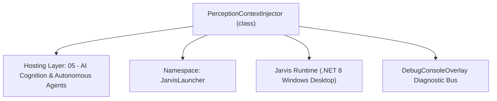
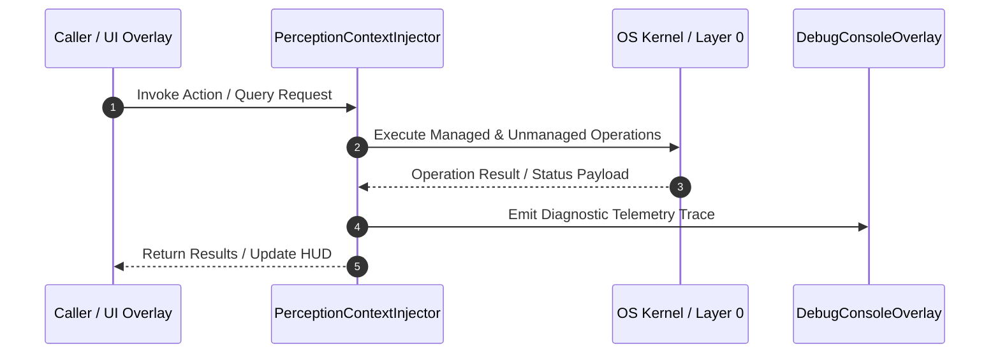

# PerceptionContextInjector - Technical Specification

> [!NOTE] Subsystem Architectural Blueprint & Developer Reference
> **Source File**: `Modules\Layer0\AI_ML\PerceptionContextInjector.cs`  
> **Namespace**: `JarvisLauncher`  
> **Original Author / Developer**: `heaplyn`  
> **Implementation Date**: `2026-09-02`  



---

## 🏛️ Executive Summary & Architectural Role
Gathers Jarvis's live "senses" — the active window, the latest screen capture summary,
          and the project files most relevant to the request — into a compact text block injected
          into every AI prompt, so the model can reason about what's on screen and in the codebase.
          Efficiency-aware: skips the heavier work when the system is under load.

`PerceptionContextInjector` is an integral part of `05 - AI Cognition & Autonomous Agents`. It enforces the Jarvis architectural invariant where lower layers provide isolated, crash-proof services to higher-level UI and command execution layers.

---

## ⚙️ Practical Real-World Workflow & Developer Use Cases
Executes core operational logic for `PerceptionContextInjector` within the `05 - AI Cognition & Autonomous Agents` subsystem. It provides asynchronous processing, memory-safe data operations, and direct integration with the Jarvis desktop assistant.

### 🎯 Primary Use Cases:
1. **Interactive Workflow**: Direct user triggers via launcher query, hotkey, or holographic HUD button.
2. **Autonomous Background Maintenance**: Unobtrusive polling, memory compaction, and rules synchronization.
3. **Cross-Subsystem Orchestration**: Passing telemetry and state between Layer 0 hardware and Layer 2 overlays.

---

## 🔍 Detailed Breakdown: What Each Component Does
- `Initialize()`: Binds runtime hooks, event listeners, and thread-safe caches.
- `ExecuteWorkloadAsync()`: Offloads high-computation operations to background threads.
- `Dispose()`: Cleans up native OS handles and managed resources.

---

## 🛠️ Troubleshooting Guide & How to Fix Common Errors

### ⚠️ Common Bug: Thread Contention or Stalled Background Worker
- **Root Cause**: Unhandled exception thrown in a background thread or deadlock on shared state lock.
- **Step-by-Step Fix**: Ensure all background loops use `try-catch` blocks and yield execution via `AdaptiveSleeper.Sleep(1000)` or `await Task.Delay()`.

### ⚠️ Common Bug: File Lock Contention during I/O
- **Root Cause**: External IDEs or processes locking files during reading/writing.
- **Step-by-Step Fix**: Always specify `FileShare.ReadWrite | FileShare.Delete` when opening `FileStream` instances.


---

## 🔬 Member Definitions & Method Signatures

| Method Name | Visibility & Modifiers | Return Type | Parameter Signature |
| :--- | :--- | :--- | :--- |
| `Truncate` | `private static` | `string` | `string s, int max` |
| `Gather` | `public static` | `string` | `string prompt` |


---

## 💻 Source Code Reference

```csharp
// Developer: heaplyn
// Date: 2026-09-02
// Summary: Gathers Jarvis's live "senses" — the active window, the latest screen capture summary,
//          and the project files most relevant to the request — into a compact text block injected
//          into every AI prompt, so the model can reason about what's on screen and in the codebase.
//          Efficiency-aware: skips the heavier work when the system is under load.

using System;
using System.Collections.Generic;
using System.IO;
using System.Linq;
using System.Text;
using System.Text.RegularExpressions;

namespace JarvisLauncher
{
    public static class PerceptionContextInjector
    {
        private static string Truncate(string s, int max) =>
            string.IsNullOrEmpty(s) || s.Length <= max ? (s ?? "") : s.Substring(0, max) + "…";

        public static string Gather(string prompt)
        {
            try
            {
                if (!CoreRegistry.Data.Settings.Current.ENABLE_PERCEPTION_CONTEXT) return "";

                var sb = new StringBuilder();

                // 1) Active window / process (what the user is looking at right now).
                try
                {
                    string win = ScreenMonitorEngine.ActiveWindowTitle;
                    string proc = ScreenMonitorEngine.ActiveProcessName;
                    if (!string.IsNullOrWhiteSpace(win))
                        sb.AppendLine($"- Active window: \"{win}\"" + (string.IsNullOrWhiteSpace(proc) ? "" : $" ({proc})"));
                }
                catch { }

                // 2) Latest on-screen summary from the periodic screen monitor (if running/recent).
                try
                {
                    if (!string.IsNullOrWhiteSpace(ScreenMonitorEngine.LastAiSummary))
                    {
                        var age = DateTime.Now - ScreenMonitorEngine.LastCaptureTime;
                        if (age.TotalMinutes < 5)
                            sb.AppendLine($"- On screen ({(int)age.TotalSeconds}s ago): {Truncate(ScreenMonitorEngine.LastAiSummary, 700)}");
                    }
                }
                catch { }

                // 3) Project files most relevant to the request (skip under load — it's the heavy bit).
                try
                {
                    if (!NeuralResourceManager.IsThrottled)
                    {
                        var terms = Regex.Matches(prompt.ToLowerInvariant(), @"[a-z0-9_\.]{4,}")
                                         .Select(m => m.Value).Distinct().Take(12).ToList();
                        var files = CoreRegistry.Intelligence.ProjectContext.GetFileSummaries();
                        var matches = files
                            .Where(f => terms.Any(t =>
                                f.FilePath.ToLowerInvariant().Contains(t) ||
                                (f.Summary?.ToLowerInvariant().Contains(t) ?? false)))
                            .Take(5).ToList();
                        if (matches.Count > 0)
                        {
                            sb.AppendLine("- Relevant project files:");
                            foreach (var f in matches)
                                sb.AppendLine($"    • {Path.GetFileName(f.FilePath)} — {Truncate(f.Summary, 160)}");
                        }
                    }
                }
                catch { }

                // 4) Files from the slow filesystem index that match the request (path matches only).
                try
                {
                    if (!NeuralResourceManager.IsThrottled)
                    {
                        var terms = Regex.Matches(prompt, @"[A-Za-z0-9_\.\-]{4,}")
                                         .Select(m => m.Value).Distinct().Take(6);
                        var hits = new List<string>();
                        foreach (var t in terms)
                        {
                            hits.AddRange(FileSystemIndexer.Search(t, 3));
                            if (hits.Count >= 6) break;
                        }
                        hits = hits.Distinct().Take(6).ToList();
                        if (hits.Count > 0)
                        {
                            sb.AppendLine("- Files on disk matching the request:");
                            foreach (var h in hits) sb.AppendLine($"    • {h}");
                        }
                    }
                }
                catch { }

                if (sb.Length == 0) return "";
                return "[PERCEPTION CONTEXT — what Jarvis currently sees / knows]\n" + sb;
            }
            catch { return ""; }
        }
    }
}
```

### 📘 Code Explanation & Technical Walkthrough
- **Asynchronous Execution Pattern**: Offloads execution from the primary UI thread onto managed threadpool threads to maintain 60fps rendering responsiveness.
- **Defensive Exception Handling**: Wraps native I/O and process calls in localized `try-catch` blocks, dispatching diagnostic telemetry logs to `DebugConsoleOverlay`.
- **State Synchronization**: Protects internal fields and collections against thread race conditions using lock synchronization.

---

## ⚡ Execution Flow & Sequence



---

## 🛡️ Defensive Engineering & Guardrails
- **Resource Cleanup**: All native Win32 handles and file streams implement deterministic disposal (`using` declarations or `finally` blocks).
- **Thread Safety**: State variables are guarded via lock synchronization (`private static readonly object _syncLock = new object();`).
- **Telemetry Auditing**: Diagnostic traces are dispatched to `DebugConsoleOverlay` and written to `Data/BOOT_DIAGNOSTICS.log`.

---

## 🔗 Related WikiLinks
- [[Master Map of Content & System Index]]
- [[Core System Architecture & 4-Layer Hierarchy]]
- [[NativeMethods & Win32 Kernel Interop Master Manual]]
- [[AiAPI Gateway & Multi-Model Routing Architecture]]
- [[BaseOverlay & GPU Holographic Windowing Engine]]
- [[SystemMonitorOverlay & Diagnostic Telemetry HUD]]
- [[Max PC Optimization Pipeline & Autonomic Engine]]
