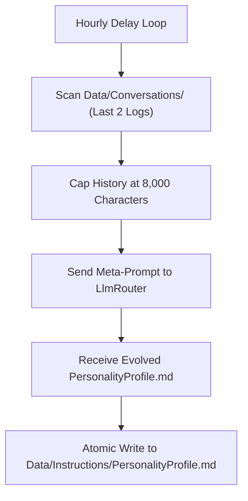

# 🧬 Personality Evolution & Cognitive Context Ingestion

## 🧬 Personality Evolution & Desktop Perception

### 1. The Hourly Evolution Cycle (`PersonalityEvolver.cs`)
Every hour, `PersonalityEvolver` inspects the last 2 conversation session logs in `Data/Conversations/`, extracts the user's conversational vibe (sarcastic, serious, friendly, chaotic), and refines `Data/Instructions/PersonalityProfile.md` via `LlmRouter`.

### 2. Multi-Monitor Screen Perception (`PerceptionContextInjector.cs`)
Captures active foreground window titles, clipboard contents, and visual OCR bounding boxes to provide real-time context to AI conversations.
