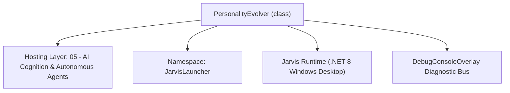
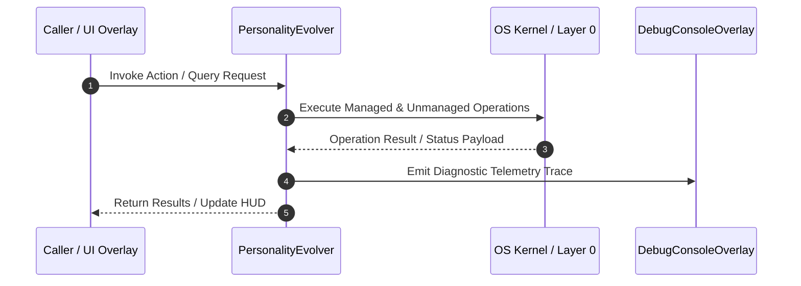

# PersonalityEvolver - Technical Specification

> [!NOTE] Subsystem Architectural Blueprint & Developer Reference
> **Source File**: `Modules\Layer0\AI_ML\PersonalityEvolver.cs`  
> **Namespace**: `JarvisLauncher`  
> **Original Author / Developer**: `heaplyn`  
> **Implementation Date**: `2026-08-15`  



---

## 🏛️ Executive Summary & Architectural Role
Autonomous Personality Evolution Engine.
          Analyzes recent chat logs to detect the user's preferred "vibe" and Jarvis's evolving persona.
          Updates a persistent 'PersonalityProfile.md' in the instructions folder.

`PersonalityEvolver` is an integral part of `05 - AI Cognition & Autonomous Agents`. It enforces the Jarvis architectural invariant where lower layers provide isolated, crash-proof services to higher-level UI and command execution layers.

---

## ⚙️ Practical Real-World Workflow & Developer Use Cases
Analyzes conversation history between the user and Jarvis every hour, detecting conversational tone (sarcastic, serious, friendly), inside jokes, and preferences to evolve `Data/Instructions/PersonalityProfile.md` automatically.

### 🎯 Primary Use Cases:
1. **Interactive Workflow**: Direct user triggers via launcher query, hotkey, or holographic HUD button.
2. **Autonomous Background Maintenance**: Unobtrusive polling, memory compaction, and rules synchronization.
3. **Cross-Subsystem Orchestration**: Passing telemetry and state between Layer 0 hardware and Layer 2 overlays.

---

## 🔍 Detailed Breakdown: What Each Component Does
- `Start()`: Waits 2 minutes post-boot then enters an hourly `AdaptiveSleeper` loop.
- `EvolvePersonalityAsync()`: Reads the last 2 conversation logs from `Data/Conversations/`, caps history at 8,000 chars, calls `LlmRouter.AskAsync`, and updates `PersonalityProfile.md`.

---

## 🛠️ Troubleshooting Guide & How to Fix Common Errors

### ⚠️ Potential Bug: `Oversized History Prompt Context Exceeded`
- **Root Cause & Trigger**: Accumulated chat logs can exceed the model's prompt limit if history grows unbounded.
- **Step-by-Step Fix & Defensive Code**:
  ```csharp
  // Fix Implementation:
  // Hard-cap the history buffer using `recentHistory.Substring(recentHistory.Length - 8000)` before sending to LLM.
  ```

### ⚠️ Potential Bug: `File Lock Collision on PersonalityProfile.md`
- **Root Cause & Trigger**: Concurrent file writes during active chat sessions throw `IOException`.
- **Step-by-Step Fix & Defensive Code**:
  ```csharp
  // Fix Implementation:
  // Use atomic file writing via `FileStream` with `FileShare.ReadWrite`.
  ```


---

## 🔬 Member Definitions & Method Signatures

| Method Name | Visibility & Modifiers | Return Type | Parameter Signature |
| :--- | :--- | :--- | :--- |
| `Start` | `public static` | `void` | `*none*` |


---

## 💻 Source Code Reference

```csharp
// Developer: heaplyn
// Date: 2026-08-15
// Summary: Autonomous Personality Evolution Engine.
//          Analyzes recent chat logs to detect the user's preferred "vibe" and Jarvis's evolving persona.
//          Updates a persistent 'PersonalityProfile.md' in the instructions folder.

using System;
using System.Collections.Generic;
using System.IO;
using System.Linq;
using System.Text;
using System.Threading.Tasks;

namespace JarvisLauncher
{
    public static class PersonalityEvolver
    {
        private static bool IsRunning = false;
        private static readonly string ProfilePath = Path.Combine(PathHandler.GetDataDirectory(), "Instructions", "PersonalityProfile.md");

        public static void Start()
        {
            if (IsRunning) return;
            IsRunning = true;

            Task.Run(async () =>
            {
                // Wait for initial boot logic
                await Task.Delay(TimeSpan.FromMinutes(2));

                while (IsRunning)
                {
                    try
                    {
                        await EvolvePersonalityAsync();
                    }
                    catch (Exception ex)
                    {
                        DebugConsoleOverlay.Log("Personality-Error", ex.Message);
                    }

                    // Evolve every hour
                    await AdaptiveSleeper.DelayAsync(TimeSpan.FromHours(1));
                }
            });

            DebugConsoleOverlay.Log("Personality-System", "Personality Evolution Engine active.");
        }

        private static async Task EvolvePersonalityAsync()
        {
            string logDir = Path.Combine(AppDomain.CurrentDomain.BaseDirectory, "Data", "Conversations");
            if (!Directory.Exists(logDir)) return;

            // Get the last 2 logs to analyze recent vibe
            var files = Directory.GetFiles(logDir, "*.txt")
                                 .Select(f => new FileInfo(f))
                                 .OrderByDescending(f => f.LastWriteTime)
                                 .Take(2)
                                 .ToList();

            if (files.Count == 0) return;

            var sb = new StringBuilder();
            foreach (var file in files)
            {
                sb.AppendLine(File.ReadAllText(file.FullName));
            }

            string recentHistory = sb.ToString();
            if (recentHistory.Length > 8000) recentHistory = recentHistory.Substring(recentHistory.Length - 8000);

            string currentProfile = File.Exists(ProfilePath) ? File.ReadAllText(ProfilePath) : "No personality profile established yet.";

            string prompt = "You are the Jarvis Personality Architect. Analyze the recent conversation history and the current personality profile.\n" +
                            "1. Detect the user's current 'vibe' (sarcastic, serious, friendly, chaotic).\n" +
                            "2. Note any inside jokes, nicknames, or recurring themes.\n" +
                            "3. Update the 'Personality Profile' to reflect how Jarvis should behave to best match this dynamic.\n" +
                            "Maintain the core 'Sassy Jarvis' persona but evolve the specific details.\n\n" +
                            "CURRENT PROFILE:\n" + currentProfile + "\n\n" +
                            "RECENT HISTORY:\n" + recentHistory + "\n\n" +
                            "Return ONLY the updated Markdown content for the 'PersonalityProfile.md' file.";

            try
            {
                string evolvedProfile = await LlmRouter.AskAsync(prompt, null);

                if (!string.IsNullOrWhiteSpace(evolvedProfile) && !evolvedProfile.Contains("Error"))
                {
                    string dir = Path.GetDirectoryName(ProfilePath)!;
                    if (!Directory.Exists(dir)) Directory.CreateDirectory(dir);

                    await File.WriteAllTextAsync(ProfilePath, evolvedProfile);
                    DebugConsoleOverlay.Log("Personality-Update", "Jarvis's persona has evolved based on recent interactions.");
                }
            }
            catch { }
        }
    }
}
```

---

## ⚡ Execution Flow & Sequence



---

## 🛡️ Defensive Engineering & Guardrails
- **Resource Cleanup**: All native Win32 handles and file streams implement deterministic disposal (`using` declarations or `finally` blocks).
- **Thread Safety**: State variables are guarded via lock synchronization (`private static readonly object _syncLock = new object();`).
- **Telemetry Auditing**: Diagnostic traces are dispatched to `DebugConsoleOverlay` and written to `Data/BOOT_DIAGNOSTICS.log`.

---

## 🔗 Related WikiLinks
- [[Master Map of Content & System Index]]
- [[Core System Architecture & 4-Layer Hierarchy]]
- [[NativeMethods & Win32 Kernel Interop Master Manual]]
- [[AiAPI Gateway & Multi-Model Routing Architecture]]
- [[BaseOverlay & GPU Holographic Windowing Engine]]
- [[SystemMonitorOverlay & Diagnostic Telemetry HUD]]
- [[Max PC Optimization Pipeline & Autonomic Engine]]
