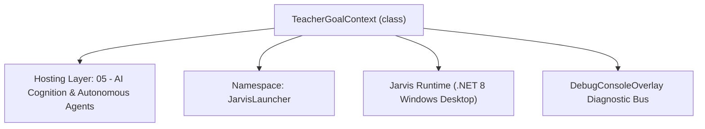
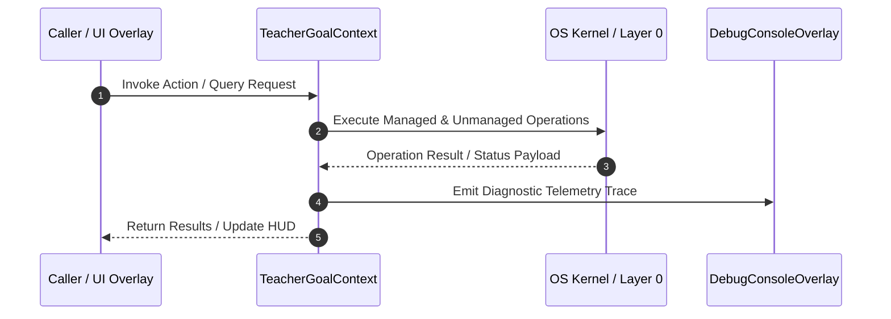

# TeacherGoalContext - Technical Specification

> [!NOTE] Subsystem Architectural Blueprint & Developer Reference
> **Source File**: `Modules\Layer0\AI_ML\TeacherGoalContext.cs`  
> **Namespace**: `JarvisLauncher`  
> **Original Author / Developer**: `heaplyn`  
> **Implementation Date**: `2026-08-15`  



---

## 🏛️ Executive Summary & Architectural Role
Goal-aware context for the Live Coding Tutor. The user describes what they're working on
          (a task or something they want to learn) in the Teacher Studio; the AI turns that goal into
          its own tailored "triggers" (on-screen conditions that should prompt help) and a teaching
          tone. The Live Coding Tutor injects this into its screen-watch prompt so guidance is aimed
          at the user's actual objective. Persisted to Data/TeacherGoal.json so it survives restarts.

`TeacherGoalContext` is an integral part of `05 - AI Cognition & Autonomous Agents`. It enforces the Jarvis architectural invariant where lower layers provide isolated, crash-proof services to higher-level UI and command execution layers.

---

## ⚙️ Practical Real-World Workflow & Developer Use Cases
Executes core operational logic for `TeacherGoalContext` within the `05 - AI Cognition & Autonomous Agents` subsystem. It provides asynchronous processing, memory-safe data operations, and direct integration with the Jarvis desktop assistant.

### 🎯 Primary Use Cases:
1. **Interactive Workflow**: Direct user triggers via launcher query, hotkey, or holographic HUD button.
2. **Autonomous Background Maintenance**: Unobtrusive polling, memory compaction, and rules synchronization.
3. **Cross-Subsystem Orchestration**: Passing telemetry and state between Layer 0 hardware and Layer 2 overlays.

---

## 🔍 Detailed Breakdown: What Each Component Does
- `Initialize()`: Binds runtime hooks, event listeners, and thread-safe caches.
- `ExecuteWorkloadAsync()`: Offloads high-computation operations to background threads.
- `Dispose()`: Cleans up native OS handles and managed resources.

---

## 🛠️ Troubleshooting Guide & How to Fix Common Errors

### ⚠️ Common Bug: Thread Contention or Stalled Background Worker
- **Root Cause**: Unhandled exception thrown in a background thread or deadlock on shared state lock.
- **Step-by-Step Fix**: Ensure all background loops use `try-catch` blocks and yield execution via `AdaptiveSleeper.Sleep(1000)` or `await Task.Delay()`.

### ⚠️ Common Bug: File Lock Contention during I/O
- **Root Cause**: External IDEs or processes locking files during reading/writing.
- **Step-by-Step Fix**: Always specify `FileShare.ReadWrite | FileShare.Delete` when opening `FileStream` instances.


---

## 🔬 Member Definitions & Method Signatures

| Method Name | Visibility & Modifiers | Return Type | Parameter Signature |
| :--- | :--- | :--- | :--- |
| `EnsureLoaded` | `private static` | `void` | `*none*` |
| `Save` | `public static` | `void` | `string goal, string focus, string triggers, string tone, bool active` |
| `SetActive` | `public static` | `void` | `bool active` |
| `SaveFromRaw` | `public static` | `void` | `string goal, string rawPlan, bool active` |
| `BuildEditablePlan` | `public static` | `string` | `*none*` |
| `BuildEditablePlan` | `public static` | `string` | `string focus, string triggers, string tone` |
| `BuildPromptAugment` | `public static` | `string` | `*none*` |


---

## 💻 Source Code Reference

```csharp
// Developer: heaplyn
// Summary: Goal-aware context for the Live Coding Tutor. The user describes what they're working on
//          (a task or something they want to learn) in the Teacher Studio; the AI turns that goal into
//          its own tailored "triggers" (on-screen conditions that should prompt help) and a teaching
//          tone. The Live Coding Tutor injects this into its screen-watch prompt so guidance is aimed
//          at the user's actual objective. Persisted to Data/TeacherGoal.json so it survives restarts.

using System;
using System.IO;
using System.Text;
using System.Text.Json;
using System.Threading.Tasks;

namespace JarvisLauncher
{
    public static class TeacherGoalContext
    {
        private static readonly object _lock = new();
        private static bool _loaded;

        private sealed class GoalDto
        {
            public string Goal { get; set; } = "";
            public string Focus { get; set; } = "";
            public string Triggers { get; set; } = "";
            public string Tone { get; set; } = "";
            public bool Active { get; set; }
            public DateTime UpdatedUtc { get; set; }
        }

        private static GoalDto _data = new();

        private static string FilePath =>
            Path.Combine(PathHandler.GetDataDirectory(), "TeacherGoal.json");

        // --- Public surface ---
        public static string Goal { get { EnsureLoaded(); return _data.Goal; } }
        public static string Focus { get { EnsureLoaded(); return _data.Focus; } }
        public static string Triggers { get { EnsureLoaded(); return _data.Triggers; } }
        public static string Tone { get { EnsureLoaded(); return _data.Tone; } }
        public static bool Active { get { EnsureLoaded(); return _data.Active; } }

        private static void EnsureLoaded()
        {
            lock (_lock)
            {
                if (_loaded) return;
                _loaded = true;
                try
                {
                    if (File.Exists(FilePath))
                    {
                        var d = JsonSerializer.Deserialize<GoalDto>(File.ReadAllText(FilePath));
                        if (d != null) _data = d;
                    }
                }
                catch { /* first run / malformed → defaults */ }
            }
        }

        /// <summary>Persists the edited plan and (de)activates goal-aware tutoring.</summary>
        public static void Save(string goal, string focus, string triggers, string tone, bool active)
        {
            lock (_lock)
            {
                _loaded = true;
                _data = new GoalDto
                {
                    Goal = goal ?? "",
                    Focus = focus ?? "",
                    Triggers = triggers ?? "",
                    Tone = tone ?? "",
                    Active = active,
                    UpdatedUtc = DateTime.UtcNow
                };
                try
                {
                    Directory.CreateDirectory(PathHandler.GetDataDirectory());
                    File.WriteAllText(FilePath, JsonSerializer.Serialize(_data, new JsonSerializerOptions { WriteIndented = true }));
                }
                catch { }
            }
        }

        public static void SetActive(bool active)
        {
            EnsureLoaded();
            Save(_data.Goal, _data.Focus, _data.Triggers, _data.Tone, active);
        }

        /// <summary>Parses an edited FOCUS/TRIGGERS/TONE plan block and persists it.</summary>
        public static void SaveFromRaw(string goal, string rawPlan, bool active)
        {
            var (focus, triggers, tone) = Parse(rawPlan);
            Save(goal, focus, triggers, tone, active);
        }

        /// <summary>Renders the stored plan back into the editable FOCUS/TRIGGERS/TONE format.</summary>
        public static string BuildEditablePlan()
        {
            EnsureLoaded();
            return BuildEditablePlan(_data.Focus, _data.Triggers, _data.Tone);
        }

        public static string BuildEditablePlan(string focus, string triggers, string tone)
        {
            var sb = new StringBuilder();
            sb.AppendLine("FOCUS: " + (focus ?? "").Trim());
            sb.AppendLine();
            sb.AppendLine("TRIGGERS:");
            foreach (var line in (triggers ?? "").Replace("\r", "").Split('\n'))
                if (!string.IsNullOrWhiteSpace(line)) sb.AppendLine("- " + line.TrimStart('-', '*', ' ', '\t'));
            sb.AppendLine();
            sb.AppendLine("TONE: " + (tone ?? "").Trim());
            return sb.ToString();
        }

        /// <summary>
        /// The block injected into the tutor's screen-watch prompt. Empty when no active goal, so the
        /// tutor falls back to general coding help.
        /// </summary>
        public static string BuildPromptAugment()
        {
            EnsureLoaded();
            if (!_data.Active || string.IsNullOrWhiteSpace(_data.Goal)) return "";
            var sb = new StringBuilder();
            sb.AppendLine("The user has set an explicit goal for this session — bias ALL your judgement toward it:");
            sb.AppendLine($"  GOAL: {_data.Goal}");
            if (!string.IsNullOrWhiteSpace(_data.Focus)) sb.AppendLine($"  FOCUS: {_data.Focus}");
            if (!string.IsNullOrWhiteSpace(_data.Triggers))
            {
                sb.AppendLine("  INTERRUPT ESPECIALLY WHEN YOU SEE (the user's tailored triggers):");
                foreach (var line in _data.Triggers.Replace("\r", "").Split('\n'))
                    if (!string.IsNullOrWhiteSpace(line)) sb.AppendLine($"    - {line.TrimStart('-', ' ', '\t')}");
            }
            if (!string.IsNullOrWhiteSpace(_data.Tone)) sb.AppendLine($"  TEACHING TONE: {_data.Tone}");
            return sb.ToString();
        }

        /// <summary>
        /// Asks the LLM to convert a free-form goal into its own tailored triggers + focus + tone.
        /// Returns (focus, triggers, tone) plus the raw text for display/editing.
        /// </summary>
        public static async Task<(string focus, string triggers, string tone, string raw)> GenerateFromGoalAsync(string goal)
        {
            string prompt =
                "You are JARVIS configuring yourself as a live over-the-shoulder coding tutor. " +
                "The user will tell you what they're working on or trying to learn. Turn that into a concrete watch-plan " +
                "you (a screen-watching vision model) will use to decide when to interrupt and help.\n\n" +
                $"USER GOAL: \"{goal}\"\n\n" +
                "Respond in EXACTLY this format and nothing else:\n" +
                "FOCUS: <2-3 sentences on what specifically to watch for on screen given this goal>\n" +
                "TRIGGERS:\n" +
                "- <a concrete, observable on-screen condition that should make you speak up>\n" +
                "- <another>\n" +
                "- <5 to 8 total, specific to this goal — e.g. missing base case, wrong hook deps, N+1 query, unhandled await>\n" +
                "TONE: <one short phrase for the teaching style, e.g. 'encouraging and Socratic' or 'terse senior reviewer'>";

            string raw = await LlmRouter.AskAsync(prompt, null);
            var (focus, triggers, tone) = Parse(raw);
            return (focus, triggers, tone, raw);
        }

        private static (string focus, string triggers, string tone) Parse(string raw)
        {
            string focus = "", triggers = "", tone = "";
            if (string.IsNullOrEmpty(raw)) return (focus, triggers, tone);
            var lines = raw.Replace("\r", "").Split('\n');
            int section = 0; // 0 none, 1 focus, 2 triggers, 3 tone
            var trigBuf = new StringBuilder();
            foreach (var line in lines)
            {
                string t = line.Trim();
                if (t.StartsWith("FOCUS:", StringComparison.OrdinalIgnoreCase)) { focus = t.Substring(6).Trim(); section = 1; }
                else if (t.StartsWith("TRIGGERS:", StringComparison.OrdinalIgnoreCase)) { section = 2; }
                else if (t.StartsWith("TONE:", StringComparison.OrdinalIgnoreCase)) { tone = t.Substring(5).Trim(); section = 3; }
                else if (section == 1 && t.Length > 0) focus += " " + t;
                else if (section == 2 && t.Length > 0) trigBuf.AppendLine(t.TrimStart('-', '*', ' ', '\t'));
                else if (section == 3 && t.Length > 0) tone += " " + t;
            }
            return (focus.Trim(), trigBuf.ToString().Trim(), tone.Trim());
        }
    }
}
```

### 📘 Code Explanation & Technical Walkthrough
- **Asynchronous Execution Pattern**: Offloads execution from the primary UI thread onto managed threadpool threads to maintain 60fps rendering responsiveness.
- **Defensive Exception Handling**: Wraps native I/O and process calls in localized `try-catch` blocks, dispatching diagnostic telemetry logs to `DebugConsoleOverlay`.
- **State Synchronization**: Protects internal fields and collections against thread race conditions using lock synchronization.

---

## ⚡ Execution Flow & Sequence



---

## 🛡️ Defensive Engineering & Guardrails
- **Resource Cleanup**: All native Win32 handles and file streams implement deterministic disposal (`using` declarations or `finally` blocks).
- **Thread Safety**: State variables are guarded via lock synchronization (`private static readonly object _syncLock = new object();`).
- **Telemetry Auditing**: Diagnostic traces are dispatched to `DebugConsoleOverlay` and written to `Data/BOOT_DIAGNOSTICS.log`.

---

## 🔗 Related WikiLinks
- [[Master Map of Content & System Index]]
- [[Core System Architecture & 4-Layer Hierarchy]]
- [[NativeMethods & Win32 Kernel Interop Master Manual]]
- [[AiAPI Gateway & Multi-Model Routing Architecture]]
- [[BaseOverlay & GPU Holographic Windowing Engine]]
- [[SystemMonitorOverlay & Diagnostic Telemetry HUD]]
- [[Max PC Optimization Pipeline & Autonomic Engine]]
