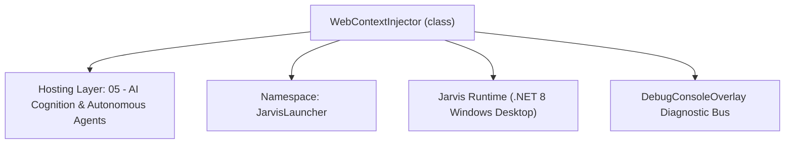
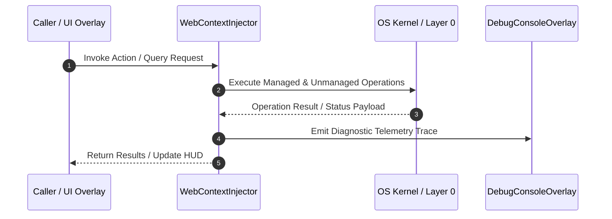

# WebContextInjector - Technical Specification

> [!NOTE] Subsystem Architectural Blueprint & Developer Reference
> **Source File**: `Modules\Layer0\AI_ML\WebContextInjector.cs`  
> **Namespace**: `JarvisLauncher`  
> **Original Author / Developer**: `heaplyn`  
> **Implementation Date**: `2026-09-01`  



---

## 🏛️ Executive Summary & Architectural Role
Injects live web context into AI chat prompts (read-only, safe). Two triggers:
          (1) any URL the user pastes is scraped and its content added; (2) an explicit web
          search ("/web X", "search the web for X", "search: X") runs and its results added.
          Conservative on purpose — normal chats don't hit the network, so latency stays low.

`WebContextInjector` is an integral part of `05 - AI Cognition & Autonomous Agents`. It enforces the Jarvis architectural invariant where lower layers provide isolated, crash-proof services to higher-level UI and command execution layers.

---

## ⚙️ Practical Real-World Workflow & Developer Use Cases
Executes core operational logic for `WebContextInjector` within the `05 - AI Cognition & Autonomous Agents` subsystem. It provides asynchronous processing, memory-safe data operations, and direct integration with the Jarvis desktop assistant.

### 🎯 Primary Use Cases:
1. **Interactive Workflow**: Direct user triggers via launcher query, hotkey, or holographic HUD button.
2. **Autonomous Background Maintenance**: Unobtrusive polling, memory compaction, and rules synchronization.
3. **Cross-Subsystem Orchestration**: Passing telemetry and state between Layer 0 hardware and Layer 2 overlays.

---

## 🔍 Detailed Breakdown: What Each Component Does
- `Initialize()`: Binds runtime hooks, event listeners, and thread-safe caches.
- `ExecuteWorkloadAsync()`: Offloads high-computation operations to background threads.
- `Dispose()`: Cleans up native OS handles and managed resources.

---

## 🛠️ Troubleshooting Guide & How to Fix Common Errors

### ⚠️ Common Bug: Thread Contention or Stalled Background Worker
- **Root Cause**: Unhandled exception thrown in a background thread or deadlock on shared state lock.
- **Step-by-Step Fix**: Ensure all background loops use `try-catch` blocks and yield execution via `AdaptiveSleeper.Sleep(1000)` or `await Task.Delay()`.

### ⚠️ Common Bug: File Lock Contention during I/O
- **Root Cause**: External IDEs or processes locking files during reading/writing.
- **Step-by-Step Fix**: Always specify `FileShare.ReadWrite | FileShare.Delete` when opening `FileStream` instances.


---

## 🔬 Member Definitions & Method Signatures

| Method Name | Visibility & Modifiers | Return Type | Parameter Signature |
| :--- | :--- | :--- | :--- |


---

## 💻 Source Code Reference

```csharp
// Developer: heaplyn
// Date: 2026-09-01
// Summary: Injects live web context into AI chat prompts (read-only, safe). Two triggers:
//          (1) any URL the user pastes is scraped and its content added; (2) an explicit web
//          search ("/web X", "search the web for X", "search: X") runs and its results added.
//          Conservative on purpose — normal chats don't hit the network, so latency stays low.

using System;
using System.Linq;
using System.Text;
using System.Text.RegularExpressions;
using System.Threading;
using System.Threading.Tasks;

namespace JarvisLauncher
{
    public static class WebContextInjector
    {
        private static readonly Regex UrlRx =
            new(@"https?://[^\s\)\]\}""']+", RegexOptions.Compiled);
        private static readonly Regex SearchRx =
            new(@"(?:^/web\s+|search the web for\s+|^search:\s*)(?<q>.+)", RegexOptions.IgnoreCase);

        private const int MaxChunk = 4000;

        /// <summary>Returns a web-context block to prepend, or "" if nothing to fetch.</summary>
        public static async Task<string> MaybeFetchAsync(string prompt, CancellationToken ct = default)
        {
            try
            {
                var sb = new StringBuilder();

                // 1) Scrape up to 2 URLs present in the prompt.
                var urls = UrlRx.Matches(prompt).Select(m => m.Value).Distinct().Take(2).ToList();
                foreach (var u in urls)
                {
                    try
                    {
                        var r = await WebScraperManager.ScrapePageAsync(u);
                        string report = WebScraperManager.FormatReport(r);
                        if (!string.IsNullOrWhiteSpace(report))
                        {
                            if (report.Length > MaxChunk) report = report.Substring(0, MaxChunk) + " …[truncated]";
                            sb.AppendLine($"[WEB PAGE: {u}]\n{report}\n");
                        }
                    }
                    catch { }
                }

                // 2) Explicit web search.
                var m = SearchRx.Match(prompt);
                if (m.Success)
                {
                    string term = m.Groups["q"].Value.Trim();
                    try
                    {
                        string res = await WebOperationManager.SearchWebAsync(term);
                        if (!string.IsNullOrWhiteSpace(res))
                        {
                            if (res.Length > MaxChunk) res = res.Substring(0, MaxChunk) + " …[truncated]";
                            sb.AppendLine($"[WEB SEARCH: {term}]\n{res}\n");
                        }
                    }
                    catch { }
                }

                if (sb.Length == 0) return "";
                return "[SYSTEM: LIVE WEB CONTEXT — use this to inform your answer, cite the source URL]\n" + sb;
            }
            catch { return ""; }
        }
    }
}

```

### 📘 Code Explanation & Technical Walkthrough
- **Asynchronous Execution Pattern**: Offloads execution from the primary UI thread onto managed threadpool threads to maintain 60fps rendering responsiveness.
- **Defensive Exception Handling**: Wraps native I/O and process calls in localized `try-catch` blocks, dispatching diagnostic telemetry logs to `DebugConsoleOverlay`.
- **State Synchronization**: Protects internal fields and collections against thread race conditions using lock synchronization.

---

## ⚡ Execution Flow & Sequence



---

## 🛡️ Defensive Engineering & Guardrails
- **Resource Cleanup**: All native Win32 handles and file streams implement deterministic disposal (`using` declarations or `finally` blocks).
- **Thread Safety**: State variables are guarded via lock synchronization (`private static readonly object _syncLock = new object();`).
- **Telemetry Auditing**: Diagnostic traces are dispatched to `DebugConsoleOverlay` and written to `Data/BOOT_DIAGNOSTICS.log`.

---

## 🔗 Related WikiLinks
- [[Master Map of Content & System Index]]
- [[Core System Architecture & 4-Layer Hierarchy]]
- [[NativeMethods & Win32 Kernel Interop Master Manual]]
- [[AiAPI Gateway & Multi-Model Routing Architecture]]
- [[BaseOverlay & GPU Holographic Windowing Engine]]
- [[SystemMonitorOverlay & Diagnostic Telemetry HUD]]
- [[Max PC Optimization Pipeline & Autonomic Engine]]
