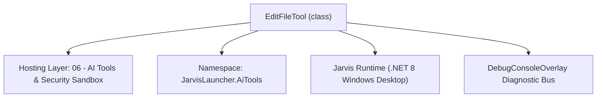
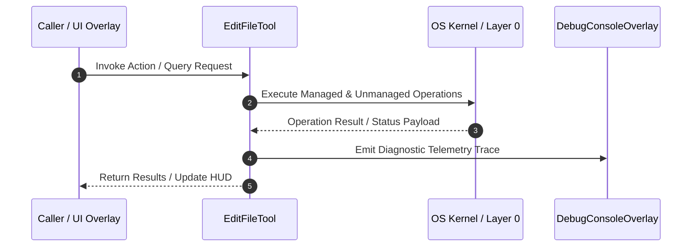

# AgenticTools - Technical Specification

> [!NOTE] Subsystem Architectural Blueprint & Developer Reference
> **Source File**: `Modules\Layer0\AiTools\AgenticTools.cs`  
> **Namespace**: `JarvisLauncher.AiTools`  
> **Original Author / Developer**: `heaplyn`  
> **Implementation Date**: `2026-09-02`  



---

## 🏛️ Executive Summary & Architectural Role
Agentic tools the model can invoke: surgical file edits (path-jailed) and
          self-configuration (changing Jarvis's own settings, with human confirmation).
          Web search / fetch / download live in WebTools.cs.

`EditFileTool` is an integral part of `06 - AI Tools & Security Sandbox`. It enforces the Jarvis architectural invariant where lower layers provide isolated, crash-proof services to higher-level UI and command execution layers.

---

## ⚙️ Practical Real-World Workflow & Developer Use Cases
Executes core operational logic for `AgenticTools` within the `06 - AI Tools & Security Sandbox` subsystem. It provides asynchronous processing, memory-safe data operations, and direct integration with the Jarvis desktop assistant.

### 🎯 Primary Use Cases:
1. **Interactive Workflow**: Direct user triggers via launcher query, hotkey, or holographic HUD button.
2. **Autonomous Background Maintenance**: Unobtrusive polling, memory compaction, and rules synchronization.
3. **Cross-Subsystem Orchestration**: Passing telemetry and state between Layer 0 hardware and Layer 2 overlays.

---

## 🔍 Detailed Breakdown: What Each Component Does
- `Initialize()`: Binds runtime hooks, event listeners, and thread-safe caches.
- `ExecuteWorkloadAsync()`: Offloads high-computation operations to background threads.
- `Dispose()`: Cleans up native OS handles and managed resources.

---

## 🛠️ Troubleshooting Guide & How to Fix Common Errors

### ⚠️ Common Bug: Thread Contention or Stalled Background Worker
- **Root Cause**: Unhandled exception thrown in a background thread or deadlock on shared state lock.
- **Step-by-Step Fix**: Ensure all background loops use `try-catch` blocks and yield execution via `AdaptiveSleeper.Sleep(1000)` or `await Task.Delay()`.

### ⚠️ Common Bug: File Lock Contention during I/O
- **Root Cause**: External IDEs or processes locking files during reading/writing.
- **Step-by-Step Fix**: Always specify `FileShare.ReadWrite | FileShare.Delete` when opening `FileStream` instances.


---

## 🔬 Member Definitions & Method Signatures

| Method Name | Visibility & Modifiers | Return Type | Parameter Signature |
| :--- | :--- | :--- | :--- |
| `ExecuteAsync` | `public async` | `Task<string>` | `Match m, HashSet<string> executedTags` |
| `ExecuteAsync` | `public ` | `Task<string>` | `Match m, HashSet<string> executedTags` |


---

## 💻 Source Code Reference

```csharp
// Developer: heaplyn
// Date: 2026-09-02
// Summary: Agentic tools the model can invoke: surgical file edits (path-jailed) and
//          self-configuration (changing Jarvis's own settings, with human confirmation).
//          Web search / fetch / download live in WebTools.cs.

using System;
using System.Collections.Generic;
using System.IO;
using System.Reflection;
using System.Text.RegularExpressions;
using System.Threading.Tasks;

namespace JarvisLauncher.AiTools
{
    // @edit{path}{find}{replace} — replace the first occurrence of <find> with <replace> in a file.
    public class EditFileTool : IAiTool
    {
        public string Tag => "EDIT";
        public string RegexPattern => @"@edit\{(?<p>.*?)\}\{(?<f>.*?)\}\{(?<r>.*?)\}";
        public async Task<string> ExecuteAsync(Match m, HashSet<string> executedTags)
        {
            string p = m.Groups["p"].Value.Trim().Trim('"', '\'');
            string find = m.Groups["f"].Value;
            string repl = m.Groups["r"].Value;
            if (!executedTags.Add("EDIT:" + p + find.GetHashCode())) return "";
            if (!AiPathJail.TryResolve(p, out string full, out string err)) return err;
            if (!File.Exists(full)) return $"[ERROR: file {p} not found]\n";
            string content = await File.ReadAllTextAsync(full);
            int idx = content.IndexOf(find, StringComparison.Ordinal);
            if (idx < 0) return $"[ERROR: text to replace not found in {p}]\n";
            content = content.Substring(0, idx) + repl + content.Substring(idx + find.Length);
            await File.WriteAllTextAsync(full, content);
            return $"[EDITED: {p}]\n";
        }
    }

    // @set{SETTING_NAME}{value} — Jarvis changes its own configuration (with human confirmation).
    public class SettingsControlTool : IAiTool
    {
        public string Tag => "SET";
        public string RegexPattern => @"@set\{(?<k>.*?)\}\{(?<v>.*?)\}";
        public Task<string> ExecuteAsync(Match m, HashSet<string> executedTags)
        {
            string key = m.Groups["k"].Value.Trim();
            string val = m.Groups["v"].Value.Trim();
            if (!executedTags.Add("SET:" + key)) return Task.FromResult("");

            var prop = typeof(SystemSettings).GetProperty(key,
                BindingFlags.Public | BindingFlags.Instance | BindingFlags.IgnoreCase);
            if (prop == null || !prop.CanWrite) return Task.FromResult($"[ERROR: no writable setting '{key}']\n");

            if (!HumanConfirm.Ask($"Jarvis (AI) wants to change setting:\n\n{prop.Name} = {val}\n\nAllow?"))
                return Task.FromResult($"[DENIED: user declined to change {prop.Name}]\n");

            try
            {
                object converted = prop.PropertyType == typeof(bool)
                    ? (val.Equals("true", StringComparison.OrdinalIgnoreCase) || val == "1")
                    : Convert.ChangeType(val, prop.PropertyType);
                prop.SetValue(SettingsManager.Current, converted);
                SettingsManager.Save();
                return Task.FromResult($"[SETTING CHANGED: {prop.Name} = {val}]\n");
            }
            catch (Exception ex) { return Task.FromResult($"[ERROR setting {prop.Name}: {ex.Message}]\n"); }
        }
    }
}
```

### 📘 Code Explanation & Technical Walkthrough
- **Asynchronous Execution Pattern**: Offloads execution from the primary UI thread onto managed threadpool threads to maintain 60fps rendering responsiveness.
- **Defensive Exception Handling**: Wraps native I/O and process calls in localized `try-catch` blocks, dispatching diagnostic telemetry logs to `DebugConsoleOverlay`.
- **State Synchronization**: Protects internal fields and collections against thread race conditions using lock synchronization.

---

## ⚡ Execution Flow & Sequence



---

## 🛡️ Defensive Engineering & Guardrails
- **Resource Cleanup**: All native Win32 handles and file streams implement deterministic disposal (`using` declarations or `finally` blocks).
- **Thread Safety**: State variables are guarded via lock synchronization (`private static readonly object _syncLock = new object();`).
- **Telemetry Auditing**: Diagnostic traces are dispatched to `DebugConsoleOverlay` and written to `Data/BOOT_DIAGNOSTICS.log`.

---

## 🔗 Related WikiLinks
- [[Master Map of Content & System Index]]
- [[Core System Architecture & 4-Layer Hierarchy]]
- [[NativeMethods & Win32 Kernel Interop Master Manual]]
- [[AiAPI Gateway & Multi-Model Routing Architecture]]
- [[BaseOverlay & GPU Holographic Windowing Engine]]
- [[SystemMonitorOverlay & Diagnostic Telemetry HUD]]
- [[Max PC Optimization Pipeline & Autonomic Engine]]
