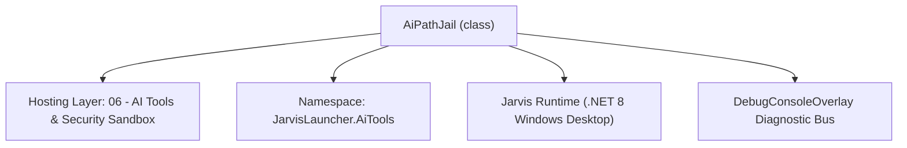
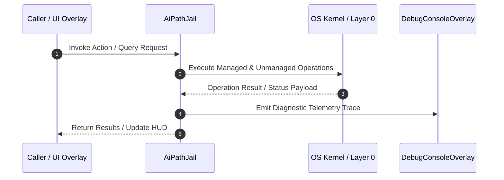

# AiPathJail - Technical Specification

> [!NOTE] Subsystem Architectural Blueprint & Developer Reference
> **Source File**: `Modules\Layer0\AiTools\AiPathJail.cs`  
> **Namespace**: `JarvisLauncher.AiTools`  
> **Original Author / Developer**: `heaplyn`  
> **Implementation Date**: `2026-08-31`  



---

## 🏛️ Executive Summary & Architectural Role
SECURITY - confines model-driven file tools (@rf/@wf/@rf_b/@wf_b/@ls) to a
          workspace root so the model cannot read or write arbitrary paths on disk
          (e.g. C:\Windows, the Startup folder, browser cookies, SSH keys).

`AiPathJail` is an integral part of `06 - AI Tools & Security Sandbox`. It enforces the Jarvis architectural invariant where lower layers provide isolated, crash-proof services to higher-level UI and command execution layers.

---

## ⚙️ Practical Real-World Workflow & Developer Use Cases
Executes core operational logic for `AiPathJail` within the `06 - AI Tools & Security Sandbox` subsystem. It provides asynchronous processing, memory-safe data operations, and direct integration with the Jarvis desktop assistant.

### 🎯 Primary Use Cases:
1. **Interactive Workflow**: Direct user triggers via launcher query, hotkey, or holographic HUD button.
2. **Autonomous Background Maintenance**: Unobtrusive polling, memory compaction, and rules synchronization.
3. **Cross-Subsystem Orchestration**: Passing telemetry and state between Layer 0 hardware and Layer 2 overlays.

---

## 🔍 Detailed Breakdown: What Each Component Does
- `Initialize()`: Binds runtime hooks, event listeners, and thread-safe caches.
- `ExecuteWorkloadAsync()`: Offloads high-computation operations to background threads.
- `Dispose()`: Cleans up native OS handles and managed resources.

---

## 🛠️ Troubleshooting Guide & How to Fix Common Errors

### ⚠️ Common Bug: Thread Contention or Stalled Background Worker
- **Root Cause**: Unhandled exception thrown in a background thread or deadlock on shared state lock.
- **Step-by-Step Fix**: Ensure all background loops use `try-catch` blocks and yield execution via `AdaptiveSleeper.Sleep(1000)` or `await Task.Delay()`.

### ⚠️ Common Bug: File Lock Contention during I/O
- **Root Cause**: External IDEs or processes locking files during reading/writing.
- **Step-by-Step Fix**: Always specify `FileShare.ReadWrite | FileShare.Delete` when opening `FileStream` instances.


---

## 🔬 Member Definitions & Method Signatures

| Method Name | Visibility & Modifiers | Return Type | Parameter Signature |
| :--- | :--- | :--- | :--- |
| `TryResolve` | `public static` | `bool` | `string requested, out string fullPath, out string error` |


---

## 💻 Source Code Reference

```csharp
// Developer: heaplyn
// Date: 2026-08-31
// Summary: SECURITY - confines model-driven file tools (@rf/@wf/@rf_b/@wf_b/@ls) to a
//          workspace root so the model cannot read or write arbitrary paths on disk
//          (e.g. C:\Windows, the Startup folder, browser cookies, SSH keys).

using System;
using System.IO;

namespace JarvisLauncher.AiTools
{
    public static class AiPathJail
    {
        // Workspace root the model is allowed to touch. Defaults to the Jarvis install dir.
        public static string Root { get; } =
            Path.GetFullPath(AppDomain.CurrentDomain.BaseDirectory);

        /// <summary>
        /// Resolves a model-supplied path against the workspace and rejects anything that
        /// escapes the root (via absolute paths, .. traversal, symlinks, etc.).
        /// </summary>
        public static bool TryResolve(string requested, out string fullPath, out string error)
        {
            fullPath = string.Empty;
            error = string.Empty;
            try
            {
                if (string.IsNullOrWhiteSpace(requested))
                { error = "[ERROR: empty path blocked]\n"; return false; }

                string combined = Path.IsPathRooted(requested)
                    ? requested
                    : Path.Combine(Root, requested);
                string full = Path.GetFullPath(combined);

                // Agent Mode (ENABLE_PC_CONTROL) grants full filesystem access. With it off, file
                // tools stay confined to the app workspace.
                if (CoreRegistry.Data.Settings.Current.ENABLE_PC_CONTROL)
                {
                    fullPath = full;
                    return true;
                }

                string rootWithSep = Root.EndsWith(Path.DirectorySeparatorChar)
                    ? Root : Root + Path.DirectorySeparatorChar;

                if (!string.Equals(full, Root, StringComparison.OrdinalIgnoreCase) &&
                    !full.StartsWith(rootWithSep, StringComparison.OrdinalIgnoreCase))
                {
                    error = $"[ERROR: path '{requested}' is outside the workspace. Enable Agent Mode for full file access.]\n";
                    return false;
                }

                fullPath = full;
                return true;
            }
            catch (Exception ex)
            {
                error = $"[ERROR: invalid path '{requested}': {ex.Message}]\n";
                return false;
            }
        }
    }
}

```

### 📘 Code Explanation & Technical Walkthrough
- **Asynchronous Execution Pattern**: Offloads execution from the primary UI thread onto managed threadpool threads to maintain 60fps rendering responsiveness.
- **Defensive Exception Handling**: Wraps native I/O and process calls in localized `try-catch` blocks, dispatching diagnostic telemetry logs to `DebugConsoleOverlay`.
- **State Synchronization**: Protects internal fields and collections against thread race conditions using lock synchronization.

---

## ⚡ Execution Flow & Sequence



---

## 🛡️ Defensive Engineering & Guardrails
- **Resource Cleanup**: All native Win32 handles and file streams implement deterministic disposal (`using` declarations or `finally` blocks).
- **Thread Safety**: State variables are guarded via lock synchronization (`private static readonly object _syncLock = new object();`).
- **Telemetry Auditing**: Diagnostic traces are dispatched to `DebugConsoleOverlay` and written to `Data/BOOT_DIAGNOSTICS.log`.

---

## 🔗 Related WikiLinks
- [[Master Map of Content & System Index]]
- [[Core System Architecture & 4-Layer Hierarchy]]
- [[NativeMethods & Win32 Kernel Interop Master Manual]]
- [[AiAPI Gateway & Multi-Model Routing Architecture]]
- [[BaseOverlay & GPU Holographic Windowing Engine]]
- [[SystemMonitorOverlay & Diagnostic Telemetry HUD]]
- [[Max PC Optimization Pipeline & Autonomic Engine]]
