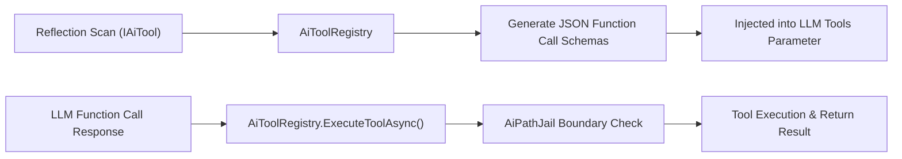

# 🔒 AiToolRegistry & Path Jail Security Framework

## 🔒 Tool Reflection & Sandboxed Execution

`AiToolRegistry` (`Modules/Layer0/AiTools/AiToolRegistry.cs`) indexes all classes implementing `IAiTool` and exports standard JSON function schemas to LLMs.

---

## 🛡️ `AiPathJail` Filesystem Security Rules
- Prevents file writing or deletion outside allowed project workspaces.
- Strictly blocks operations targeting `%WINDIR%`, `C:\Windows`, or system partition root files.
