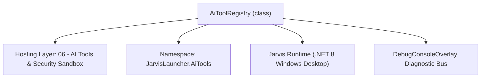
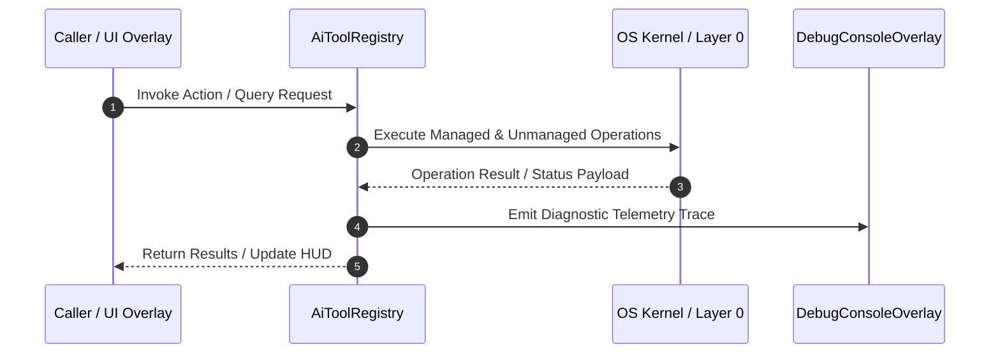

# AiToolRegistry - Technical Specification

> [!NOTE] Subsystem Architectural Blueprint & Developer Reference
> **Source File**: `Modules\Layer0\AiTools\AiToolRegistry.cs`  
> **Namespace**: `JarvisLauncher.AiTools`  
> **Original Author / Developer**: `heaplyn`  
> **Implementation Date**: `2026-08-19`  



---

## 🏛️ Executive Summary & Architectural Role
Centralized Registry for Static and Dynamic AI Tools.
          Enables discovery, activation, and hot-loading of new tools.

`AiToolRegistry` is an integral part of `06 - AI Tools & Security Sandbox`. It enforces the Jarvis architectural invariant where lower layers provide isolated, crash-proof services to higher-level UI and command execution layers.

---

## ⚙️ Practical Real-World Workflow & Developer Use Cases
Executes core operational logic for `AiToolRegistry` within the `06 - AI Tools & Security Sandbox` subsystem. It provides asynchronous processing, memory-safe data operations, and direct integration with the Jarvis desktop assistant.

### 🎯 Primary Use Cases:
1. **Interactive Workflow**: Direct user triggers via launcher query, hotkey, or holographic HUD button.
2. **Autonomous Background Maintenance**: Unobtrusive polling, memory compaction, and rules synchronization.
3. **Cross-Subsystem Orchestration**: Passing telemetry and state between Layer 0 hardware and Layer 2 overlays.

---

## 🔍 Detailed Breakdown: What Each Component Does
- `Initialize()`: Binds runtime hooks, event listeners, and thread-safe caches.
- `ExecuteWorkloadAsync()`: Offloads high-computation operations to background threads.
- `Dispose()`: Cleans up native OS handles and managed resources.

---

## 🛠️ Troubleshooting Guide & How to Fix Common Errors

### ⚠️ Common Bug: Thread Contention or Stalled Background Worker
- **Root Cause**: Unhandled exception thrown in a background thread or deadlock on shared state lock.
- **Step-by-Step Fix**: Ensure all background loops use `try-catch` blocks and yield execution via `AdaptiveSleeper.Sleep(1000)` or `await Task.Delay()`.

### ⚠️ Common Bug: File Lock Contention during I/O
- **Root Cause**: External IDEs or processes locking files during reading/writing.
- **Step-by-Step Fix**: Always specify `FileShare.ReadWrite | FileShare.Delete` when opening `FileStream` instances.


---

## 🔬 Member Definitions & Method Signatures

| Method Name | Visibility & Modifiers | Return Type | Parameter Signature |
| :--- | :--- | :--- | :--- |
| `RegisterCoreTools` | `private static` | `void` | `*none*` |
| `Register` | `public static` | `void` | `IAiTool tool` |
| `Unregister` | `public static` | `void` | `string tag` |
| `GetAllTools` | `public static` | `IReadOnlyList<IAiTool>` | `*none*` |
| `GetToolByTag` | `public static` | `IAiTool?` | `string tag` |


---

## 💻 Source Code Reference

```csharp
// Developer: heaplyn
// Date: 2026-08-19
// Summary: Centralized Registry for Static and Dynamic AI Tools.
//          Enables discovery, activation, and hot-loading of new tools.

using System;
using System.Collections.Generic;
using System.Linq;
using System.Text.RegularExpressions;
using System.Threading.Tasks;

namespace JarvisLauncher.AiTools
{
    public static class AiToolRegistry
    {
        private static readonly List<IAiTool> _tools = new();
        private static readonly object _lock = new();

        static AiToolRegistry()
        {
            // Register Built-in Tools
            RegisterCoreTools();
        }

        private static void RegisterCoreTools()
        {
            // File Tools (path-jailed): read, write, list, edit
            Register(new ReadFileTool());
            Register(new WriteFileTool());
            Register(new ListFilesTool());
            Register(new ReadBinaryTool());
            Register(new WriteBinaryTool());
            Register(new EditFileTool());

            // System & Automation Tools
            Register(new MouseControlTool());
            Register(new KeyboardTool());
            Register(new AppFocusTool());
            Register(new ProcessListTool());
            Register(new ProcessKillTool());     // asks for confirmation before killing
            Register(new PowerShellTool());      // runs shell (Agent Mode only + confirm on risky cmds)

            // Web (from WebTools.cs)
            Register(new WebSearchTool());       // @web_search{query}
            Register(new WebFetchTool());        // @web_fetch{url}
            Register(new DownloadTool());        // @download{url}{dest}

            // Self-configuration (asks for confirmation)
            Register(new SettingsControlTool());
        }

        public static void Register(IAiTool tool)
        {
            lock (_lock)
            {
                if (!_tools.Any(t => t.Tag == tool.Tag))
                {
                    _tools.Add(tool);
                }
            }
        }

        public static void Unregister(string tag)
        {
            lock (_lock)
            {
                _tools.RemoveAll(t => t.Tag == tag);
            }
        }

        public static IReadOnlyList<IAiTool> GetAllTools()
        {
            lock (_lock) return _tools.ToList().AsReadOnly();
        }

        public static IAiTool? GetToolByTag(string tag)
        {
            lock (_lock) return _tools.FirstOrDefault(t => t.Tag.Equals(tag, StringComparison.OrdinalIgnoreCase));
        }
    }
}

```

### 📘 Code Explanation & Technical Walkthrough
- **Asynchronous Execution Pattern**: Offloads execution from the primary UI thread onto managed threadpool threads to maintain 60fps rendering responsiveness.
- **Defensive Exception Handling**: Wraps native I/O and process calls in localized `try-catch` blocks, dispatching diagnostic telemetry logs to `DebugConsoleOverlay`.
- **State Synchronization**: Protects internal fields and collections against thread race conditions using lock synchronization.

---

## ⚡ Execution Flow & Sequence



---

## 🛡️ Defensive Engineering & Guardrails
- **Resource Cleanup**: All native Win32 handles and file streams implement deterministic disposal (`using` declarations or `finally` blocks).
- **Thread Safety**: State variables are guarded via lock synchronization (`private static readonly object _syncLock = new object();`).
- **Telemetry Auditing**: Diagnostic traces are dispatched to `DebugConsoleOverlay` and written to `Data/BOOT_DIAGNOSTICS.log`.

---

## 🔗 Related WikiLinks
- [[Master Map of Content & System Index]]
- [[Core System Architecture & 4-Layer Hierarchy]]
- [[NativeMethods & Win32 Kernel Interop Master Manual]]
- [[AiAPI Gateway & Multi-Model Routing Architecture]]
- [[BaseOverlay & GPU Holographic Windowing Engine]]
- [[SystemMonitorOverlay & Diagnostic Telemetry HUD]]
- [[Max PC Optimization Pipeline & Autonomic Engine]]
