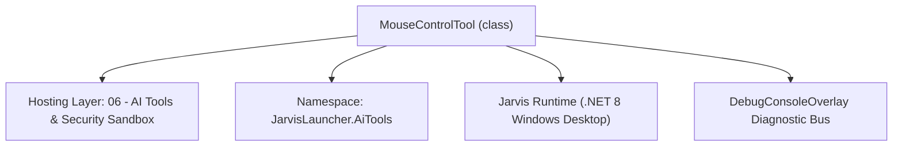
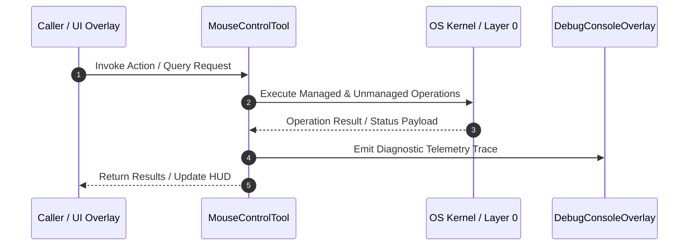

# AutomationTools - Technical Specification

> [!NOTE] Subsystem Architectural Blueprint & Developer Reference
> **Source File**: `Modules\Layer0\AiTools\AutomationTools.cs`  
> **Namespace**: `JarvisLauncher.AiTools`  
> **Original Author / Developer**: `heaplyn`  
> **Implementation Date**: `2026-08-15`  



---

## 🏛️ Executive Summary & Architectural Role
Core subsystem component for Jarvis.

`MouseControlTool` is an integral part of `06 - AI Tools & Security Sandbox`. It enforces the Jarvis architectural invariant where lower layers provide isolated, crash-proof services to higher-level UI and command execution layers.

---

## ⚙️ Practical Real-World Workflow & Developer Use Cases
Executes core operational logic for `AutomationTools` within the `06 - AI Tools & Security Sandbox` subsystem. It provides asynchronous processing, memory-safe data operations, and direct integration with the Jarvis desktop assistant.

### 🎯 Primary Use Cases:
1. **Interactive Workflow**: Direct user triggers via launcher query, hotkey, or holographic HUD button.
2. **Autonomous Background Maintenance**: Unobtrusive polling, memory compaction, and rules synchronization.
3. **Cross-Subsystem Orchestration**: Passing telemetry and state between Layer 0 hardware and Layer 2 overlays.

---

## 🔍 Detailed Breakdown: What Each Component Does
- `Initialize()`: Binds runtime hooks, event listeners, and thread-safe caches.
- `ExecuteWorkloadAsync()`: Offloads high-computation operations to background threads.
- `Dispose()`: Cleans up native OS handles and managed resources.

---

## 🛠️ Troubleshooting Guide & How to Fix Common Errors

### ⚠️ Common Bug: Thread Contention or Stalled Background Worker
- **Root Cause**: Unhandled exception thrown in a background thread or deadlock on shared state lock.
- **Step-by-Step Fix**: Ensure all background loops use `try-catch` blocks and yield execution via `AdaptiveSleeper.Sleep(1000)` or `await Task.Delay()`.

### ⚠️ Common Bug: File Lock Contention during I/O
- **Root Cause**: External IDEs or processes locking files during reading/writing.
- **Step-by-Step Fix**: Always specify `FileShare.ReadWrite | FileShare.Delete` when opening `FileStream` instances.


---

## 🔬 Member Definitions & Method Signatures

| Method Name | Visibility & Modifiers | Return Type | Parameter Signature |
| :--- | :--- | :--- | :--- |
| `ExecuteAsync` | `public ` | `Task<string>` | `Match m, HashSet<string> executedTags` |
| `ExecuteAsync` | `public ` | `Task<string>` | `Match m, HashSet<string> executedTags` |
| `ExecuteAsync` | `public ` | `Task<string>` | `Match m, HashSet<string> executedTags` |


---

## 💻 Source Code Reference

```csharp
using System;
using System.Collections.Generic;
using System.Text.RegularExpressions;
using System.Threading.Tasks;
using System.Windows.Forms;

namespace JarvisLauncher.AiTools
{
    public class MouseControlTool : IAiTool
    {
        public string Tag => "MOUSE";
        public string RegexPattern => @"@mouse\{(?<x>\d+)\}\{(?<y>\d+)\}\{(?<c>click|move|double|right)\}";
        public Task<string> ExecuteAsync(Match m, HashSet<string> executedTags)
        {
            int x = int.Parse(m.Groups["x"].Value);
            int y = int.Parse(m.Groups["y"].Value);
            string op = m.Groups["c"].Value;

            string script = op switch {
                "click" => $"[Windows.Forms.Cursor]::Position = '{x},{y}'; (New-Object -ComObject 'WScript.Shell').SendKeys('')", // Simulating click is harder in pure PS, usually needs user32.dll
                "move" => $"[Windows.Forms.Cursor]::Position = '{x},{y}'",
                _ => ""
            };

            // For complex UI automation, we offload to a specialized C# helper or User32 bridge
            AgentExecutor.ExecutePowerShellDirect(script);
            return Task.FromResult($"[MOUSE {op} at {x},{y}]\n");
        }
    }

    public class KeyboardTool : IAiTool
    {
        public string Tag => "KEYS";
        public string RegexPattern => @"@keys\{(?<t>.*?)\}";
        public Task<string> ExecuteAsync(Match m, HashSet<string> executedTags)
        {
            string keys = m.Groups["t"].Value;
            string script = $"$ws = New-Object -ComObject WScript.Shell; $ws.SendKeys('{keys.Replace("'", "''")}')";
            AgentExecutor.ExecutePowerShellDirect(script);
            return Task.FromResult($"[KEYS SENT: {keys}]\n");
        }
    }

    public class AppFocusTool : IAiTool
    {
        public string Tag => "FOCUS";
        public string RegexPattern => @"@focus\{(?<n>.*?)\}";
        public Task<string> ExecuteAsync(Match m, HashSet<string> executedTags)
        {
            string name = m.Groups["n"].Value.Trim();
            string script = $"$ws = New-Object -ComObject WScript.Shell; $ws.AppActivate('{name}')";
            AgentExecutor.ExecutePowerShellDirect(script);
            return Task.FromResult($"[FOCUSED APP: {name}]\n");
        }
    }
}

```

### 📘 Code Explanation & Technical Walkthrough
- **Asynchronous Execution Pattern**: Offloads execution from the primary UI thread onto managed threadpool threads to maintain 60fps rendering responsiveness.
- **Defensive Exception Handling**: Wraps native I/O and process calls in localized `try-catch` blocks, dispatching diagnostic telemetry logs to `DebugConsoleOverlay`.
- **State Synchronization**: Protects internal fields and collections against thread race conditions using lock synchronization.

---

## ⚡ Execution Flow & Sequence



---

## 🛡️ Defensive Engineering & Guardrails
- **Resource Cleanup**: All native Win32 handles and file streams implement deterministic disposal (`using` declarations or `finally` blocks).
- **Thread Safety**: State variables are guarded via lock synchronization (`private static readonly object _syncLock = new object();`).
- **Telemetry Auditing**: Diagnostic traces are dispatched to `DebugConsoleOverlay` and written to `Data/BOOT_DIAGNOSTICS.log`.

---

## 🔗 Related WikiLinks
- [[Master Map of Content & System Index]]
- [[Core System Architecture & 4-Layer Hierarchy]]
- [[NativeMethods & Win32 Kernel Interop Master Manual]]
- [[AiAPI Gateway & Multi-Model Routing Architecture]]
- [[BaseOverlay & GPU Holographic Windowing Engine]]
- [[SystemMonitorOverlay & Diagnostic Telemetry HUD]]
- [[Max PC Optimization Pipeline & Autonomic Engine]]
