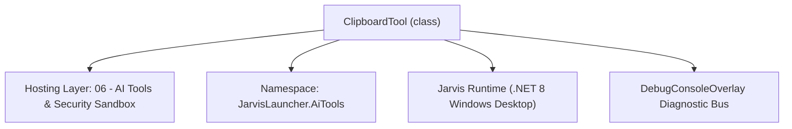
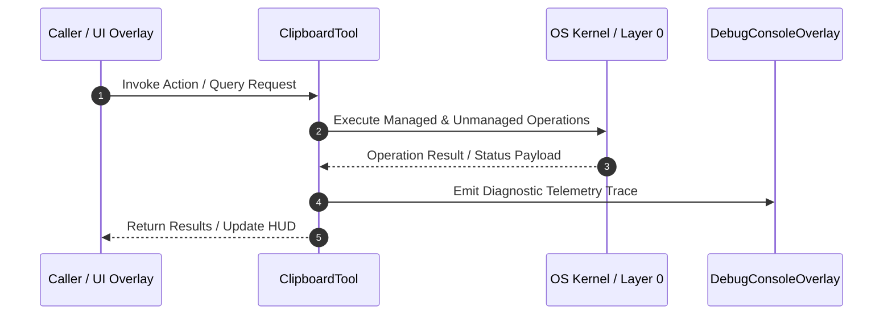

# ExtraAutomationTools - Technical Specification

> [!NOTE] Subsystem Architectural Blueprint & Developer Reference
> **Source File**: `Modules\Layer0\AiTools\ExtraAutomationTools.cs`  
> **Namespace**: `JarvisLauncher.AiTools`  
> **Original Author / Developer**: `heaplyn`  
> **Implementation Date**: `2026-08-15`  



---

## 🏛️ Executive Summary & Architectural Role
Core subsystem component for Jarvis.

`ClipboardTool` is an integral part of `06 - AI Tools & Security Sandbox`. It enforces the Jarvis architectural invariant where lower layers provide isolated, crash-proof services to higher-level UI and command execution layers.

---

## ⚙️ Practical Real-World Workflow & Developer Use Cases
Executes core operational logic for `ExtraAutomationTools` within the `06 - AI Tools & Security Sandbox` subsystem. It provides asynchronous processing, memory-safe data operations, and direct integration with the Jarvis desktop assistant.

### 🎯 Primary Use Cases:
1. **Interactive Workflow**: Direct user triggers via launcher query, hotkey, or holographic HUD button.
2. **Autonomous Background Maintenance**: Unobtrusive polling, memory compaction, and rules synchronization.
3. **Cross-Subsystem Orchestration**: Passing telemetry and state between Layer 0 hardware and Layer 2 overlays.

---

## 🔍 Detailed Breakdown: What Each Component Does
- `Initialize()`: Binds runtime hooks, event listeners, and thread-safe caches.
- `ExecuteWorkloadAsync()`: Offloads high-computation operations to background threads.
- `Dispose()`: Cleans up native OS handles and managed resources.

---

## 🛠️ Troubleshooting Guide & How to Fix Common Errors

### ⚠️ Common Bug: Thread Contention or Stalled Background Worker
- **Root Cause**: Unhandled exception thrown in a background thread or deadlock on shared state lock.
- **Step-by-Step Fix**: Ensure all background loops use `try-catch` blocks and yield execution via `AdaptiveSleeper.Sleep(1000)` or `await Task.Delay()`.

### ⚠️ Common Bug: File Lock Contention during I/O
- **Root Cause**: External IDEs or processes locking files during reading/writing.
- **Step-by-Step Fix**: Always specify `FileShare.ReadWrite | FileShare.Delete` when opening `FileStream` instances.


---

## 🔬 Member Definitions & Method Signatures

| Method Name | Visibility & Modifiers | Return Type | Parameter Signature |
| :--- | :--- | :--- | :--- |
| `ExecuteAsync` | `public ` | `Task<string>` | `Match m, HashSet<string> executedTags` |
| `ExecuteAsync` | `public ` | `Task<string>` | `Match m, HashSet<string> executedTags` |
| `ExecuteAsync` | `public ` | `Task<string>` | `Match m, HashSet<string> executedTags` |
| `ExecuteAsync` | `public ` | `Task<string>` | `Match m, HashSet<string> executedTags` |


---

## 💻 Source Code Reference

```csharp
using System;
using System.Collections.Generic;
using System.Text.RegularExpressions;
using System.Threading.Tasks;
using System.Windows;
using System.Windows.Media;
using System.IO;
using System.IO.Compression;
using Microsoft.Win32;

namespace JarvisLauncher.AiTools
{
    public class ClipboardTool : IAiTool
    {
        public string Tag => "CLIP";
        public string RegexPattern => @"@clip_write\{(?<t>.*?)\}";
        public Task<string> ExecuteAsync(Match m, HashSet<string> executedTags)
        {
            string t = m.Groups["t"].Value;
            Application.Current.Dispatcher.Invoke(() => { try { Clipboard.SetText(t); } catch { } });
            return Task.FromResult($"[CLIPBOARD UPDATED]\n");
        }
    }

    public class RegistryReadTool : IAiTool
    {
        public string Tag => "REG_R";
        public string RegexPattern => @"@reg_read\{(?<p>.*?)\}\{(?<k>.*?)\}";
        public Task<string> ExecuteAsync(Match m, HashSet<string> executedTags)
        {
            try {
                string p = m.Groups["p"].Value;
                string k = m.Groups["k"].Value;
                var val = Registry.GetValue(p, k, "NOT_FOUND");
                return Task.FromResult($"[REGISTRY {p}\\{k}]: {val}\n");
            } catch (Exception ex) { return Task.FromResult($"[REG ERROR]: {ex.Message}\n"); }
        }
    }

    public class ArchiveTool : IAiTool
    {
        public string Tag => "ZIP";
        public string RegexPattern => @"@zip\{(?<s>.*?)\}\{(?<d>.*?)\}";
        public Task<string> ExecuteAsync(Match m, HashSet<string> executedTags)
        {
            try {
                string s = m.Groups["s"].Value;
                string d = m.Groups["d"].Value;
                if (File.Exists(d)) File.Delete(d);
                ZipFile.CreateFromDirectory(s, d);
                return Task.FromResult($"[ARCHIVE CREATED: {d}]\n");
            } catch (Exception ex) { return Task.FromResult($"[ZIP ERROR]: {ex.Message}\n"); }
        }
    }

    public class ScreenInfoTool : IAiTool
    {
        public string Tag => "SCR";
        public string RegexPattern => @"@monitor_info";
        public Task<string> ExecuteAsync(Match m, HashSet<string> executedTags)
        {
            return Application.Current.Dispatcher.Invoke(() => {
                var w = SystemParameters.PrimaryScreenWidth;
                var h = SystemParameters.PrimaryScreenHeight;
                double dpi = 96.0;
                if (Application.Current.MainWindow != null) dpi = VisualTreeHelper.GetDpi(Application.Current.MainWindow).PixelsPerInchX;
                return Task.FromResult($"[MONITOR]: {w}x{h}, DPI: {dpi}\n");
            });
        }
    }
}

```

### 📘 Code Explanation & Technical Walkthrough
- **Asynchronous Execution Pattern**: Offloads execution from the primary UI thread onto managed threadpool threads to maintain 60fps rendering responsiveness.
- **Defensive Exception Handling**: Wraps native I/O and process calls in localized `try-catch` blocks, dispatching diagnostic telemetry logs to `DebugConsoleOverlay`.
- **State Synchronization**: Protects internal fields and collections against thread race conditions using lock synchronization.

---

## ⚡ Execution Flow & Sequence



---

## 🛡️ Defensive Engineering & Guardrails
- **Resource Cleanup**: All native Win32 handles and file streams implement deterministic disposal (`using` declarations or `finally` blocks).
- **Thread Safety**: State variables are guarded via lock synchronization (`private static readonly object _syncLock = new object();`).
- **Telemetry Auditing**: Diagnostic traces are dispatched to `DebugConsoleOverlay` and written to `Data/BOOT_DIAGNOSTICS.log`.

---

## 🔗 Related WikiLinks
- [[Master Map of Content & System Index]]
- [[Core System Architecture & 4-Layer Hierarchy]]
- [[NativeMethods & Win32 Kernel Interop Master Manual]]
- [[AiAPI Gateway & Multi-Model Routing Architecture]]
- [[BaseOverlay & GPU Holographic Windowing Engine]]
- [[SystemMonitorOverlay & Diagnostic Telemetry HUD]]
- [[Max PC Optimization Pipeline & Autonomic Engine]]
