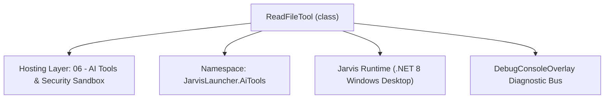
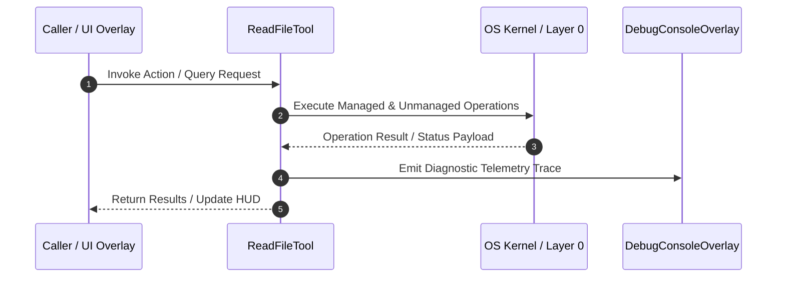

# FileTools - Technical Specification

> [!NOTE] Subsystem Architectural Blueprint & Developer Reference
> **Source File**: `Modules\Layer0\AiTools\FileTools.cs`  
> **Namespace**: `JarvisLauncher.AiTools`  
> **Original Author / Developer**: `heaplyn`  
> **Implementation Date**: `2026-08-15`  



---

## 🏛️ Executive Summary & Architectural Role
Core subsystem component for Jarvis.

`ReadFileTool` is an integral part of `06 - AI Tools & Security Sandbox`. It enforces the Jarvis architectural invariant where lower layers provide isolated, crash-proof services to higher-level UI and command execution layers.

---

## ⚙️ Practical Real-World Workflow & Developer Use Cases
Executes core operational logic for `FileTools` within the `06 - AI Tools & Security Sandbox` subsystem. It provides asynchronous processing, memory-safe data operations, and direct integration with the Jarvis desktop assistant.

### 🎯 Primary Use Cases:
1. **Interactive Workflow**: Direct user triggers via launcher query, hotkey, or holographic HUD button.
2. **Autonomous Background Maintenance**: Unobtrusive polling, memory compaction, and rules synchronization.
3. **Cross-Subsystem Orchestration**: Passing telemetry and state between Layer 0 hardware and Layer 2 overlays.

---

## 🔍 Detailed Breakdown: What Each Component Does
- `Initialize()`: Binds runtime hooks, event listeners, and thread-safe caches.
- `ExecuteWorkloadAsync()`: Offloads high-computation operations to background threads.
- `Dispose()`: Cleans up native OS handles and managed resources.

---

## 🛠️ Troubleshooting Guide & How to Fix Common Errors

### ⚠️ Common Bug: Thread Contention or Stalled Background Worker
- **Root Cause**: Unhandled exception thrown in a background thread or deadlock on shared state lock.
- **Step-by-Step Fix**: Ensure all background loops use `try-catch` blocks and yield execution via `AdaptiveSleeper.Sleep(1000)` or `await Task.Delay()`.

### ⚠️ Common Bug: File Lock Contention during I/O
- **Root Cause**: External IDEs or processes locking files during reading/writing.
- **Step-by-Step Fix**: Always specify `FileShare.ReadWrite | FileShare.Delete` when opening `FileStream` instances.


---

## 🔬 Member Definitions & Method Signatures

| Method Name | Visibility & Modifiers | Return Type | Parameter Signature |
| :--- | :--- | :--- | :--- |
| `ExecuteAsync` | `public async` | `Task<string>` | `Match m, HashSet<string> executedTags` |
| `ExecuteAsync` | `public async` | `Task<string>` | `Match m, HashSet<string> executedTags` |
| `ExecuteAsync` | `public ` | `Task<string>` | `Match m, HashSet<string> executedTags` |
| `ExecuteAsync` | `public async` | `Task<string>` | `Match m, HashSet<string> executedTags` |
| `ExecuteAsync` | `public async` | `Task<string>` | `Match m, HashSet<string> executedTags` |


---

## 💻 Source Code Reference

```csharp
using System;
using System.Collections.Generic;
using System.IO;
using System.Linq;
using System.Text.RegularExpressions;
using System.Threading.Tasks;

namespace JarvisLauncher.AiTools
{
    public class ReadFileTool : IAiTool
    {
        public string Tag => "RF";
        public string RegexPattern => @"@rf\{(?<p>.*?)\}";
        public async Task<string> ExecuteAsync(Match m, HashSet<string> executedTags)
        {
            string p = m.Groups["p"].Value.Trim().Trim('"', '\'');
            if (!executedTags.Add("RF:" + p)) return "";
            if (!AiPathJail.TryResolve(p, out string full, out string err)) return err;
            if (File.Exists(full)) {
                string content = await File.ReadAllTextAsync(full);
                return $"[FILE: {p}]\n{(content.Length > 3000 ? content.Substring(0, 3000) + "... [Truncated]" : content)}\n[END]\n";
            }
            return $"[ERROR: File {p} not found]\n";
        }
    }

    public class WriteFileTool : IAiTool
    {
        public string Tag => "WF";
        public string RegexPattern => @"@wf\{(?<p>.*?)\}\{(?<c>.*?)\}";
        public async Task<string> ExecuteAsync(Match m, HashSet<string> executedTags)
        {
            string p = m.Groups["p"].Value.Trim().Trim('"', '\'');
            string c = m.Groups["c"].Value;
            if (!executedTags.Add("WF:" + p + c.GetHashCode())) return "";
            if (!AiPathJail.TryResolve(p, out string full, out string err)) return err;
            Directory.CreateDirectory(Path.GetDirectoryName(full) ?? AiPathJail.Root);
            await File.WriteAllTextAsync(full, c);
            SemanticMemoryManager.AddTrackedFile(full);
            return $"[WRITTEN: {p}]\n";
        }
    }

    public class ListFilesTool : IAiTool
    {
        public string Tag => "LS";
        public string RegexPattern => @"@ls\{(?<p>.*?)\}";
        public Task<string> ExecuteAsync(Match m, HashSet<string> executedTags)
        {
            string p = m.Groups["p"].Value.Trim().Trim('"', '\'');
            if (!AiPathJail.TryResolve(p, out string full, out string err)) return Task.FromResult(err);
            if (Directory.Exists(full)) {
                var entries = Directory.GetFileSystemEntries(full).Select(Path.GetFileName).Take(50);
                return Task.FromResult($"[DIR {p}]:\n{string.Join("\n", entries)}\n");
            }
            return Task.FromResult($"[ERROR: Dir {p} not found]\n");
        }
    }

    public class ReadBinaryTool : IAiTool
    {
        public string Tag => "RF_B";
        public string RegexPattern => @"@rf_b\{(?<p>.*?)\}";
        public async Task<string> ExecuteAsync(Match m, HashSet<string> executedTags)
        {
            string p = m.Groups["p"].Value.Trim().Trim('"', '\'');
            if (!executedTags.Add("RF_B:" + p)) return "";
            if (!AiPathJail.TryResolve(p, out string full, out string err)) return err;
            if (File.Exists(full)) {
                byte[] data = await File.ReadAllBytesAsync(full);
                string b64 = Convert.ToBase64String(data);
                return $"[BINARY FILE: {p}]\n[BASE64]: {b64}\n[END]\n";
            }
            return $"[ERROR: File {p} not found]\n";
        }
    }

    public class WriteBinaryTool : IAiTool
    {
        public string Tag => "WF_B";
        public string RegexPattern => @"@wf_b\{(?<p>.*?)\}\{(?<b>.*?)\}";
        public async Task<string> ExecuteAsync(Match m, HashSet<string> executedTags)
        {
            string p = m.Groups["p"].Value.Trim().Trim('"', '\'');
            string b = m.Groups["b"].Value.Trim();
            if (!executedTags.Add("WF_B:" + p)) return "";
            if (!AiPathJail.TryResolve(p, out string full, out string err)) return err;
            try {
                byte[] data = Convert.FromBase64String(b);
                Directory.CreateDirectory(Path.GetDirectoryName(full) ?? AiPathJail.Root);
                await File.WriteAllBytesAsync(full, data);
                return $"[WRITTEN BINARY: {p}]\n";
            } catch (Exception ex) { return $"[ERROR WF_B]: {ex.Message}\n"; }
        }
    }
}
```

### 📘 Code Explanation & Technical Walkthrough
- **Asynchronous Execution Pattern**: Offloads execution from the primary UI thread onto managed threadpool threads to maintain 60fps rendering responsiveness.
- **Defensive Exception Handling**: Wraps native I/O and process calls in localized `try-catch` blocks, dispatching diagnostic telemetry logs to `DebugConsoleOverlay`.
- **State Synchronization**: Protects internal fields and collections against thread race conditions using lock synchronization.

---

## ⚡ Execution Flow & Sequence



---

## 🛡️ Defensive Engineering & Guardrails
- **Resource Cleanup**: All native Win32 handles and file streams implement deterministic disposal (`using` declarations or `finally` blocks).
- **Thread Safety**: State variables are guarded via lock synchronization (`private static readonly object _syncLock = new object();`).
- **Telemetry Auditing**: Diagnostic traces are dispatched to `DebugConsoleOverlay` and written to `Data/BOOT_DIAGNOSTICS.log`.

---

## 🔗 Related WikiLinks
- [[Master Map of Content & System Index]]
- [[Core System Architecture & 4-Layer Hierarchy]]
- [[NativeMethods & Win32 Kernel Interop Master Manual]]
- [[AiAPI Gateway & Multi-Model Routing Architecture]]
- [[BaseOverlay & GPU Holographic Windowing Engine]]
- [[SystemMonitorOverlay & Diagnostic Telemetry HUD]]
- [[Max PC Optimization Pipeline & Autonomic Engine]]
