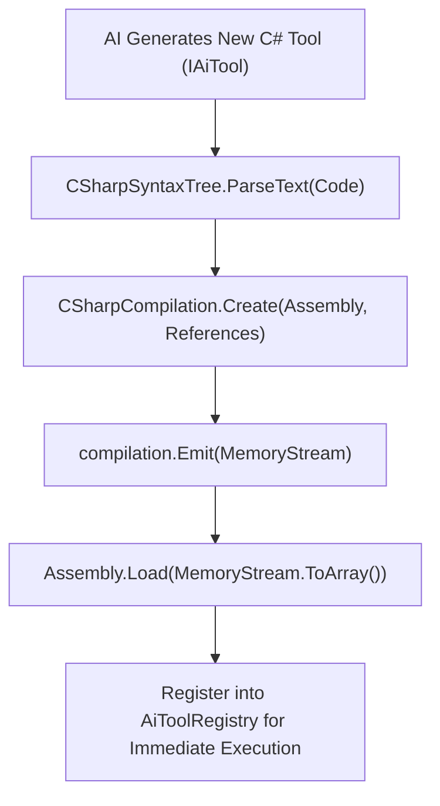

# 🧬 Self-Evolving Tool Engine & In-Memory Roslyn Compiler

## 🧬 Dynamic In-Memory Roslyn Tool Compilation

`SelfEvolvingToolEngine` (`Modules/Layer0/AiTools/SelfEvolvingToolEngine.cs`) allows Jarvis to dynamically write, compile, and execute new C# tools at runtime using Roslyn (`Microsoft.CodeAnalysis.CSharp`).

