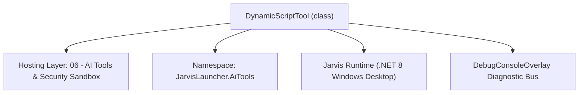
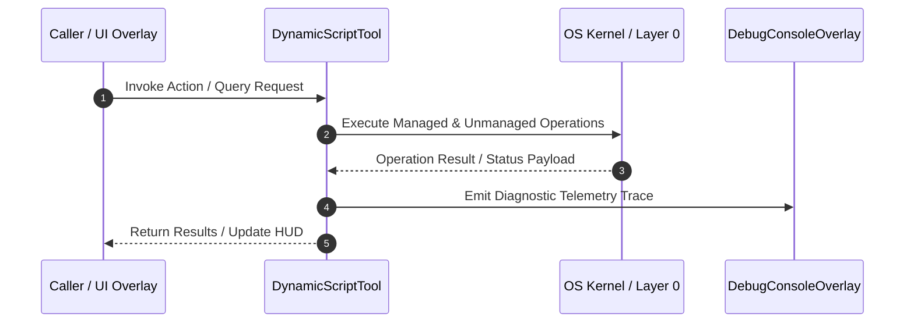

# SelfEvolvingToolEngine - Technical Specification

> [!NOTE] Subsystem Architectural Blueprint & Developer Reference
> **Source File**: `Modules\Layer0\AiTools\SelfEvolvingToolEngine.cs`  
> **Namespace**: `JarvisLauncher.AiTools`  
> **Original Author / Developer**: `heaplyn`  
> **Implementation Date**: `2026-08-19`  



---

## 🏛️ Executive Summary & Architectural Role
Autonomous Tool Synthesis Engine.
          Allows the AI to design, verify, and register its own tools at runtime.

`DynamicScriptTool` is an integral part of `06 - AI Tools & Security Sandbox`. It enforces the Jarvis architectural invariant where lower layers provide isolated, crash-proof services to higher-level UI and command execution layers.

---

## ⚙️ Practical Real-World Workflow & Developer Use Cases
Executes core operational logic for `SelfEvolvingToolEngine` within the `06 - AI Tools & Security Sandbox` subsystem. It provides asynchronous processing, memory-safe data operations, and direct integration with the Jarvis desktop assistant.

### 🎯 Primary Use Cases:
1. **Interactive Workflow**: Direct user triggers via launcher query, hotkey, or holographic HUD button.
2. **Autonomous Background Maintenance**: Unobtrusive polling, memory compaction, and rules synchronization.
3. **Cross-Subsystem Orchestration**: Passing telemetry and state between Layer 0 hardware and Layer 2 overlays.

---

## 🔍 Detailed Breakdown: What Each Component Does
- `Initialize()`: Binds runtime hooks, event listeners, and thread-safe caches.
- `ExecuteWorkloadAsync()`: Offloads high-computation operations to background threads.
- `Dispose()`: Cleans up native OS handles and managed resources.

---

## 🛠️ Troubleshooting Guide & How to Fix Common Errors

### ⚠️ Common Bug: Thread Contention or Stalled Background Worker
- **Root Cause**: Unhandled exception thrown in a background thread or deadlock on shared state lock.
- **Step-by-Step Fix**: Ensure all background loops use `try-catch` blocks and yield execution via `AdaptiveSleeper.Sleep(1000)` or `await Task.Delay()`.

### ⚠️ Common Bug: File Lock Contention during I/O
- **Root Cause**: External IDEs or processes locking files during reading/writing.
- **Step-by-Step Fix**: Always specify `FileShare.ReadWrite | FileShare.Delete` when opening `FileStream` instances.


---

## 🔬 Member Definitions & Method Signatures

| Method Name | Visibility & Modifiers | Return Type | Parameter Signature |
| :--- | :--- | :--- | :--- |
| `ExecuteAsync` | `public ` | `Task<string>` | `Match match, HashSet<string> executedTags` |
| `ProcessToolSynthesisAsync` | `public static` | `Task<string>` | `string aiResponse` |


---

## 💻 Source Code Reference

```csharp
// Developer: heaplyn
// Date: 2026-08-19
// Summary: Autonomous Tool Synthesis Engine.
//          Allows the AI to design, verify, and register its own tools at runtime.

using System;
using System.Collections.Generic;
using System.Text.RegularExpressions;
using System.Threading.Tasks;

namespace JarvisLauncher.AiTools
{
    public class DynamicScriptTool : IAiTool
    {
        public string Tag { get; }
        public string RegexPattern { get; }
        public string PowerShellScriptTemplate { get; }
        public bool IsVerified { get; set; } = false;

        public DynamicScriptTool(string tag, string pattern, string script)
        {
            Tag = tag;
            RegexPattern = pattern;
            PowerShellScriptTemplate = script;
        }

        public Task<string> ExecuteAsync(Match match, HashSet<string> executedTags)
        {
            if (!executedTags.Add(Tag + ":" + match.Value.GetHashCode())) return Task.FromResult("");
            if (!CoreRegistry.Data.Settings.Current.ENABLE_PC_CONTROL)
                return Task.FromResult("[BLOCKED: enable Agent Mode to run synthesized tools]\n");
            string script = PowerShellScriptTemplate;
            foreach (string g in match.Groups.Keys)
            {
                if (int.TryParse(g, out _)) continue;
                script = script.Replace($"${{{g}}}", match.Groups[g].Value);
            }
            string result = AgentExecutor.ExecutePowerShellDirect(script);
            return Task.FromResult($"[DYNAMIC TOOL {Tag}]:\n{result}\n");
        }
    }

    public static class SelfEvolvingToolEngine
    {
        // Agent Mode only. Each synthesized tool is confirmed by the user before it is registered,
        // because it runs arbitrary PowerShell. This is how the model builds a reusable capability
        // for a repeated complex task instead of redoing it each turn.
        public static Task<string> ProcessToolSynthesisAsync(string aiResponse)
        {
            if (!CoreRegistry.Data.Settings.Current.ENABLE_PC_CONTROL) return Task.FromResult(string.Empty);

            var rx = new Regex(@"@new_tool\{(?<tag>.*?)\}\{(?<regex>.*?)\}\{(?<script>.*?)\}", RegexOptions.Singleline);
            int created = 0;
            foreach (Match m in rx.Matches(aiResponse))
            {
                string tag = m.Groups["tag"].Value.Trim();
                string pattern = m.Groups["regex"].Value.Trim();
                string script = m.Groups["script"].Value.Trim();
                if (string.IsNullOrEmpty(tag) || string.IsNullOrEmpty(pattern)) continue;

                if (!HumanConfirm.Ask($"Jarvis (AI) wants to CREATE a reusable tool '{tag}' that runs this script:\n\n{script}\n\nAllow?"))
                    continue;

                AiToolRegistry.Register(new DynamicScriptTool(tag, pattern, script) { IsVerified = true });
                created++;
                try { DebugConsoleOverlay.Log("Tool-Evolution", $"Synthesized & registered tool: {tag}"); } catch { }
            }
            return Task.FromResult(created > 0 ? $"[SYSTEM]: {created} new tool(s) created.\n" : "");
        }
    }
}
```

### 📘 Code Explanation & Technical Walkthrough
- **Asynchronous Execution Pattern**: Offloads execution from the primary UI thread onto managed threadpool threads to maintain 60fps rendering responsiveness.
- **Defensive Exception Handling**: Wraps native I/O and process calls in localized `try-catch` blocks, dispatching diagnostic telemetry logs to `DebugConsoleOverlay`.
- **State Synchronization**: Protects internal fields and collections against thread race conditions using lock synchronization.

---

## ⚡ Execution Flow & Sequence



---

## 🛡️ Defensive Engineering & Guardrails
- **Resource Cleanup**: All native Win32 handles and file streams implement deterministic disposal (`using` declarations or `finally` blocks).
- **Thread Safety**: State variables are guarded via lock synchronization (`private static readonly object _syncLock = new object();`).
- **Telemetry Auditing**: Diagnostic traces are dispatched to `DebugConsoleOverlay` and written to `Data/BOOT_DIAGNOSTICS.log`.

---

## 🔗 Related WikiLinks
- [[Master Map of Content & System Index]]
- [[Core System Architecture & 4-Layer Hierarchy]]
- [[NativeMethods & Win32 Kernel Interop Master Manual]]
- [[AiAPI Gateway & Multi-Model Routing Architecture]]
- [[BaseOverlay & GPU Holographic Windowing Engine]]
- [[SystemMonitorOverlay & Diagnostic Telemetry HUD]]
- [[Max PC Optimization Pipeline & Autonomic Engine]]
