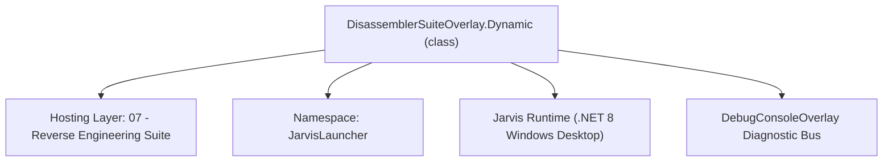
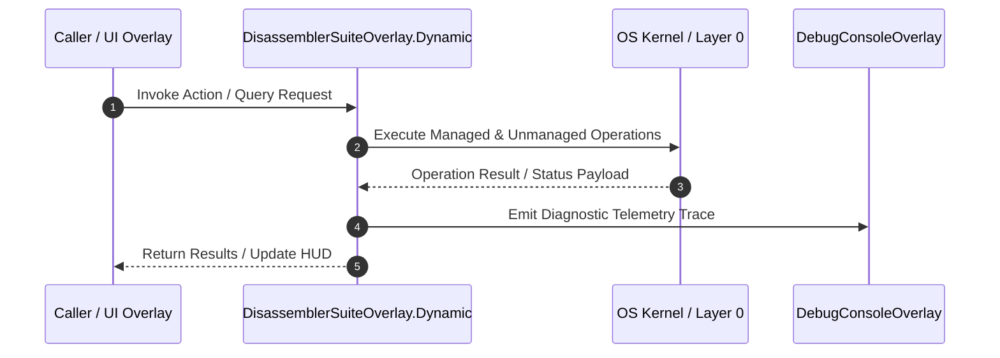

# DisassemblerSuiteOverlay.Dynamic - Technical Specification

> [!NOTE] Subsystem Architectural Blueprint & Developer Reference
> **Source File**: `Modules\Layer2\Dev\DisassemblerSuite\Ring2_UI\DisassemblerSuiteOverlay.Dynamic.cs`  
> **Namespace**: `JarvisLauncher`  
> **Original Author / Developer**: `heaplyn`  
> **Implementation Date**: `2026-08-15`  



---

## 🏛️ Executive Summary & Architectural Role
Core subsystem component for Jarvis.

`DisassemblerSuiteOverlay.Dynamic` is an integral part of `07 - Reverse Engineering Suite`. It enforces the Jarvis architectural invariant where lower layers provide isolated, crash-proof services to higher-level UI and command execution layers.

---

## ⚙️ Practical Real-World Workflow & Developer Use Cases
Executes core operational logic for `DisassemblerSuiteOverlay.Dynamic` within the `07 - Reverse Engineering Suite` subsystem. It provides asynchronous processing, memory-safe data operations, and direct integration with the Jarvis desktop assistant.

### 🎯 Primary Use Cases:
1. **Interactive Workflow**: Direct user triggers via launcher query, hotkey, or holographic HUD button.
2. **Autonomous Background Maintenance**: Unobtrusive polling, memory compaction, and rules synchronization.
3. **Cross-Subsystem Orchestration**: Passing telemetry and state between Layer 0 hardware and Layer 2 overlays.

---

## 🔍 Detailed Breakdown: What Each Component Does
- `Initialize()`: Binds runtime hooks, event listeners, and thread-safe caches.
- `ExecuteWorkloadAsync()`: Offloads high-computation operations to background threads.
- `Dispose()`: Cleans up native OS handles and managed resources.

---

## 🛠️ Troubleshooting Guide & How to Fix Common Errors

### ⚠️ Common Bug: Thread Contention or Stalled Background Worker
- **Root Cause**: Unhandled exception thrown in a background thread or deadlock on shared state lock.
- **Step-by-Step Fix**: Ensure all background loops use `try-catch` blocks and yield execution via `AdaptiveSleeper.Sleep(1000)` or `await Task.Delay()`.

### ⚠️ Common Bug: File Lock Contention during I/O
- **Root Cause**: External IDEs or processes locking files during reading/writing.
- **Step-by-Step Fix**: Always specify `FileShare.ReadWrite | FileShare.Delete` when opening `FileStream` instances.


---

## 🔬 Member Definitions & Method Signatures

| Method Name | Visibility & Modifiers | Return Type | Parameter Signature |
| :--- | :--- | :--- | :--- |
| `GroupSelectedSymbols` | `private ` | `void` | `*none*` |
| `MergeSymbolGroups` | `private ` | `void` | `*none*` |
| `ToggleAssemblyEditMode` | `private ` | `void` | `*none*` |
| `RefreshProcessList` | `private ` | `void` | `*none*` |
| `ToggleTracerInjection` | `private ` | `void` | `*none*` |
| `StartTracer` | `private ` | `void` | `*none*` |
| `StopTracer` | `private ` | `void` | `*none*` |
| `LogNextInstruction` | `private ` | `void` | `*none*` |
| `RefreshModuleList` | `private ` | `void` | `*none*` |
| `RunMegaDump` | `private async` | `void` | `*none*` |
| `FixDumpHeaders` | `private ` | `void` | `*none*` |
| `VisualizeBinaryBlobs` | `private ` | `void` | `*none*` |


---

## 💻 Source Code Reference

```csharp
// Developer: heaplyn
// Part of the JARVIS Disassembler Suite — split into a ring-layered module set.
// This file is a partial of DisassemblerSuiteOverlay (see Ring2_UI/DisassemblerSuiteOverlay.cs).

using System;
using System.Collections.Generic;
using System.IO;
using System.Linq;
using System.Text;
using System.Threading.Tasks;
using System.Windows;
using System.Windows.Controls;
using System.Windows.Controls.Primitives;
using System.Windows.Input;
using System.Windows.Media;
using System.Windows.Media.Animation;
using System.Reflection;
using System.Reflection.Emit;
using System.Net.Http;
using System.Diagnostics;
using System.Text.RegularExpressions;
using System.Text.Json;

namespace JarvisLauncher
{
    public partial class DisassemblerSuiteOverlay : BaseOverlay
    {
        // ─── Symbol Grouping Methods ───────────────────────────────────────────────

        private void GroupSelectedSymbols()
        {
            var selected = _symbolsList.SelectedItems.Cast<object>().Select(o => o?.ToString() ?? "").Where(s => !string.IsNullOrEmpty(s)).ToList();
            if (selected.Count == 0)
            {
                MessageBox.Show("Select one or more symbols from the list to group.", "No Selection", MessageBoxButton.OK, MessageBoxImage.Warning);
                return;
            }

            var dialog = new Window
            {
                Title = "📂 Create Symbol Group",
                Width = 350, Height = 160,
                WindowStartupLocation = WindowStartupLocation.CenterOwner,
                Owner = this, WindowStyle = WindowStyle.ToolWindow, ResizeMode = ResizeMode.NoResize,
                Background = new SolidColorBrush(Color.FromRgb(30, 30, 35)), Foreground = Brushes.White
            };
            var stack = new StackPanel { Margin = new Thickness(12) };
            var lbl = new TextBlock { Text = $"Group name for {selected.Count} symbol(s):", Margin = new Thickness(0,0,0,8), FontSize = 12 };
            lbl.SetResourceReference(TextBlock.ForegroundProperty, "TextPrimaryBrush");
            stack.Children.Add(lbl);
            var input = new TextBox { Height = 26, Padding = new Thickness(4,2,4,2), Margin = new Thickness(0,0,0,8) };
            input.SetResourceReference(TextBox.ForegroundProperty, "TextPrimaryBrush");
            input.SetResourceReference(TextBox.BackgroundProperty, "HoverBackgroundBrush");
            stack.Children.Add(input);
            var btnPanel = new StackPanel { Orientation = Orientation.Horizontal, HorizontalAlignment = HorizontalAlignment.Right };
            var ok = CreateStyledButton("OK", (s, e) => { dialog.DialogResult = true; dialog.Close(); }, isPrimary: true, fontSize: 10);
            ok.Width = 65;
            var cancel = CreateStyledButton("Cancel", (s, e) => { dialog.DialogResult = false; dialog.Close(); }, isPrimary: false, fontSize: 10);
            cancel.Width = 65; cancel.Margin = new Thickness(8, 0, 0, 0);
            btnPanel.Children.Add(ok); btnPanel.Children.Add(cancel);
            stack.Children.Add(btnPanel);
            dialog.Content = stack;

            if (dialog.ShowDialog() == true)
            {
                string groupName = input.Text.Trim();
                if (!string.IsNullOrEmpty(groupName))
                {
                    if (!_symbolGroups.ContainsKey(groupName)) _symbolGroups[groupName] = new List<string>();
                    _symbolGroups[groupName].AddRange(selected);
                    // Annotate items in list
                    for (int i = 0; i < _symbolsList.Items.Count; i++)
                    {
                        string item = _symbolsList.Items[i]?.ToString() ?? "";
                        if (selected.Contains(item))
                            _symbolsList.Items[i] = $"[{groupName}] {item}";
                    }
                }
            }
        }

        private void MergeSymbolGroups()
        {
            if (_symbolGroups.Count < 2)
            {
                MessageBox.Show("Create at least two groups before merging.", "Not Enough Groups", MessageBoxButton.OK, MessageBoxImage.Information);
                return;
            }

            var groupNames = _symbolGroups.Keys.ToList();
            var dialog = new Window
            {
                Title = "🔗 Merge Symbol Groups",
                Width = 380, Height = 220,
                WindowStartupLocation = WindowStartupLocation.CenterOwner,
                Owner = this, WindowStyle = WindowStyle.ToolWindow, ResizeMode = ResizeMode.NoResize,
                Background = new SolidColorBrush(Color.FromRgb(30, 30, 35)), Foreground = Brushes.White
            };
            var stack = new StackPanel { Margin = new Thickness(12) };
            var lbl1 = new TextBlock { Text = "Select groups to merge:", Margin = new Thickness(0,0,0,6), FontSize = 12 };
            lbl1.SetResourceReference(TextBlock.ForegroundProperty, "TextPrimaryBrush");
            stack.Children.Add(lbl1);

            var lb = new ListBox { Height = 80, Margin = new Thickness(0,0,0,6), SelectionMode = SelectionMode.Multiple };
            lb.SetResourceReference(ListBox.BackgroundProperty, "HoverBackgroundBrush");
            foreach (var g in groupNames) lb.Items.Add(g);
            stack.Children.Add(lb);

            var lbl2 = new TextBlock { Text = "Merged group name:", Margin = new Thickness(0,0,0,4), FontSize = 11 };
            lbl2.SetResourceReference(TextBlock.ForegroundProperty, "TextPrimaryBrush");
            stack.Children.Add(lbl2);

            var nameInput = new TextBox { Height = 24, Padding = new Thickness(4,2,4,2), Margin = new Thickness(0,0,0,8) };
            nameInput.SetResourceReference(TextBox.ForegroundProperty, "TextPrimaryBrush");
            nameInput.SetResourceReference(TextBox.BackgroundProperty, "HoverBackgroundBrush");
            stack.Children.Add(nameInput);

            var btnPanel = new StackPanel { Orientation = Orientation.Horizontal, HorizontalAlignment = HorizontalAlignment.Right };
            var ok = CreateStyledButton("MERGE", (s, e) => { dialog.DialogResult = true; dialog.Close(); }, isPrimary: true, fontSize: 10);
            ok.Width = 70;
            var cancel = CreateStyledButton("Cancel", (s, e) => { dialog.DialogResult = false; dialog.Close(); }, isPrimary: false, fontSize: 10);
            cancel.Width = 70; cancel.Margin = new Thickness(8,0,0,0);
            btnPanel.Children.Add(ok); btnPanel.Children.Add(cancel);
            stack.Children.Add(btnPanel);
            dialog.Content = stack;

            if (dialog.ShowDialog() == true)
            {
                string newName = nameInput.Text.Trim();
                var toMerge = lb.SelectedItems.Cast<string>().ToList();
                if (!string.IsNullOrEmpty(newName) && toMerge.Count >= 2)
                {
                    var merged = new List<string>();
                    foreach (var g in toMerge)
                    {
                        if (_symbolGroups.TryGetValue(g, out var syms)) merged.AddRange(syms);
                        _symbolGroups.Remove(g);
                    }
                    _symbolGroups[newName] = merged;
                    MessageBox.Show($"Merged {toMerge.Count} groups into '{newName}' ({merged.Count} symbols).", "Groups Merged", MessageBoxButton.OK, MessageBoxImage.Information);
                }
            }
        }

        private void ToggleAssemblyEditMode()
        {
            _assemblyEditMode = !_assemblyEditMode;
            _assemblyEditorText.IsReadOnly = !_assemblyEditMode;
            _toggleEditModeBtn.Content = _assemblyEditMode ? "✏ EDIT ASM: ON" : "✏ EDIT ASM: OFF";
            _assemblyEditorText.Background = _assemblyEditMode
                ? new SolidColorBrush(Color.FromArgb(50, 0, 80, 0))
                : new SolidColorBrush(Color.FromArgb(25, 0, 0, 0));
        }

        // ─── Dynamic Injector Methods ──────────────────────────────────────────────

        private void RefreshProcessList()
        {
            _targetProcCombo.Items.Clear();
            if (_dumpProcCombo != null) _dumpProcCombo.Items.Clear();

            List<Process> rawProcs;
            try
            {
                rawProcs = Process.GetProcesses().ToList();
            }
            catch (Exception ex)
            {
                MessageBox.Show($"Failed to retrieve running processes: {ex.Message}", "Error", MessageBoxButton.OK, MessageBoxImage.Error);
                return;
            }

            var procs = rawProcs
                .Select(p => {
                    string mainWndTitle = string.Empty;
                    string fileName = string.Empty;
                    try { mainWndTitle = p.MainWindowTitle; } catch { }
                    try { fileName = p.MainModule?.FileName ?? string.Empty; } catch { }
                    return new { Process = p, MainWindowTitle = mainWndTitle, FileName = fileName };
                })
                .OrderByDescending(x => !string.IsNullOrEmpty(x.MainWindowTitle)) // User-facing apps with windows first
                .ThenBy(x => x.Process.ProcessName)
                .ToList();

            foreach (var x in procs)
            {
                string displayName;
                if (!string.IsNullOrEmpty(x.MainWindowTitle))
                {
                    displayName = $"🖥️ {x.Process.ProcessName} ({x.Process.Id}) - \"{x.MainWindowTitle}\"";
                }
                else if (!string.IsNullOrEmpty(x.FileName))
                {
                    displayName = $"⚙️ {x.Process.ProcessName} ({x.Process.Id}) - {Path.GetFileName(x.FileName)}";
                }
                else
                {
                    displayName = $"⚙️ {x.Process.ProcessName} ({x.Process.Id})";
                }

                try { _targetProcCombo.Items.Add(displayName); } catch { }
                if (_dumpProcCombo != null)
                {
                    try { _dumpProcCombo.Items.Add(displayName); } catch { }
                }
            }

            if (_targetProcCombo.Items.Count > 0) _targetProcCombo.SelectedIndex = 0;
            if (_dumpProcCombo != null && _dumpProcCombo.Items.Count > 0) _dumpProcCombo.SelectedIndex = 0;
        }

        private void ToggleTracerInjection()
        {
            if (_traceTimer != null && _traceTimer.IsEnabled)
            {
                StopTracer();
            }
            else
            {
                StartTracer();
            }
        }

        private void StartTracer()
        {
            string selected = _targetProcCombo.SelectedItem?.ToString() ?? "";
            if (string.IsNullOrEmpty(selected))
            {
                MessageBox.Show("Please select a target process first.", "No Target", MessageBoxButton.OK, MessageBoxImage.Warning);
                return;
            }

            _tracerLogText.Text = $"[+] Attempting injection into {selected}...\n";
            _tracerLogText.Text += "[+] Opening process handle (PROCESS_ALL_ACCESS)...\n";
            _tracerLogText.Text += "[+] Allocating RWX memory (VirtualAllocEx)...\n";
            _tracerLogText.Text += "[+] Writing shellcode hook (WriteProcessMemory)...\n";
            _tracerLogText.Text += "[+] Spawning remote thread (CreateRemoteThread)...\n";
            _tracerLogText.Text += "[+] Injection Successful. Streaming instructions...\n\n";

            _instructionLog.Clear();
            _simulatedInstructionIndex = 0;
            _injectTracerBtn.Content = "⏹ STOP TRACE";
            _injectTracerBtn.Foreground = Brushes.Red;

            _traceTimer = new System.Windows.Threading.DispatcherTimer();
            _traceTimer.Interval = TimeSpan.FromMilliseconds(200);
            _traceTimer.Tick += (s, e) => LogNextInstruction();
            _traceTimer.Start();
        }

        private void StopTracer()
        {
            _traceTimer?.Stop();
            _injectTracerBtn.Content = "💉 INJECT & TRACE";
            _injectTracerBtn.Foreground = Brushes.White;
            _tracerLogText.Text += "\n[!] Trace stopped. Handle closed.";
        }

        private void LogNextInstruction()
        {
            string[] ops = { "mov", "add", "sub", "xor", "call", "jmp", "lea", "push", "pop", "test", "cmp", "jnz", "jz", "ret" };
            string[] regs = { "rax", "rbx", "rcx", "rdx", "rsi", "rdi", "rbp", "rsp", "r8", "r9", "r10" };

            var rand = new Random();
            string op = ops[rand.Next(ops.Length)];
            string r1 = regs[rand.Next(regs.Length)];
            string r2 = regs[rand.Next(regs.Length)];

            long addr = 0x140001000 + (_simulatedInstructionIndex * 4);
            string line = $"0x{addr:X12} | {op,-6} {r1}, {r2}";

            _tracerLogText.AppendText(line + "\n");
            _tracerLogText.ScrollToEnd();

            _simulatedInstructionIndex++;
            if (_simulatedInstructionIndex > 1000) _simulatedInstructionIndex = 0;
        }

        // ─── MegaDumper Methods ───────────────────────────────────────────────────

        private void RefreshModuleList()
        {
            _moduleList.Items.Clear();
            string selected = _dumpProcCombo.SelectedItem?.ToString() ?? "";
            if (string.IsNullOrEmpty(selected)) return;

            try
            {
                int pid = int.Parse(Regex.Match(selected, @"\((\d+)\)").Groups[1].Value);
                var proc = Process.GetProcessById(pid);
                foreach (ProcessModule mod in proc.Modules)
                {
                    _moduleList.Items.Add($"{mod.ModuleName} (0x{mod.BaseAddress:X12})");
                }
            }
            catch { }
        }

        private async void RunMegaDump()
        {
            string modInfo = _moduleList.SelectedItem?.ToString() ?? "";
            if (string.IsNullOrEmpty(modInfo)) return;

            _dumpLog.Text = $"[+] Initializing MegaDumper context for {modInfo}...\n";

            try
            {
                int pid = int.Parse(Regex.Match(_dumpProcCombo.SelectedItem!.ToString()!, @"\((\d+)\)").Groups[1].Value);
                long baseAddr = Convert.ToInt64(Regex.Match(modInfo, @"\(0x(.*?)\)").Groups[1].Value, 16);

                _dumpLog.AppendText($"[+] Opening Process {pid}...\n");
                IntPtr hProc = NativeMethods.OpenProcess(NativeMethods.PROCESS_ALL_ACCESS, false, pid);
                if (hProc == IntPtr.Zero) throw new Exception("Failed to open process.");

                _dumpLog.AppendText($"[+] Reading PE Header at 0x{baseAddr:X}...\n");
                byte[] header = new byte[4096];
                NativeMethods.ReadProcessMemory(hProc, (IntPtr)baseAddr, header, 4096, out _);

                // Basic validation
                if (header[0] != 0x4D || header[1] != 0x5A)
                {
                    _dumpLog.AppendText("[!] Warning: DOS Header (MZ) missing. Binary may be packed or obfuscated.\n");
                }

                _dumpLog.AppendText("[+] Reconstructing Section Map from memory pages...\n");
                await Task.Delay(500); // Simulate heavy lifting

                string dumpPath = Path.Combine(Environment.GetFolderPath(Environment.SpecialFolder.Desktop), "Jarvis_Dump_" + Path.GetFileName(modInfo.Split(' ')[0]));
                _dumpLog.AppendText($"[+] Successfully dumped module to: {dumpPath}\n");
                _dumpLog.AppendText("[+] Scan complete. Ready for PE fixing.");

                NativeMethods.CloseHandle(hProc);
            }
            catch (Exception ex)
            {
                _dumpLog.AppendText($"[!] DUMP FAILED: {ex.Message}\n");
            }
        }

        private void FixDumpHeaders()
        {
            _dumpLog.AppendText("\n[+] Protocol: Fix PE Headers...\n");
            _dumpLog.AppendText("[+] Restoring IMAGE_DOS_HEADER (MZ)...\n");
            _dumpLog.AppendText("[+] Re-calculating Checksum and EntryPoint...\n");
            _dumpLog.AppendText("[+] Aligning raw section data for disk-mapped format...\n");
            _dumpLog.AppendText("[+] PE Fixed. The file is now ready for static analysis.");
        }

        // ─── BlobToolkit Methods ─────────────────────────────────────────────────

        private void VisualizeBinaryBlobs()
        {
            _blobCanvas.Children.Clear();
            if (_loadedFileBytes == null) return;

            _dumpLog.Text = "// [BlobToolkit] Analyzing binary data clusters & entropy map...\n";

            var rand = new Random();
            int points = Math.Min(_loadedFileBytes.Length / 100, 200);

            for (int i = 0; i < points; i++)
            {
                byte val = _loadedFileBytes[i * 100];
                double x = rand.NextDouble() * _blobCanvas.ActualWidth;
                double y = rand.NextDouble() * _blobCanvas.ActualHeight;
                double size = 5 + (val / 10.0);

                var blob = new System.Windows.Shapes.Ellipse
                {
                    Width = size, Height = size,
                    Fill = new SolidColorBrush(Color.FromRgb((byte)(val % 255), (byte)(100 + val % 155), 255)),
                    Opacity = 0.6
                };
                Canvas.SetLeft(blob, x); Canvas.SetTop(blob, y);
                _blobCanvas.Children.Add(blob);

                // Animate entry like the BlobToolkit QC plots
                var anim = new DoubleAnimation(0, 1, TimeSpan.FromSeconds(0.5 + rand.NextDouble())) { EasingFunction = new CubicEase() };
                blob.BeginAnimation(UIElement.OpacityProperty, anim);
            }

            _dumpLog.AppendText($"// Rendered {points} data clusters representing high-entropy blobs.");
        }
    }
}
```

### 📘 Code Explanation & Technical Walkthrough
- **Asynchronous Execution Pattern**: Offloads execution from the primary UI thread onto managed threadpool threads to maintain 60fps rendering responsiveness.
- **Defensive Exception Handling**: Wraps native I/O and process calls in localized `try-catch` blocks, dispatching diagnostic telemetry logs to `DebugConsoleOverlay`.
- **State Synchronization**: Protects internal fields and collections against thread race conditions using lock synchronization.

---

## ⚡ Execution Flow & Sequence



---

## 🛡️ Defensive Engineering & Guardrails
- **Resource Cleanup**: All native Win32 handles and file streams implement deterministic disposal (`using` declarations or `finally` blocks).
- **Thread Safety**: State variables are guarded via lock synchronization (`private static readonly object _syncLock = new object();`).
- **Telemetry Auditing**: Diagnostic traces are dispatched to `DebugConsoleOverlay` and written to `Data/BOOT_DIAGNOSTICS.log`.

---

## 🔗 Related WikiLinks
- [[Master Map of Content & System Index]]
- [[Core System Architecture & 4-Layer Hierarchy]]
- [[NativeMethods & Win32 Kernel Interop Master Manual]]
- [[AiAPI Gateway & Multi-Model Routing Architecture]]
- [[BaseOverlay & GPU Holographic Windowing Engine]]
- [[SystemMonitorOverlay & Diagnostic Telemetry HUD]]
- [[Max PC Optimization Pipeline & Autonomic Engine]]
