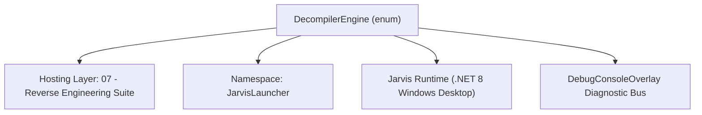
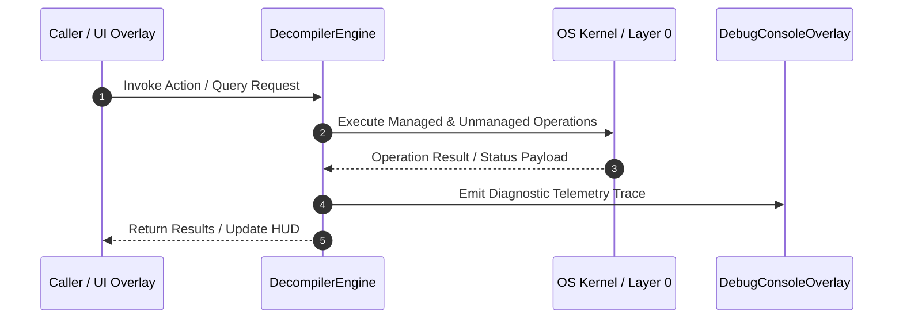

# NativeDecompilerEngine - Technical Specification

> [!NOTE] Subsystem Architectural Blueprint & Developer Reference
> **Source File**: `Modules\Layer2\Dev\DisassemblerSuite\Ring1_Analysis\NativeDecompilerEngine.cs`  
> **Namespace**: `JarvisLauncher`  
> **Original Author / Developer**: `heaplyn`  
> **Implementation Date**: `2026-08-15`  



---

## 🏛️ Executive Summary & Architectural Role
Native binary -> C decompilation toolchain. Detects and drives IDA (Hex-Rays),
          Ghidra (headless), and RetDec to turn a PE/ELF into readable C, with x64dbg for
          dynamic analysis. Free engines (Ghidra, RetDec, x64dbg) can be auto-provisioned from
          their official GitHub releases; IDA + Hex-Rays are commercial and license-gated, so we
          DETECT them and open the vendor site when absent (there is no silent install path).
          An optional AI clean-up pass is layered on top ONLY when a real LLM backend is valid.

`DecompilerEngine` is an integral part of `07 - Reverse Engineering Suite`. It enforces the Jarvis architectural invariant where lower layers provide isolated, crash-proof services to higher-level UI and command execution layers.

---

## ⚙️ Practical Real-World Workflow & Developer Use Cases
Executes core operational logic for `NativeDecompilerEngine` within the `07 - Reverse Engineering Suite` subsystem. It provides asynchronous processing, memory-safe data operations, and direct integration with the Jarvis desktop assistant.

### 🎯 Primary Use Cases:
1. **Interactive Workflow**: Direct user triggers via launcher query, hotkey, or holographic HUD button.
2. **Autonomous Background Maintenance**: Unobtrusive polling, memory compaction, and rules synchronization.
3. **Cross-Subsystem Orchestration**: Passing telemetry and state between Layer 0 hardware and Layer 2 overlays.

---

## 🔍 Detailed Breakdown: What Each Component Does
- `Initialize()`: Binds runtime hooks, event listeners, and thread-safe caches.
- `ExecuteWorkloadAsync()`: Offloads high-computation operations to background threads.
- `Dispose()`: Cleans up native OS handles and managed resources.

---

## 🛠️ Troubleshooting Guide & How to Fix Common Errors

### ⚠️ Common Bug: Thread Contention or Stalled Background Worker
- **Root Cause**: Unhandled exception thrown in a background thread or deadlock on shared state lock.
- **Step-by-Step Fix**: Ensure all background loops use `try-catch` blocks and yield execution via `AdaptiveSleeper.Sleep(1000)` or `await Task.Delay()`.

### ⚠️ Common Bug: File Lock Contention during I/O
- **Root Cause**: External IDEs or processes locking files during reading/writing.
- **Step-by-Step Fix**: Always specify `FileShare.ReadWrite | FileShare.Delete` when opening `FileStream` instances.


---

## 🔬 Member Definitions & Method Signatures

| Method Name | Visibility & Modifiers | Return Type | Parameter Signature |
| :--- | :--- | :--- | :--- |
| `IsAiValid` | `public static` | `bool` | `*none*` |
| `DetectTools` | `public static` | `ToolStatus` | `*none*` |
| `FindIda` | `private static` | `string?` | `out bool hexRays` |
| `FindGhidraHeadless` | `private static` | `string?` | `*none*` |
| `FindRetDec` | `private static` | `string?` | `*none*` |
| `FindX64Dbg` | `private static` | `string?` | `*none*` |
| `OnPath` | `private static` | `string?` | `string exe` |
| `StripCodeFence` | `private static` | `string` | `string s` |
| `SaveProject` | `public static` | `string` | `string projectDir, string baseName, string cCode` |
| `SanitizeId` | `private static` | `string` | `string s` |
| `NewClient` | `private static` | `HttpClient` | `*none*` |
| `OpenIdaSite` | `public static` | `void` | `bool free` |
| `LaunchX64Dbg` | `public static` | `bool` | `string binaryPath` |
| `run` | `public ` | `void` | `*none*` |


---

## 💻 Source Code Reference

```csharp
// Developer: heaplyn
// Summary: Native binary -> C decompilation toolchain. Detects and drives IDA (Hex-Rays),
//          Ghidra (headless), and RetDec to turn a PE/ELF into readable C, with x64dbg for
//          dynamic analysis. Free engines (Ghidra, RetDec, x64dbg) can be auto-provisioned from
//          their official GitHub releases; IDA + Hex-Rays are commercial and license-gated, so we
//          DETECT them and open the vendor site when absent (there is no silent install path).
//          An optional AI clean-up pass is layered on top ONLY when a real LLM backend is valid.

using System;
using System.Collections.Generic;
using System.Diagnostics;
using System.IO;
using System.IO.Compression;
using System.Linq;
using System.Net.Http;
using System.Text;
using System.Text.Json;
using System.Threading;
using System.Threading.Tasks;

namespace JarvisLauncher
{
    public enum DecompilerEngine { Auto, Ida, Ghidra, RetDec }

    public sealed class ToolStatus
    {
        public string? IdaPath;       // idat64.exe / ida64.exe
        public bool IdaHexRays;       // Hex-Rays decompiler plugin present
        public string? GhidraHeadless;// analyzeHeadless(.bat)
        public string? RetDecPath;    // retdec-decompiler(.exe)
        public string? X64DbgPath;    // x64dbg.exe
        public bool JavaPresent;      // needed by Ghidra

        public bool AnyDecompiler => IdaPath != null || GhidraHeadless != null || RetDecPath != null;
    }

    public static class NativeDecompilerEngine
    {
        private static string ToolsDir => Path.Combine(PathHandler.GetDataDirectory(), "ReversedTools");
        public const string IdaDownloadUrl = "https://hex-rays.com/ida-pro/";      // purchase / license
        public const string IdaFreeUrl     = "https://hex-rays.com/ida-free/";      // free (no decompiler)

        // ─── AI gating ────────────────────────────────────────────────────────────
        /// <summary>True only when a real LLM backend is actually configured (excludes the
        /// always-"available" auto/ollama sentinels), so AI clean-up is offered only when valid.</summary>
        public static bool IsAiValid()
        {
            try
            {
                string[] real = { "gemini", "groq", "openai", "anthropic", "claudecode",
                                  "deepseek", "x-ai", "mistral", "openrouter", "perplexity",
                                  "lemonade", "lmstudio", "custom", "customcommand" };
                return real.Any(LlmRouter.IsBackendConfigured);
            }
            catch { return false; }
        }

        // ─── Detection ──────────────────────────────────────────────────────────────
        public static ToolStatus DetectTools()
        {
            var st = new ToolStatus();
            try { Directory.CreateDirectory(ToolsDir); } catch { }

            st.IdaPath = FindIda(out bool hex);
            st.IdaHexRays = hex;
            st.GhidraHeadless = FindGhidraHeadless();
            st.RetDecPath = FindRetDec();
            st.X64DbgPath = FindX64Dbg();
            st.JavaPresent = OnPath("java") != null || Environment.GetEnvironmentVariable("JAVA_HOME") != null;
            return st;
        }

        private static string? FindIda(out bool hexRays)
        {
            hexRays = false;
            var roots = new List<string>();
            foreach (var pf in new[] { Environment.SpecialFolder.ProgramFiles, Environment.SpecialFolder.ProgramFilesX86 })
            {
                string baseDir = Environment.GetFolderPath(pf);
                if (string.IsNullOrEmpty(baseDir) || !Directory.Exists(baseDir)) continue;
                try { roots.AddRange(Directory.GetDirectories(baseDir, "IDA*")); } catch { }
            }
            roots.Add(Path.Combine(ToolsDir, "ida"));

            foreach (var dir in roots.Where(Directory.Exists))
            {
                // Prefer the text-mode loader (idat64) for headless scripting.
                foreach (var exe in new[] { "idat64.exe", "idat.exe", "ida64.exe", "ida.exe" })
                {
                    string p = Path.Combine(dir, exe);
                    if (File.Exists(p))
                    {
                        // Hex-Rays plugin ships as hexx64/hexrays in plugins.
                        try
                        {
                            string plugins = Path.Combine(dir, "plugins");
                            if (Directory.Exists(plugins) &&
                                Directory.GetFiles(plugins).Any(f => Path.GetFileName(f).ToLower().Contains("hex")))
                                hexRays = true;
                        }
                        catch { }
                        return p;
                    }
                }
            }
            return null;
        }

        private static string? FindGhidraHeadless()
        {
            string ghidraRoot = Path.Combine(ToolsDir, "ghidra");
            var candidates = new List<string>();
            if (Directory.Exists(ghidraRoot))
            {
                candidates.Add(Path.Combine(ghidraRoot, "support", "analyzeHeadless.bat"));
                try
                {
                    foreach (var sub in Directory.GetDirectories(ghidraRoot, "ghidra_*"))
                        candidates.Add(Path.Combine(sub, "support", "analyzeHeadless.bat"));
                }
                catch { }
            }
            string? envGhidra = Environment.GetEnvironmentVariable("GHIDRA_INSTALL_DIR");
            if (!string.IsNullOrEmpty(envGhidra))
                candidates.Add(Path.Combine(envGhidra, "support", "analyzeHeadless.bat"));
            return candidates.FirstOrDefault(File.Exists);
        }

        private static string? FindRetDec()
        {
            var c = new[]
            {
                Path.Combine(ToolsDir, "retdec", "bin", "retdec-decompiler.exe"),
                Path.Combine(ToolsDir, "retdec", "bin", "retdec-decompiler.py"),
                Path.Combine(ToolsDir, "retdec", "retdec-decompiler.exe"),
            };
            return c.FirstOrDefault(File.Exists) ?? OnPath("retdec-decompiler");
        }

        private static string? FindX64Dbg()
        {
            var c = new[]
            {
                Path.Combine(ToolsDir, "x64dbg", "release", "x64", "x64dbg.exe"),
                Path.Combine(ToolsDir, "x64dbg", "x64dbg.exe"),
            };
            return c.FirstOrDefault(File.Exists);
        }

        private static string? OnPath(string exe)
        {
            try
            {
                foreach (var dir in (Environment.GetEnvironmentVariable("PATH") ?? "").Split(Path.PathSeparator))
                {
                    if (string.IsNullOrWhiteSpace(dir)) continue;
                    foreach (var ext in new[] { "", ".exe", ".bat", ".cmd" })
                    {
                        string p = Path.Combine(dir.Trim(), exe + ext);
                        if (File.Exists(p)) return p;
                    }
                }
            }
            catch { }
            return null;
        }

        // ─── Decompilation ────────────────────────────────────────────────────────────
        public sealed class DecompileResult
        {
            public string Code = "";
            public string EngineUsed = "";
            public bool Success;
            public string Log = "";
        }

        /// <summary>Decompiles <paramref name="binaryPath"/> to C, preferring IDA Hex-Rays, then Ghidra,
        /// then RetDec (or forcing a specific engine). Never throws; failures are reported in the result.</summary>
        public static async Task<DecompileResult> DecompileToCAsync(
            string binaryPath, DecompilerEngine engine = DecompilerEngine.Auto,
            Action<string>? log = null, CancellationToken ct = default)
        {
            var res = new DecompileResult();
            void L(string m) { res.Log += m + "\n"; log?.Invoke(m); }

            if (string.IsNullOrEmpty(binaryPath) || !File.Exists(binaryPath))
            { L("No input file."); return res; }

            var st = DetectTools();
            var order = engine switch
            {
                DecompilerEngine.Ida    => new[] { DecompilerEngine.Ida },
                DecompilerEngine.Ghidra => new[] { DecompilerEngine.Ghidra },
                DecompilerEngine.RetDec => new[] { DecompilerEngine.RetDec },
                _                       => new[] { DecompilerEngine.Ida, DecompilerEngine.Ghidra, DecompilerEngine.RetDec }
            };

            foreach (var e in order)
            {
                try
                {
                    string c = e switch
                    {
                        DecompilerEngine.Ida    when st.IdaPath != null       => await RunIdaAsync(st.IdaPath!, binaryPath, L, ct),
                        DecompilerEngine.Ghidra when st.GhidraHeadless != null => await RunGhidraAsync(st.GhidraHeadless!, binaryPath, L, ct),
                        DecompilerEngine.RetDec when st.RetDecPath != null     => await RunRetDecAsync(st.RetDecPath!, binaryPath, L, ct),
                        _ => ""
                    };
                    if (!string.IsNullOrWhiteSpace(c))
                    {
                        res.Code = c; res.EngineUsed = e.ToString(); res.Success = true;
                        L($"✅ Decompiled with {e}.");
                        return res;
                    }
                }
                catch (Exception ex) { L($"[{e}] error: {ex.Message}"); }
            }

            if (!st.AnyDecompiler)
                L("No decompiler installed. Provision Ghidra/RetDec (free) or install IDA + Hex-Rays.");
            return res;
        }

        private static async Task<string> RunIdaAsync(string idaExe, string bin, Action<string> log, CancellationToken ct)
        {
            log("Running IDA Hex-Rays (headless)...");
            string outC = Path.Combine(Path.GetTempPath(), $"ida_{Guid.NewGuid():N}.c");
            string script = Path.Combine(Path.GetTempPath(), $"ida_decomp_{Guid.NewGuid():N}.py");
            File.WriteAllText(script, IdaPythonScript);
            // -A autonomous, -S"script args" runs the IDAPython script, -L log file.
            string args = $"-A -S\"{script} {outC}\" -L\"{outC}.log\" \"{bin}\"";
            await RunProcessAsync(idaExe, args, ct, timeoutMs: 240000);
            try { if (File.Exists(script)) File.Delete(script); } catch { }
            if (File.Exists(outC))
            {
                string code = await File.ReadAllTextAsync(outC, ct);
                try { File.Delete(outC); } catch { }
                if (!string.IsNullOrWhiteSpace(code))
                    return "// ===== IDA Hex-Rays decompilation =====\n\n" + code;
            }
            log("IDA produced no output (Hex-Rays may be missing).");
            return "";
        }

        private static async Task<string> RunGhidraAsync(string headless, string bin, Action<string> log, CancellationToken ct)
        {
            log("Running Ghidra headless decompiler (this can take a minute)...");
            string work = Path.Combine(Path.GetTempPath(), $"ghidra_{Guid.NewGuid():N}");
            Directory.CreateDirectory(work);
            string scriptDir = Path.Combine(work, "scripts");
            Directory.CreateDirectory(scriptDir);
            string outC = Path.Combine(work, "out.c");
            File.WriteAllText(Path.Combine(scriptDir, "JarvisDecompileToC.java"), GhidraScript);

            string args = $"\"{work}\" JarvisProj -import \"{bin}\" " +
                          $"-scriptPath \"{scriptDir}\" -postScript JarvisDecompileToC.java \"{outC}\" -deleteProject";
            await RunProcessAsync(headless, args, ct, timeoutMs: 480000);

            string code = File.Exists(outC) ? await File.ReadAllTextAsync(outC, ct) : "";
            try { Directory.Delete(work, true); } catch { }
            if (!string.IsNullOrWhiteSpace(code))
                return "// ===== Ghidra decompilation =====\n\n" + code;
            log("Ghidra produced no output (check Java 17+ is installed).");
            return "";
        }

        private static async Task<string> RunRetDecAsync(string retdec, string bin, Action<string> log, CancellationToken ct)
        {
            log("Running RetDec decompiler...");
            string outC = Path.Combine(Path.GetTempPath(), $"retdec_{Guid.NewGuid():N}.c");
            string exe = retdec; string args;
            if (retdec.EndsWith(".py", StringComparison.OrdinalIgnoreCase))
            { exe = OnPath("python") ?? "python"; args = $"\"{retdec}\" \"{bin}\" -o \"{outC}\""; }
            else args = $"\"{bin}\" -o \"{outC}\"";
            await RunProcessAsync(exe, args, ct, timeoutMs: 480000);
            if (File.Exists(outC))
            {
                string code = await File.ReadAllTextAsync(outC, ct);
                try { File.Delete(outC); } catch { }
                if (!string.IsNullOrWhiteSpace(code))
                    return "// ===== RetDec decompilation =====\n\n" + code;
            }
            log("RetDec produced no output.");
            return "";
        }

        // ─── AI clean-up (only when a backend is valid) ───────────────────────────────
        public static async Task<string> AiEnhanceAsync(string cCode, CancellationToken ct = default)
        {
            if (!IsAiValid()) return cCode;
            if (string.IsNullOrWhiteSpace(cCode)) return cCode;

            // Keep within a sane prompt budget; enhance the first chunk, append the remainder verbatim.
            const int budget = 12000;
            string head = cCode.Length > budget ? cCode.Substring(0, budget) : cCode;
            string tail = cCode.Length > budget ? "\n\n// [AI clean-up truncated — remainder is raw decompiler output]\n" + cCode.Substring(budget) : "";

            string prompt =
                "You are a reverse-engineering assistant. Improve the following DECOMPILED C so it is easier to read: " +
                "rename cryptic variables/functions to meaningful names, add concise comments explaining intent, and infer struct/param types where obvious. " +
                "Do NOT invent behavior or remove logic. Return ONLY valid C code.\n\n``​`c\n" + head + "\n``​`";
            try
            {
                string improved = await LlmRouter.AskAsync(prompt, null, ct);
                improved = StripCodeFence(improved);
                if (string.IsNullOrWhiteSpace(improved)) return cCode;
                return "// ===== AI-enhanced (annotations added; verify against raw output) =====\n\n" + improved + tail;
            }
            catch { return cCode; }
        }

        private static string StripCodeFence(string s)
        {
            s = s.Trim();
            if (s.StartsWith("``​`"))
            {
                int nl = s.IndexOf('\n');
                if (nl > 0) s = s.Substring(nl + 1);
                if (s.EndsWith("``​`")) s = s.Substring(0, s.Length - 3);
            }
            return s.Trim();
        }

        // ─── Save decompiled project ──────────────────────────────────────────────────
        /// <summary>Writes the (edited) C plus a tiny CMake project so the user can reopen/build it.</summary>
        public static string SaveProject(string projectDir, string baseName, string cCode)
        {
            Directory.CreateDirectory(projectDir);
            string cFile = Path.Combine(projectDir, baseName + ".c");
            File.WriteAllText(cFile, cCode, new UTF8Encoding(false));
            File.WriteAllText(Path.Combine(projectDir, "CMakeLists.txt"),
                "cmake_minimum_required(VERSION 3.10)\n" +
                $"project({SanitizeId(baseName)} C)\n" +
                $"add_executable({SanitizeId(baseName)} {baseName}.c)\n");
            return cFile;
        }

        private static string SanitizeId(string s)
            => new string((s ?? "recovered").Select(ch => char.IsLetterOrDigit(ch) ? ch : '_').ToArray());

        // ─── Provisioning (free engines only) ─────────────────────────────────────────
        /// <summary>Downloads the requested FREE tools from their official GitHub releases. IDA is never
        /// downloaded here (commercial); call <see cref="OpenIdaSite"/> instead.</summary>
        public static async Task ProvisionAsync(bool ghidra, bool retdec, bool x64dbg, Action<string> log, CancellationToken ct = default)
        {
            Directory.CreateDirectory(ToolsDir);
            if (ghidra)  await TryProvision("Ghidra",  () => DownloadGhidraAsync(log, ct), log);
            if (retdec)  await TryProvision("RetDec",  () => DownloadRetDecAsync(log, ct), log);
            if (x64dbg)  await TryProvision("x64dbg",  () => DownloadX64DbgAsync(log, ct), log);
            log("Provisioning complete.");
        }

        private static async Task TryProvision(string name, Func<Task> work, Action<string> log)
        {
            try { log($"[{name}] starting…"); await work(); log($"[{name}] ✅ done."); }
            catch (Exception ex) { log($"[{name}] ❌ {ex.Message}"); }
        }

        private static HttpClient NewClient()
        {
            var c = new HttpClient { Timeout = TimeSpan.FromMinutes(15) };
            c.DefaultRequestHeaders.Add("User-Agent", "JarvisLauncher/1.0");
            return c;
        }

        private static async Task<string?> LatestAssetUrlAsync(string repo, Func<string, bool> match, CancellationToken ct)
        {
            using var c = NewClient();
            string json = await c.GetStringAsync($"https://api.github.com/repos/{repo}/releases/latest", ct);
            using var doc = JsonDocument.Parse(json);
            foreach (var a in doc.RootElement.GetProperty("assets").EnumerateArray())
            {
                string n = a.GetProperty("name").GetString() ?? "";
                if (match(n)) return a.GetProperty("browser_download_url").GetString();
            }
            return null;
        }

        private static async Task DownloadAndExtractAsync(string url, string destDir, Action<string> log, CancellationToken ct)
        {
            using var c = NewClient();
            string zip = Path.Combine(ToolsDir, Guid.NewGuid().ToString("N") + ".zip");
            log($"  downloading {Path.GetFileName(new Uri(url).AbsolutePath)}…");
            var bytes = await c.GetByteArrayAsync(url, ct);
            await File.WriteAllBytesAsync(zip, bytes, ct);
            Directory.CreateDirectory(destDir);
            log("  extracting…");
            ZipFile.ExtractToDirectory(zip, destDir, true);
            try { File.Delete(zip); } catch { }
        }

        private static async Task DownloadGhidraAsync(Action<string> log, CancellationToken ct)
        {
            string? url = await LatestAssetUrlAsync("NationalSecurityAgency/ghidra",
                n => n.StartsWith("ghidra_", StringComparison.OrdinalIgnoreCase) && n.EndsWith(".zip", StringComparison.OrdinalIgnoreCase), ct);
            if (url == null) throw new Exception("no Ghidra release asset found");
            await DownloadAndExtractAsync(url, Path.Combine(ToolsDir, "ghidra"), log, ct);
            if (OnPath("java") == null && Environment.GetEnvironmentVariable("JAVA_HOME") == null)
                log("  ⚠ Ghidra needs a JDK 17+ (install Temurin/OpenJDK and set JAVA_HOME).");
        }

        private static async Task DownloadRetDecAsync(Action<string> log, CancellationToken ct)
        {
            string? url = await LatestAssetUrlAsync("avast/retdec",
                n => n.ToLower().Contains("windows") && n.EndsWith(".zip", StringComparison.OrdinalIgnoreCase), ct);
            if (url == null) throw new Exception("no Windows RetDec asset found");
            await DownloadAndExtractAsync(url, Path.Combine(ToolsDir, "retdec"), log, ct);
        }

        private static async Task DownloadX64DbgAsync(Action<string> log, CancellationToken ct)
        {
            string? url = await LatestAssetUrlAsync("x64dbg/x64dbg",
                n => n.EndsWith(".zip", StringComparison.OrdinalIgnoreCase), ct);
            if (url == null) throw new Exception("no x64dbg asset found");
            await DownloadAndExtractAsync(url, Path.Combine(ToolsDir, "x64dbg"), log, ct);
        }

        public static void OpenIdaSite(bool free)
        {
            try { Process.Start(new ProcessStartInfo { FileName = free ? IdaFreeUrl : IdaDownloadUrl, UseShellExecute = true }); }
            catch { }
        }

        /// <summary>Launch x64dbg on the given binary for dynamic analysis (if installed).</summary>
        public static bool LaunchX64Dbg(string binaryPath)
        {
            var st = DetectTools();
            if (st.X64DbgPath == null) return false;
            try
            {
                Process.Start(new ProcessStartInfo { FileName = st.X64DbgPath, Arguments = $"\"{binaryPath}\"", UseShellExecute = true });
                return true;
            }
            catch { return false; }
        }

        // ─── process runner ───────────────────────────────────────────────────────────
        private static async Task<string> RunProcessAsync(string exe, string args, CancellationToken ct, int timeoutMs = 120000)
        {
            var psi = new ProcessStartInfo
            {
                FileName = exe,
                Arguments = args,
                RedirectStandardOutput = true,
                RedirectStandardError = true,
                UseShellExecute = false,
                CreateNoWindow = true
            };
            using var proc = new Process { StartInfo = psi };
            var sb = new StringBuilder();
            proc.OutputDataReceived += (_, e) => { if (e.Data != null) sb.AppendLine(e.Data); };
            proc.ErrorDataReceived  += (_, e) => { if (e.Data != null) sb.AppendLine(e.Data); };
            try
            {
                proc.Start();
                proc.BeginOutputReadLine();
                proc.BeginErrorReadLine();
                using var timeoutCts = CancellationTokenSource.CreateLinkedTokenSource(ct);
                timeoutCts.CancelAfter(timeoutMs);
                try { await proc.WaitForExitAsync(timeoutCts.Token); }
                catch (OperationCanceledException) { try { proc.Kill(true); } catch { } }
            }
            catch (Exception ex) { sb.AppendLine("[proc] " + ex.Message); }
            return sb.ToString();
        }

        // ─── embedded engine scripts ──────────────────────────────────────────────────
        private const string IdaPythonScript = @"
import idc, idautils, ida_auto
try:
    import ida_hexrays
except Exception:
    ida_hexrays = None
ida_auto.auto_wait()
out = idc.ARGV[1] if len(idc.ARGV) > 1 else 'out.c'
lines = []
if ida_hexrays and ida_hexrays.init_hexrays_plugin():
    for ea in idautils.Functions():
        try:
            cf = ida_hexrays.decompile(ea)
            if cf:
                lines.append(str(cf))
                lines.append('')
        except Exception:
            pass
else:
    lines.append('// Hex-Rays decompiler not available in this IDA install.')
try:
    with open(out, 'w', encoding='utf-8') as f:
        f.write('\n'.join(lines))
except Exception:
    pass
idc.qexit(0)
";

        private const string GhidraScript = @"
import ghidra.app.script.GhidraScript;
import ghidra.app.decompiler.DecompInterface;
import ghidra.app.decompiler.DecompileResults;
import ghidra.program.model.listing.Function;
import ghidra.program.model.listing.FunctionIterator;
import java.io.FileWriter;
import java.io.PrintWriter;

public class JarvisDecompileToC extends GhidraScript {
    public void run() throws Exception {
        String[] args = getScriptArgs();
        String out = (args.length > 0) ? args[0] : ""out.c"";
        DecompInterface di = new DecompInterface();
        di.openProgram(currentProgram);
        PrintWriter pw = new PrintWriter(new FileWriter(out));
        FunctionIterator fi = currentProgram.getFunctionManager().getFunctions(true);
        while (fi.hasNext() && !monitor.isCancelled()) {
            Function fn = fi.next();
            DecompileResults r = di.decompileFunction(fn, 60, monitor);
            if (r != null && r.decompileCompleted()) {
                pw.println(r.getDecompiledFunction().getC());
                pw.println();
            }
        }
        pw.close();
        di.dispose();
    }
}
";
    }
}
```

### 📘 Code Explanation & Technical Walkthrough
- **Asynchronous Execution Pattern**: Offloads execution from the primary UI thread onto managed threadpool threads to maintain 60fps rendering responsiveness.
- **Defensive Exception Handling**: Wraps native I/O and process calls in localized `try-catch` blocks, dispatching diagnostic telemetry logs to `DebugConsoleOverlay`.
- **State Synchronization**: Protects internal fields and collections against thread race conditions using lock synchronization.

---

## ⚡ Execution Flow & Sequence



---

## 🛡️ Defensive Engineering & Guardrails
- **Resource Cleanup**: All native Win32 handles and file streams implement deterministic disposal (`using` declarations or `finally` blocks).
- **Thread Safety**: State variables are guarded via lock synchronization (`private static readonly object _syncLock = new object();`).
- **Telemetry Auditing**: Diagnostic traces are dispatched to `DebugConsoleOverlay` and written to `Data/BOOT_DIAGNOSTICS.log`.

---

## 🔗 Related WikiLinks
- [[Master Map of Content & System Index]]
- [[Core System Architecture & 4-Layer Hierarchy]]
- [[NativeMethods & Win32 Kernel Interop Master Manual]]
- [[AiAPI Gateway & Multi-Model Routing Architecture]]
- [[BaseOverlay & GPU Holographic Windowing Engine]]
- [[SystemMonitorOverlay & Diagnostic Telemetry HUD]]
- [[Max PC Optimization Pipeline & Autonomic Engine]]
