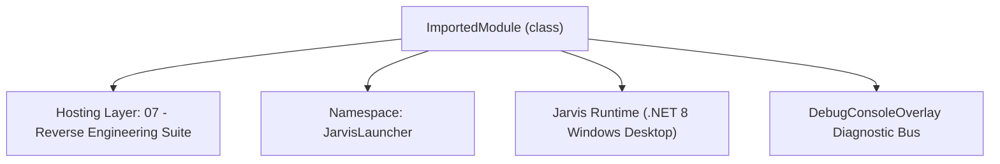
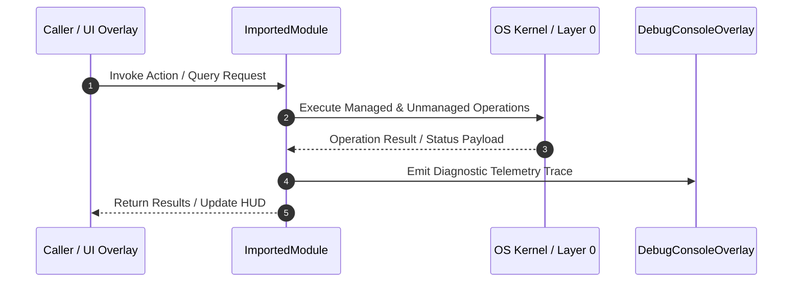

# PeStatics - Technical Specification

> [!NOTE] Subsystem Architectural Blueprint & Developer Reference
> **Source File**: `Modules\Layer2\Dev\DisassemblerSuite\Ring0_Core\PeStatics.cs`  
> **Namespace**: `JarvisLauncher`  
> **Original Author / Developer**: `heaplyn`  
> **Implementation Date**: `2026-08-15`  



---

## 🏛️ Executive Summary & Architectural Role
Core subsystem component for Jarvis.

`ImportedModule` is an integral part of `07 - Reverse Engineering Suite`. It enforces the Jarvis architectural invariant where lower layers provide isolated, crash-proof services to higher-level UI and command execution layers.

---

## ⚙️ Practical Real-World Workflow & Developer Use Cases
Executes core operational logic for `PeStatics` within the `07 - Reverse Engineering Suite` subsystem. It provides asynchronous processing, memory-safe data operations, and direct integration with the Jarvis desktop assistant.

### 🎯 Primary Use Cases:
1. **Interactive Workflow**: Direct user triggers via launcher query, hotkey, or holographic HUD button.
2. **Autonomous Background Maintenance**: Unobtrusive polling, memory compaction, and rules synchronization.
3. **Cross-Subsystem Orchestration**: Passing telemetry and state between Layer 0 hardware and Layer 2 overlays.

---

## 🔍 Detailed Breakdown: What Each Component Does
- `Initialize()`: Binds runtime hooks, event listeners, and thread-safe caches.
- `ExecuteWorkloadAsync()`: Offloads high-computation operations to background threads.
- `Dispose()`: Cleans up native OS handles and managed resources.

---

## 🛠️ Troubleshooting Guide & How to Fix Common Errors

### ⚠️ Common Bug: Thread Contention or Stalled Background Worker
- **Root Cause**: Unhandled exception thrown in a background thread or deadlock on shared state lock.
- **Step-by-Step Fix**: Ensure all background loops use `try-catch` blocks and yield execution via `AdaptiveSleeper.Sleep(1000)` or `await Task.Delay()`.

### ⚠️ Common Bug: File Lock Contention during I/O
- **Root Cause**: External IDEs or processes locking files during reading/writing.
- **Step-by-Step Fix**: Always specify `FileShare.ReadWrite | FileShare.Delete` when opening `FileStream` instances.


---

## 🔬 Member Definitions & Method Signatures

| Method Name | Visibility & Modifiers | Return Type | Parameter Signature |
| :--- | :--- | :--- | :--- |
| `ReadU16` | `public static` | `ushort` | `byte[] b, long off` |
| `ReadU32` | `public static` | `uint` | `byte[] b, long off` |
| `ReadU64` | `public static` | `ulong` | `byte[] b, long off` |
| `IsPe` | `public static` | `bool` | `byte[] b` |
| `ReadAsciiZ` | `private static` | `string` | `byte[] b, long off, int cap = 256` |
| `RvaToOffset` | `public static` | `long` | `byte[] b, uint rva` |
| `ParseImports` | `public static` | `List<ImportedModule>` | `byte[] b` |
| `readonly` | `private ` | `static` | `string Category, string[] Needles` |
| `ExtractIocs` | `public static` | `IocSet` | `IEnumerable<string> strings` |


---

## 💻 Source Code Reference

```csharp
// Developer: heaplyn
// Ring 0 (Core) of the JARVIS Disassembler Suite.
// Pure, UI-free static-analysis primitives: PE navigation, real import-table parsing,
// Win32 API capability classification, and IOC extraction. No instance state, no WPF.
// Higher rings (Ring1 analysis engines, Ring2 UI) consume this; this file requires nothing above it.

using System;
using System.Collections.Generic;
using System.Linq;
using System.Text;
using System.Text.RegularExpressions;

namespace JarvisLauncher
{
    /// <summary>A single imported module and the functions the binary imports from it.</summary>
    public sealed class ImportedModule
    {
        public string Dll = "";
        public readonly List<string> Functions = new();
    }

    /// <summary>Ring0 core: pure functions for grounded static analysis of a loaded byte buffer.</summary>
    public static class PeStatics
    {
        // ─── Safe primitive readers ────────────────────────────────────────────────
        public static ushort ReadU16(byte[] b, long off) =>
            (off < 0 || off + 2 > b.Length) ? (ushort)0 : BitConverter.ToUInt16(b, (int)off);

        public static uint ReadU32(byte[] b, long off) =>
            (off < 0 || off + 4 > b.Length) ? 0u : BitConverter.ToUInt32(b, (int)off);

        public static ulong ReadU64(byte[] b, long off) =>
            (off < 0 || off + 8 > b.Length) ? 0ul : BitConverter.ToUInt64(b, (int)off);

        /// <summary>True when the buffer starts with an MZ/PE image.</summary>
        public static bool IsPe(byte[] b)
        {
            if (b == null || b.Length < 0x40 || b[0] != 0x4D || b[1] != 0x5A) return false;
            int e = (int)ReadU32(b, 0x3C);
            return e > 0 && e < b.Length - 4 && b[e] == 0x50 && b[e + 1] == 0x45;
        }

        private static string ReadAsciiZ(byte[] b, long off, int cap = 256)
        {
            if (off < 0 || off >= b.Length) return "";
            var sb = new StringBuilder();
            for (int i = 0; i < cap && off + i < b.Length; i++)
            {
                byte c = b[off + i];
                if (c == 0) break;
                if (c < 32 || c > 126) return sb.ToString(); // stop on non-printable
                sb.Append((char)c);
            }
            return sb.ToString();
        }

        // ─── RVA → file offset via the section table ───────────────────────────────
        public static long RvaToOffset(byte[] b, uint rva)
        {
            if (!IsPe(b)) return -1;
            int e = (int)ReadU32(b, 0x3C);
            ushort numSections = ReadU16(b, e + 6);
            ushort sizeOpt = ReadU16(b, e + 20);
            int secTable = e + 24 + sizeOpt;

            for (int i = 0; i < numSections; i++)
            {
                int s = secTable + i * 40;
                if (s + 40 > b.Length) break;
                uint virtSize = ReadU32(b, s + 8);
                uint virtAddr = ReadU32(b, s + 12);
                uint rawSize = ReadU32(b, s + 16);
                uint rawPtr = ReadU32(b, s + 20);
                uint span = Math.Max(virtSize, rawSize);
                if (rva >= virtAddr && rva < virtAddr + span)
                {
                    long off = (rva - virtAddr) + rawPtr;
                    return (off >= 0 && off < b.Length) ? off : -1;
                }
            }
            return -1;
        }

        /// <summary>
        /// Walks the PE import directory and returns every imported DLL with its functions.
        /// Handles PE32 / PE32+, name-imports and ordinal-imports. Fully bounds-checked.
        /// </summary>
        public static List<ImportedModule> ParseImports(byte[] b)
        {
            var result = new List<ImportedModule>();
            try
            {
                if (!IsPe(b)) return result;
                int e = (int)ReadU32(b, 0x3C);
                int opt = e + 24;
                ushort magic = ReadU16(b, opt);
                bool is64 = magic == 0x20b;
                int dataDirStart = opt + (is64 ? 112 : 96);
                uint importRva = ReadU32(b, dataDirStart + 1 * 8); // directory entry #1 = Import Table
                if (importRva == 0) return result;

                long descOff = RvaToOffset(b, importRva);
                if (descOff < 0) return result;

                for (int d = 0; d < 4096; d++)
                {
                    long desc = descOff + d * 20;
                    if (desc + 20 > b.Length) break;
                    uint originalFirstThunk = ReadU32(b, desc + 0);
                    uint nameRva = ReadU32(b, desc + 12);
                    uint firstThunk = ReadU32(b, desc + 16);
                    if (originalFirstThunk == 0 && nameRva == 0 && firstThunk == 0) break; // null terminator

                    var mod = new ImportedModule();
                    long nameOff = RvaToOffset(b, nameRva);
                    mod.Dll = nameOff >= 0 ? ReadAsciiZ(b, nameOff) : $"<rva 0x{nameRva:X}>";

                    uint thunkRva = originalFirstThunk != 0 ? originalFirstThunk : firstThunk;
                    long thunkOff = RvaToOffset(b, thunkRva);
                    if (thunkOff >= 0)
                    {
                        int step = is64 ? 8 : 4;
                        for (int t = 0; t < 4096; t++)
                        {
                            long entryOff = thunkOff + (long)t * step;
                            ulong entry = is64 ? ReadU64(b, entryOff) : ReadU32(b, entryOff);
                            if (entry == 0) break;

                            bool byOrdinal = is64 ? (entry & 0x8000000000000000ul) != 0
                                                  : (entry & 0x80000000ul) != 0;
                            if (byOrdinal)
                            {
                                mod.Functions.Add($"#Ordinal_{entry & 0xFFFF}");
                            }
                            else
                            {
                                long ibnOff = RvaToOffset(b, (uint)entry);
                                if (ibnOff >= 0)
                                {
                                    string fn = ReadAsciiZ(b, ibnOff + 2); // skip 2-byte hint
                                    if (!string.IsNullOrEmpty(fn)) mod.Functions.Add(fn);
                                }
                            }
                            if (mod.Functions.Count >= 2000) break;
                        }
                    }
                    result.Add(mod);
                }
            }
            catch { /* best-effort parser: never throw into the UI */ }
            return result;
        }

        // ─── Win32 capability classification from REAL imports ─────────────────────
        // Keyword → behavioral category. Matched case-insensitively as substrings of API names,
        // which is far more precise than scanning the whole file for the same token.
        private static readonly (string Category, string[] Needles)[] ApiCategories =
        {
            ("Anti-Debug / Anti-Analysis", new[]{ "IsDebuggerPresent","CheckRemoteDebuggerPresent","NtQueryInformationProcess","OutputDebugString","NtSetInformationThread","GetTickCount","QueryPerformanceCounter" }),
            ("Process Injection / Code Exec", new[]{ "VirtualAllocEx","WriteProcessMemory","CreateRemoteThread","QueueUserAPC","NtMapViewOfSection","SetThreadContext","RtlCreateUserThread","NtUnmapViewOfSection" }),
            ("Process / Thread Control", new[]{ "OpenProcess","CreateProcess","TerminateProcess","CreateThread","OpenThread","ResumeThread","SuspendThread" }),
            ("Dynamic API Resolution", new[]{ "LoadLibrary","GetProcAddress","LdrLoadDll","GetModuleHandle" }),
            ("Filesystem", new[]{ "CreateFile","WriteFile","ReadFile","DeleteFile","MoveFile","CopyFile","FindFirstFile","SetFileAttributes" }),
            ("Registry / Persistence", new[]{ "RegOpenKey","RegSetValue","RegCreateKey","RegDeleteKey","RegQueryValue" }),
            ("Networking", new[]{ "socket","connect","send","recv","WSAStartup","InternetOpen","InternetConnect","HttpSendRequest","URLDownloadToFile","WinHttpConnect","gethostbyname" }),
            ("Cryptography", new[]{ "CryptEncrypt","CryptDecrypt","CryptAcquireContext","CryptGenKey","BCryptEncrypt","CryptHashData","CryptDeriveKey" }),
            ("Keylogging / Input Capture", new[]{ "SetWindowsHookEx","GetAsyncKeyState","GetKeyState","GetForegroundWindow","RegisterRawInputDevices" }),
            ("Privilege / Token", new[]{ "AdjustTokenPrivileges","OpenProcessToken","LookupPrivilegeValue","ImpersonateLoggedOnUser" }),
            ("Service Control", new[]{ "OpenSCManager","CreateService","StartService","ControlService" }),
            ("Screen / Clipboard Capture", new[]{ "BitBlt","GetDC","GetClipboardData","OpenClipboard" }),
        };

        /// <summary>Maps a flat list of imported function names to behavioral categories.</summary>
        public static Dictionary<string, List<string>> ClassifyApis(IEnumerable<string> functions)
        {
            var found = new Dictionary<string, List<string>>();
            var funcs = functions.Where(f => !string.IsNullOrEmpty(f)).Distinct().ToList();
            foreach (var (category, needles) in ApiCategories)
            {
                foreach (var fn in funcs)
                {
                    if (needles.Any(n => fn.IndexOf(n, StringComparison.OrdinalIgnoreCase) >= 0))
                    {
                        if (!found.TryGetValue(category, out var list)) found[category] = list = new List<string>();
                        if (!list.Contains(fn) && list.Count < 40) list.Add(fn);
                    }
                }
            }
            return found;
        }

        // ─── IOC extraction from already-extracted strings ─────────────────────────
        private static readonly Regex RxUrl = new(@"https?://[^\s""'<>]{4,200}", RegexOptions.Compiled | RegexOptions.IgnoreCase);
        private static readonly Regex RxIp = new(@"\b(?:(?:25[0-5]|2[0-4]\d|1?\d?\d)\.){3}(?:25[0-5]|2[0-4]\d|1?\d?\d)\b", RegexOptions.Compiled);
        private static readonly Regex RxRegistry = new(@"(?:HKEY_[A-Z_]+|HKLM|HKCU|SOFTWARE\\[^\s""']{2,120})", RegexOptions.Compiled);
        private static readonly Regex RxPath = new(@"[A-Za-z]:\\[^\s""'<>|]{2,160}", RegexOptions.Compiled);
        private static readonly Regex RxSuspExt = new(@"[\w\-.]{1,64}\.(?:ps1|bat|vbs|js|scr|dll|sys|tmp|dat|bin|hta|cmd|lnk)\b", RegexOptions.Compiled | RegexOptions.IgnoreCase);

        public sealed class IocSet
        {
            public readonly SortedSet<string> Urls = new(StringComparer.OrdinalIgnoreCase);
            public readonly SortedSet<string> Ips = new(StringComparer.OrdinalIgnoreCase);
            public readonly SortedSet<string> RegistryKeys = new(StringComparer.OrdinalIgnoreCase);
            public readonly SortedSet<string> Paths = new(StringComparer.OrdinalIgnoreCase);
            public readonly SortedSet<string> SuspiciousFiles = new(StringComparer.OrdinalIgnoreCase);
            public int Total => Urls.Count + Ips.Count + RegistryKeys.Count + Paths.Count + SuspiciousFiles.Count;
        }

        /// <summary>Scans decoded strings for URLs, IPv4 addresses, registry keys, paths and suspicious filenames.</summary>
        public static IocSet ExtractIocs(IEnumerable<string> strings)
        {
            var set = new IocSet();
            foreach (var raw in strings)
            {
                if (string.IsNullOrEmpty(raw)) continue;
                foreach (Match m in RxUrl.Matches(raw)) if (set.Urls.Count < 300) set.Urls.Add(m.Value);
                foreach (Match m in RxIp.Matches(raw))
                {
                    // Drop the noise of version-like 0.x / 1.x tuples and 127.0.0.1 loopback padding.
                    if (m.Value.StartsWith("0.") || m.Value == "0.0.0.0") continue;
                    if (set.Ips.Count < 300) set.Ips.Add(m.Value);
                }
                foreach (Match m in RxRegistry.Matches(raw)) if (set.RegistryKeys.Count < 200) set.RegistryKeys.Add(m.Value);
                foreach (Match m in RxPath.Matches(raw)) if (set.Paths.Count < 200) set.Paths.Add(m.Value);
                foreach (Match m in RxSuspExt.Matches(raw)) if (set.SuspiciousFiles.Count < 200) set.SuspiciousFiles.Add(m.Value);
            }
            return set;
        }
    }
}
```

### 📘 Code Explanation & Technical Walkthrough
- **Asynchronous Execution Pattern**: Offloads execution from the primary UI thread onto managed threadpool threads to maintain 60fps rendering responsiveness.
- **Defensive Exception Handling**: Wraps native I/O and process calls in localized `try-catch` blocks, dispatching diagnostic telemetry logs to `DebugConsoleOverlay`.
- **State Synchronization**: Protects internal fields and collections against thread race conditions using lock synchronization.

---

## ⚡ Execution Flow & Sequence



---

## 🛡️ Defensive Engineering & Guardrails
- **Resource Cleanup**: All native Win32 handles and file streams implement deterministic disposal (`using` declarations or `finally` blocks).
- **Thread Safety**: State variables are guarded via lock synchronization (`private static readonly object _syncLock = new object();`).
- **Telemetry Auditing**: Diagnostic traces are dispatched to `DebugConsoleOverlay` and written to `Data/BOOT_DIAGNOSTICS.log`.

---

## 🔗 Related WikiLinks
- [[Master Map of Content & System Index]]
- [[Core System Architecture & 4-Layer Hierarchy]]
- [[NativeMethods & Win32 Kernel Interop Master Manual]]
- [[AiAPI Gateway & Multi-Model Routing Architecture]]
- [[BaseOverlay & GPU Holographic Windowing Engine]]
- [[SystemMonitorOverlay & Diagnostic Telemetry HUD]]
- [[Max PC Optimization Pipeline & Autonomic Engine]]
