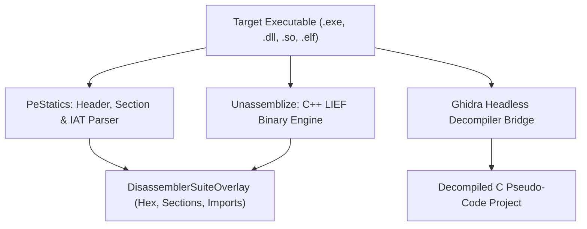

# 🔬 Reverse Engineering Suite & Binary Disassembly Master Guide

## 🔬 Complete Reverse Engineering Suite Reference

Located in `Data/ReversedTools/` and `Modules/Layer2/Dev/DisassemblerSuite/`:

### Integrated Reverse Engineering Engines:
1. **Unassemblize**: C++ LIEF binary parser extracting COFF/ELF sections, symbols, and entropy.
2. **Ghidra Headless Bridge**: Bundled **Ghidra 11.0.3** decompilation into clean C pseudo-code.
3. **Android Disassembler**: Dalvik/ART bytecode and DEX class disassembler.
