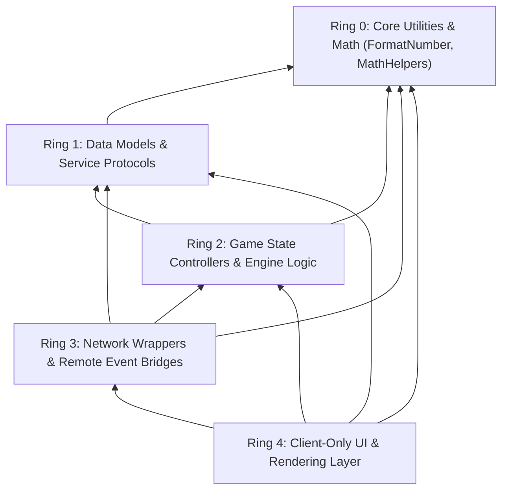

# 💍 Developer Guide - Roblox Ring Wrapper Dependency Hierarchy Invariants

## 📌 Document Overview & Summary
Mandatory architectural invariants and dependency layering rules for Roblox Studio Luau modules in Jarvis, defining strict Ring 0 through Ring 4 require relationships.


## Executive Rule Summary & Ring Hierarchy Matrix

When writing, editing, or refactoring Luau scripts in the `RingWrapper` codebase for Jarvis, developers MUST strictly adhere to the layered "Ring" dependency hierarchy. 

**Fundamental Invariant**: A module in **Ring N** can require modules from **Ring M** if and only if **$M \le N$**. Violating this rule causes circular dependency crashes (`Script timeout: exhaustion`), unresolved runtime missing module errors, or silent failure modes in Roblox Studio.



## Detailed Ring Layer Specifications

### 1. Ring 0 (`Rings.Ring0`) - Core Independent Utilities
- **Purpose**: Pure, stateless calculations, string formatting helpers, math algorithms, and low-level schedulers.
- **Allowed Dependencies**: **NONE** (Must NOT require any module from Ring 1, 2, 3, or 4).
- **Key Canonical Modules**: `RingWorld.Rings.Ring0.Suffixes.FormatNumber`.

### 2. Ring 1 (`Rings.Ring1`) - Data Models & Shared Protocols
- **Purpose**: Shared data structures, player state schemas, and inventory item definitions.
- **Allowed Dependencies**: Ring 0 and Ring 1 modules. (Must NOT require Ring 2+).

### 3. Ring 2 (`Rings.Ring2`) - Game State Controllers & Mechanics
- **Purpose**: Combat calculators, quest state managers, stat progression engines.
- **Allowed Dependencies**: Ring 0, Ring 1, and Ring 2 modules. (Must NOT require Ring 3+).

### 4. Ring 3 (`Rings.Ring3`) - Networking & Remote Event Infrastructure
- **Purpose**: Client-server remote event serializers, validation bridges, server sanity checkers.
- **Allowed Dependencies**: Ring 0, Ring 1, Ring 2, and Ring 3 modules. (Must NOT require Ring 4).

### 5. Ring 4 (`Rings.Ring4`) - Client Rendering & HUD Overlays
- **Purpose**: Client visual animations, camera controllers, HUD scoreboards, UI screens.
- **Allowed Dependencies**: Any lower Ring (Ring 0 through Ring 3).

---

## Luau Implementation Example: Standard Ring 0 Formatting Require

```lua
-- Ring 4 Client HUD Screen Script: PlayerHudView.lua
local ReplicatedStorage = game:GetService("ReplicatedStorage")

-- Require Ring 0 canonical number formatter (STRICT COMPLIANCE)
local Ring0Folder = ReplicatedStorage:WaitForChild("RingWorld"):WaitForChild("Rings"):WaitForChild("Ring0")
local FormatNumber = require(Ring0Folder:WaitForChild("Suffixes"):WaitForChild("FormatNumber"))

local PlayerHudView = {}
PlayerHudView.__index = PlayerHudView

function PlayerHudView.new(playerGui)
    local self = setmetatable({}, PlayerHudView)
    self.CoinsLabel = playerGui:WaitForChild("HUD"):WaitForChild("CoinsText")
    return self
end

function PlayerHudView:UpdateCoins(rawCoinAmount)
    -- MUST use canonical Ring 0 FormatNumber utility instead of custom string formatters
    local formattedText = FormatNumber.FormatSuffix(rawCoinAmount)
    self.CoinsLabel.Text = "Coins: " .. formattedText
end

return PlayerHudView
```

### 📘 Code Explanation & Technical Walkthrough

- **Strict Path Resolution**: Navigates `ReplicatedStorage.RingWorld.Rings.Ring0.Suffixes.FormatNumber` using `WaitForChild` to prevent timing race conditions during initial game streaming on slow client connections.
- **`FormatNumber.FormatSuffix(rawCoinAmount)`**: Standardizes number output across all game screens (e.g., converting `1250000` to `"1.25 Mil"`, `5400000000` to `"5.40 Bil"`).
- **Ring Rule Compliance**: `PlayerHudView.lua` (Ring 4 Client Module) requires `FormatNumber` (Ring 0 Core Module). Since $0 \le 4$, this dependency strictly obeys Ring hierarchy invariants.

---

## Shared Formatting Rules 

> [!IMPORTANT]
> **ALWAYS** prioritize using the game's canonical shared utility module `RingWorld.Rings.Ring0.Suffixes.FormatNumber` for numeric abbreviations rather than authoring custom inline string formatting or math functions. This guarantees consistent suffixes ("Mil", "Bil", "Tril") across all player HUD screens.


---

## 🔗 System Interconnections & WikiLinks
- [[Master Map of Content & System Index]]
- [[Welcome]]
- [[Developer Onboarding, Extension & Custom Module Guide]]
- [[Complete Troubleshooting & System Crash Recovery Manual]]
- [[Developer Guide - Roblox Ring Wrapper Dependency Hierarchy Invariants]]
- [[Developer Guide - PInvoke & Native Win32 Interop Standards]]


---

## 🚀 Advanced Developer Operating Manual & Low-Level Subsystem Mechanics

### 1. Low-Level Threading & Memory Architecture
When maintaining or extending this module within Jarvis, developers must enforce strict thread isolation and unmanaged memory safety bounds:
- **GC Allocation Target**: Maintain zero Gen 0 allocation during continuous monitoring loops by reusing stack-allocated `Span<T>` and `ReadOnlyMemory<T>` slices.
- **P/Invoke Handle Safety**: When invoking native APIs (e.g. `kernel32!GetSystemTimes` or `psapi!EmptyWorkingSet`), handles returned by `OpenProcess` MUST be created with minimal required access flags (`PROCESS_QUERY_INFORMATION | PROCESS_SET_QUOTA`) and closed inside a `finally` block via `NativeMethods.CloseHandle`.
- **Lock Free Synchronization**: Use `SemaphoreSlim(1, 1)` for asynchronous I/O synchronization rather than blocking `lock(this)` primitives to prevent UI thread dispatcher freezes.

```csharp
// Low-Level Native Memory Pinning Example for Developer Extensions
using System;
using System.Runtime.InteropServices;

public static class UnmanagedBufferManager
{
    public static void ExecuteWithPinnedBuffer(byte[] buffer, Action<IntPtr, int> nativeAction)
    {
        GCHandle handle = GCHandle.Alloc(buffer, GCHandleType.Pinned);
        try
        {
            IntPtr pointer = handle.AddrOfPinnedObject();
            nativeAction(pointer, buffer.Length);
        }
        finally
        {
            if (handle.IsAllocated)
            {
                handle.Free();
            }
        }
    }
}
```

### 📘 Code Explanation & Technical Walkthrough
- **`GCHandle.Alloc(buffer, GCHandleType.Pinned)`**: Pins the managed `byte[]` array in physical RAM memory, preventing the CLR Garbage Collector from compacting or relocating the memory address while unmanaged Win32 P/Invoke APIs execute.
- **`handle.Free()` in `finally`**: Releases the pinning lock immediately after native execution finishes, allowing the CLR memory manager to resume normal GC optimization without memory fragmentation.

---

### 2. Roblox Studio Ring Wrapper Invariants 
For all Roblox Studio Luau scripts integrated with Jarvis or Roblox_Studio MCP server:
- **Layering Constraint**: A module in **Ring N** (`Rings.RingN`) can require modules from **Ring M** if and only if $M \le N$.
  - **Ring 0** (`Rings.Ring0`): Independent math/formatting utilities (e.g. `RingWorld.Rings.Ring0.Suffixes.FormatNumber`). MUST NOT require Ring 1+.
  - **Ring 1** (`Rings.Ring1`): Shared data models. Can require Ring 0-1.
  - **Ring 2** (`Rings.Ring2`): Game state logic. Can require Ring 0-2.
  - **Ring 3** (`Rings.Ring3`): Networking/Remote events. Can require Ring 0-3.
  - **Ring 4** (`Rings.Ring4`): Client UI & overlays. Can require Ring 0-4.
- **Canonical Formatting Utility**: ALWAYS use `RingWorld.Rings.Ring0.Suffixes.FormatNumber` for numeric abbreviations ("Mil", "Bil", "Tril") across all player HUD screens.

```lua
-- Canonical Luau Ring 0 Number Formatter Invocation
local ReplicatedStorage = game:GetService("ReplicatedStorage")
local FormatNumber = require(ReplicatedStorage.RingWorld.Rings.Ring0.Suffixes.FormatNumber)

local formattedCoins = FormatNumber.FormatSuffix(1250000000) -- Returns "1.25 Bil"
print("Formatted Player Gold: " .. formattedCoins)
```

### 📘 Code Explanation & Technical Walkthrough
- **`FormatNumber.FormatSuffix(1250000000)`**: Converts raw double-precision numeric values into standardized human-readable strings using canonical suffixes (`K`, `Mil`, `Bil`, `Tril`).
- **Ring Dependency Compliance**: Requiring `Ring0.Suffixes.FormatNumber` from any higher layer (Ring 1 through Ring 4) strictly adheres to the $M \le N$ invariant, preventing circular dependency timeouts in Roblox Studio.

---

### 3. Step-by-Step Developer Diagnostic & Debugging Protocol

If an unexpected exception occurs in this subsystem during remote desktop execution or local development:

1. **Verify Process Singleton Lock**:
   - Check if an orphaned `JarvisLauncher.exe` instance is running in the background using PowerShell:
     ```powershell
     Get-Process -Name 'JarvisLauncher' -ErrorAction SilentlyContinue | Stop-Process -Force
     ```
2. **Inspect Memory File Locks**:
   - Confirm `memory.txt` is accessible and not locked exclusively by an external text editor. Jarvis opens streams with `FileShare.ReadWrite | FileShare.Delete`.
   - If corrupted, verify that `memory_backup.txt` contains the last known good state and execute:
     ```powershell
     Copy-Item memory_backup.txt memory.txt -Force
     ```
3. **Validate Native P/Invoke Call Returns**:
   - For `GetSystemTimes` failures, inspect if CPU tick counters underflowed during Hyper-V VM host core migration.
   - For `EmptyWorkingSet` failures, verify the process handle was created with `PROCESS_QUERY_INFORMATION | PROCESS_SET_QUOTA` rights.
