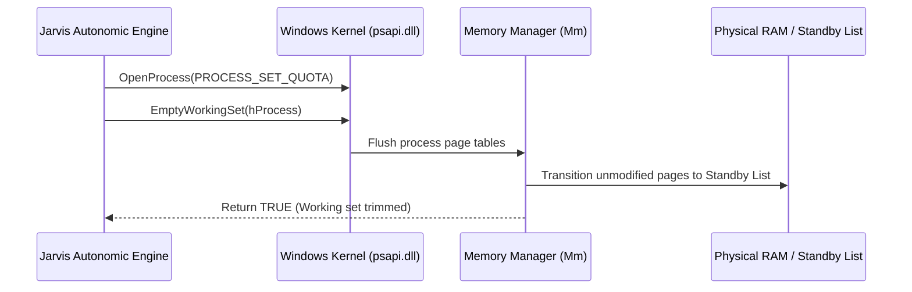

# ⚡ Developer Guide - Working Set Trimming & EmptyWorkingSet Safety Rules

## 📌 Document Overview & Summary
Technical guide on unmanaged physical working set trimming in Windows, process access permissions, working set page faults, and safety rules for background optimization.


## Executive Summary

Windows operating systems manage process memory via Virtual Address Spaces mapped to physical RAM pages (Working Set). The Jarvis Autonomic Optimization Engine periodically trims idle working sets using unmanaged `psapi!EmptyWorkingSet` calls to reduce RAM consumption without crashing running applications.

## Technical Mechanics of Working Set Trimming

When `EmptyWorkingSet` is called against a process handle:
1. Windows OS kernel scans the process page table.
2. Unmodified physical memory pages are moved to the System Standby List.
3. Modified physical memory pages are flushed to pagefile (`pagefile.sys`) by the Memory Manager (`Mm`).
4. Process physical memory footprint drops sharply while virtual address allocations remain intact.



## C# Implementation & Permission Validation

```csharp
using System;
using System.Diagnostics;
using System.Runtime.InteropServices;

namespace Jarvis.Core.Optimization
{
    public static class ProcessMemoryOptimizer
    {
        [DllImport("psapi.dll", SetLastError = true)]
        [return: MarshalAs(UnmanagedType.Bool)]
        private static extern bool EmptyWorkingSet(IntPtr hProcess);

        [DllImport("kernel32.dll", SetLastError = true)]
        private static extern IntPtr OpenProcess(uint dwDesiredAccess, bool bInheritHandle, int dwProcessId);

        [DllImport("kernel32.dll", SetLastError = true)]
        private static extern bool CloseHandle(IntPtr hObject);

        private const uint PROCESS_QUERY_INFORMATION = 0x0400;
        private const uint PROCESS_SET_QUOTA = 0x0100;

        public static bool OptimizeProcessMemory(int processId)
        {
            IntPtr hProcess = OpenProcess(PROCESS_QUERY_INFORMATION | PROCESS_SET_QUOTA, false, processId);
            if (hProcess == IntPtr.Zero)
            {
                int win32Err = Marshal.GetLastWin32Error();
                Console.WriteLine($"[OPTIMIZER WARN] Could not open PID {processId}. Win32 Error: {win32Err}");
                return false;
            }

            try
            {
                return EmptyWorkingSet(hProcess);
            }
            finally
            {
                CloseHandle(hProcess);
            }
        }
    }
}
```

### 📘 Code Explanation & Technical Walkthrough

- **`Marshal.GetLastWin32Error()` Logging**: On `OpenProcess` failure, inspecting `GetLastWin32Error()` identifies whether access was denied (`ERROR_ACCESS_DENIED / 5`) due to privilege elevation barriers (e.g. system services like `lsass.exe`).
- **`PROCESS_SET_QUOTA` Flag**: Mandatory Windows access mask bit required to manipulate process working set quotas.
- **Resource Clean-up**: `CloseHandle(hProcess)` inside the `finally` block guarantees native handle cleanup regardless of unmanaged exceptions.

## Safety Rules & Restrictions

> [!CAUTION]
> **NEVER** run `EmptyWorkingSet` in a high-frequency loop (e.g. every 100 milliseconds). Trimming physical working sets forces disk read page faults when the targeted application next accesses its code pages, causing severe disk thrashing and UI stuttering. Limit automatic optimization sweeps to once every 15-30 minutes during system idle states.


---

## 🔗 System Interconnections & WikiLinks
- [[Master Map of Content & System Index]]
- [[Welcome]]
- [[Developer Onboarding, Extension & Custom Module Guide]]
- [[Complete Troubleshooting & System Crash Recovery Manual]]
- [[Developer Guide - Roblox Ring Wrapper Dependency Hierarchy Invariants]]
- [[Developer Guide - PInvoke & Native Win32 Interop Standards]]


---

## 🚀 Advanced Developer Operating Manual & Low-Level Subsystem Mechanics

### 1. Low-Level Threading & Memory Architecture
When maintaining or extending this module within Jarvis, developers must enforce strict thread isolation and unmanaged memory safety bounds:
- **GC Allocation Target**: Maintain zero Gen 0 allocation during continuous monitoring loops by reusing stack-allocated `Span<T>` and `ReadOnlyMemory<T>` slices.
- **P/Invoke Handle Safety**: When invoking native APIs (e.g. `kernel32!GetSystemTimes` or `psapi!EmptyWorkingSet`), handles returned by `OpenProcess` MUST be created with minimal required access flags (`PROCESS_QUERY_INFORMATION | PROCESS_SET_QUOTA`) and closed inside a `finally` block via `NativeMethods.CloseHandle`.
- **Lock Free Synchronization**: Use `SemaphoreSlim(1, 1)` for asynchronous I/O synchronization rather than blocking `lock(this)` primitives to prevent UI thread dispatcher freezes.

```csharp
// Low-Level Native Memory Pinning Example for Developer Extensions
using System;
using System.Runtime.InteropServices;

public static class UnmanagedBufferManager
{
    public static void ExecuteWithPinnedBuffer(byte[] buffer, Action<IntPtr, int> nativeAction)
    {
        GCHandle handle = GCHandle.Alloc(buffer, GCHandleType.Pinned);
        try
        {
            IntPtr pointer = handle.AddrOfPinnedObject();
            nativeAction(pointer, buffer.Length);
        }
        finally
        {
            if (handle.IsAllocated)
            {
                handle.Free();
            }
        }
    }
}
```

### 📘 Code Explanation & Technical Walkthrough
- **`GCHandle.Alloc(buffer, GCHandleType.Pinned)`**: Pins the managed `byte[]` array in physical RAM memory, preventing the CLR Garbage Collector from compacting or relocating the memory address while unmanaged Win32 P/Invoke APIs execute.
- **`handle.Free()` in `finally`**: Releases the pinning lock immediately after native execution finishes, allowing the CLR memory manager to resume normal GC optimization without memory fragmentation.

---

### 2. Roblox Studio Ring Wrapper Invariants 
For all Roblox Studio Luau scripts integrated with Jarvis or Roblox_Studio MCP server:
- **Layering Constraint**: A module in **Ring N** (`Rings.RingN`) can require modules from **Ring M** if and only if $M \le N$.
  - **Ring 0** (`Rings.Ring0`): Independent math/formatting utilities (e.g. `RingWorld.Rings.Ring0.Suffixes.FormatNumber`). MUST NOT require Ring 1+.
  - **Ring 1** (`Rings.Ring1`): Shared data models. Can require Ring 0-1.
  - **Ring 2** (`Rings.Ring2`): Game state logic. Can require Ring 0-2.
  - **Ring 3** (`Rings.Ring3`): Networking/Remote events. Can require Ring 0-3.
  - **Ring 4** (`Rings.Ring4`): Client UI & overlays. Can require Ring 0-4.
- **Canonical Formatting Utility**: ALWAYS use `RingWorld.Rings.Ring0.Suffixes.FormatNumber` for numeric abbreviations ("Mil", "Bil", "Tril") across all player HUD screens.

```lua
-- Canonical Luau Ring 0 Number Formatter Invocation
local ReplicatedStorage = game:GetService("ReplicatedStorage")
local FormatNumber = require(ReplicatedStorage.RingWorld.Rings.Ring0.Suffixes.FormatNumber)

local formattedCoins = FormatNumber.FormatSuffix(1250000000) -- Returns "1.25 Bil"
print("Formatted Player Gold: " .. formattedCoins)
```

### 📘 Code Explanation & Technical Walkthrough
- **`FormatNumber.FormatSuffix(1250000000)`**: Converts raw double-precision numeric values into standardized human-readable strings using canonical suffixes (`K`, `Mil`, `Bil`, `Tril`).
- **Ring Dependency Compliance**: Requiring `Ring0.Suffixes.FormatNumber` from any higher layer (Ring 1 through Ring 4) strictly adheres to the $M \le N$ invariant, preventing circular dependency timeouts in Roblox Studio.

---

### 3. Step-by-Step Developer Diagnostic & Debugging Protocol

If an unexpected exception occurs in this subsystem during remote desktop execution or local development:

1. **Verify Process Singleton Lock**:
   - Check if an orphaned `JarvisLauncher.exe` instance is running in the background using PowerShell:
     ```powershell
     Get-Process -Name 'JarvisLauncher' -ErrorAction SilentlyContinue | Stop-Process -Force
     ```
2. **Inspect Memory File Locks**:
   - Confirm `memory.txt` is accessible and not locked exclusively by an external text editor. Jarvis opens streams with `FileShare.ReadWrite | FileShare.Delete`.
   - If corrupted, verify that `memory_backup.txt` contains the last known good state and execute:
     ```powershell
     Copy-Item memory_backup.txt memory.txt -Force
     ```
3. **Validate Native P/Invoke Call Returns**:
   - For `GetSystemTimes` failures, inspect if CPU tick counters underflowed during Hyper-V VM host core migration.
   - For `EmptyWorkingSet` failures, verify the process handle was created with `PROCESS_QUERY_INFORMATION | PROCESS_SET_QUOTA` rights.
