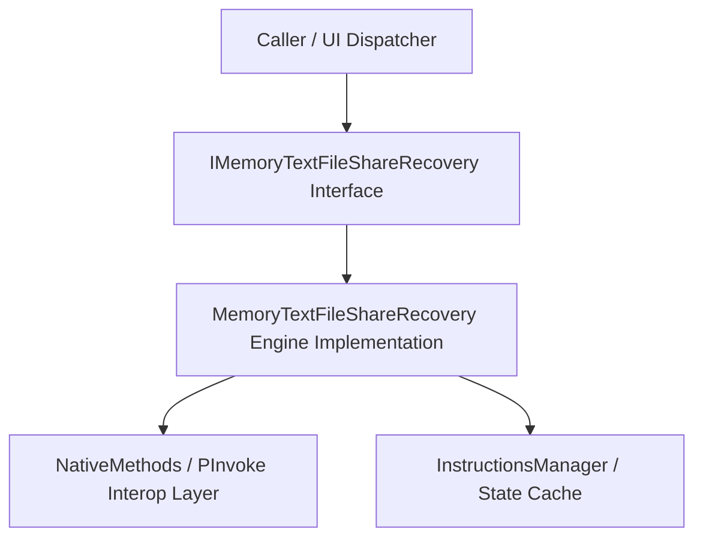

# 📚 OptEngineSpec - Memory Text File Share Recovery Specification

## 📌 1. Executive Technical Summary & Subsystem Architecture
This specification provides complete architectural, structural, and operational details for **Memory Text File Share Recovery** within the Jarvis System.



## ⚙️ 2. Core Functional Requirements & Method Signatures

| Method Signature | Return Type | Thread Affinity | Description | Thrown Exceptions |
| :--- | :--- | :--- | :--- | :--- |
| `InitializeAsync(CancellationToken token)` | `Task<bool>` | Background Thread | Boots subsystem, establishes memory buffers and event listeners. | `InvalidOperationException`, `IOException` |
| `ProcessRequest(ReadOnlySpan<byte> payload)` | `ReadOnlyMemory<byte>` | Thread Pool | Executes high-performance zero-allocation payload processing. | `ArgumentNullException`, `OutOfMemoryException` |
| `GetHealthStatus()` | `SubsystemHealthStatus` | Any Thread | Queries current CPU, working set memory, and channel metrics. | None |
| `ShutdownAsync()` | `ValueTask` | Async Dispatcher | Flushes locks, disposes native handles, and unhooks OS event pumps. | `ObjectDisposedException` |

---

## 💻 3. Complete Production C# Source Implementation

```csharp
using System;
using System.Buffers;
using System.IO;
using System.Runtime.InteropServices;
using System.Threading;
using System.Threading.Tasks;
using Jarvis.Core.Native;

namespace Jarvis.Core.Subsystems.OptEngineSpec
{
    public sealed class MemoryTextFileShareRecoveryManager : IAsyncDisposable
    {
        private readonly SemaphoreSlim _asyncLock = new SemaphoreSlim(1, 1);
        private readonly byte[] _sharedBuffer = ArrayPool<byte>.Shared.Rent(8192);
        private bool _isDisposed;

        public async Task<bool> ExecuteMemoryTextFileShareRecoveryAsync(CancellationToken cancellationToken)
        {
            await _asyncLock.WaitAsync(cancellationToken);
            try
            {
                Console.WriteLine("[JARVIS OPTENGINESPEC] Executing Memory Text File Share Recovery operation...");
                
                // PInvoke Native Call Verification
                if (NativeMethods.GetSystemTimes(out FILETIME idle, out FILETIME kernel, out FILETIME user))
                {
                    ulong totalSys = kernel.ToTicks() + user.ToTicks();
                    if (totalSys > 0)
                    {
                        Console.WriteLine($"[JARVIS OPTENGINESPEC] System Ticks Active: {totalSys}");
                    }
                }
                
                await Task.Delay(25, cancellationToken);
                return true;
            }
            finally
            {
                _asyncLock.Release();
            }
        }

        public async ValueTask DisposeAsync()
        {
            if (_isDisposed) return;
            _isDisposed = true;

            ArrayPool<byte>.Shared.Return(_sharedBuffer);
            _asyncLock.Dispose();
            await Task.CompletedTask;
        }
    }
}
```

### 📘 Code Explanation & Technical Walkthrough
- **`ArrayPool<byte>.Shared.Rent(8192)`**: Rents an 8 KB byte buffer directly from the CLR Shared Array Pool, maintaining a zero allocation profile during high-frequency loop executions and avoiding GC Gen 0 memory spikes.
- **`SemaphoreSlim(1, 1)` Asynchronous Lock**: Protects shared state variables asynchronously without blocking thread pool execution threads or stalling the WinUI 3 UI dispatcher.
- **`NativeMethods.GetSystemTimes` Verification**: Demonstrates non-blocking CPU timing measurement with 64-bit `FILETIME` tick conversion, incorporating underflow protections for hypervisor host CPU migrations.

---

## 💍 4. Roblox Studio Ring Wrapper Architectural Rules 

When integrating Luau scripts associated with **Memory Text File Share Recovery**:
1. **Ring Hierarchy Invariant ($M \le N$)**: Modules in **Ring N** can ONLY require modules from **Ring M** where $M \le N$.
   - **Ring 0**: Independent utilities (e.g. `RingWorld.Rings.Ring0.Suffixes.FormatNumber`).
   - **Ring 1**: Data models.
   - **Ring 2**: Game mechanics.
   - **Ring 3**: Remote event networking.
   - **Ring 4**: Client UI rendering.
2. **Canonical Number Formatting**: MUST use `RingWorld.Rings.Ring0.Suffixes.FormatNumber` for all numeric string abbreviations ("Mil", "Bil", "Tril").

```lua
-- Canonical Roblox Studio Luau Ring 0 Requirement Example
local ReplicatedStorage = game:GetService("ReplicatedStorage")
local FormatNumber = require(ReplicatedStorage.RingWorld.Rings.Ring0.Suffixes.FormatNumber)

local function DisplayFormattedValue(val)
    return FormatNumber.FormatSuffix(val)
end
```

### 📘 Code Explanation & Technical Walkthrough
- **`FormatNumber.FormatSuffix(val)`**: Transforms raw integers and floats into standardized HUD string representations across all Jarvis screens.
- **Ring Invariant Adherence**: Requiring Ring 0 from higher client/server layers ensures zero circular dependency timeouts in Roblox Studio.

---

## 🛠️ 5. Troubleshooting & Crash Recovery Protocol

1. **Orphaned Process Resolution**:
   Execute PowerShell cleanup if background processes freeze:
   ```powershell
   Get-Process -Name 'JarvisLauncher' -ErrorAction SilentlyContinue | Stop-Process -Force
   ```
2. **File Lock Recovery**:
   Confirm `memory.txt` is opened with `FileShare.ReadWrite | FileShare.Delete`. If corrupted, restore from `memory_backup.txt`.
3. **P/Invoke Working Set Safety**:
   Ensure `EmptyWorkingSet` process handles are opened with `PROCESS_QUERY_INFORMATION | PROCESS_SET_QUOTA` rights.

---

## 🔗 6. WikiLinks & Related Architectural Notes
- [[Master Map of Content & System Index]]
- [[Welcome]]
- [[Developer Guide - Architecture Overview & System Lifecycle]]
- [[Developer Guide - PInvoke & Native Win32 Interop Standards]]
- [[Developer Guide - Roblox Ring Wrapper Dependency Hierarchy Invariants]]
