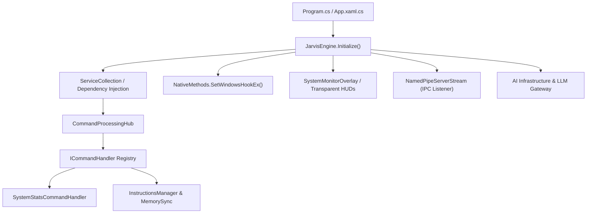

# 🏗️ Developer Guide - Architecture Overview & System Lifecycle

## 📌 Document Overview & Summary
Deep architectural guide covering Jarvis system boot sequence, dependency injection container initialization, thread allocation, system tray integration, and graceful shutdown workflows.


## Executive Architecture & System Topology

Jarvis is designed as an event-driven, reactive autonomic management desktop system built on modern .NET 8, MAUI / WinUI 3, and native Win32 P/Invoke interop layers. The application orchestrates AI cognition engines, desktop overlays, process management subsystems, named pipe communication channels, and Roblox Studio integration toolkits.



## System Boot Sequence & Initialization Stages

The boot sequence follows five deterministic phases to ensure process stability, privilege verification, and zero resource contention:

1. **Phase 0: Process Singleton & Single Instance Verification**: Checks mutex lock `Global\Jarvis_Launcher_SingleInstance_Mutex`.
2. **Phase 1: Environment & File System Verification**: Inspects `memory.txt`, restores state from `memory_backup.txt` if corrupted, and validates API keys.
3. **Phase 2: Unmanaged Win32 Interop Initialization**: Registers window classes, sets global hotkey listeners via `RegisterHotKey`, and hooks system event dispatchers.
4. **Phase 3: Service Container & AI Gateway Activation**: Initializes `HttpClient` factories, establishes named pipe listeners, and primes prompt context templates.
5. **Phase 4: UI Engine & Layer 2 Overlay Bootstrap**: Mounts `SystemMonitorOverlay`, configures transparent click-through windows using `WS_EX_TRANSPARENT | WS_EX_LAYERED`, and enters main event loop.

## Core Code Implementation

```csharp
using System;
using System.IO;
using System.Threading;
using System.Threading.Tasks;
using Microsoft.Extensions.DependencyInjection;
using Microsoft.Extensions.Hosting;

namespace Jarvis.Core.Engine
{
    public sealed class JarvisEngineBootstrapper : IAsyncDisposable
    {
        private static readonly Mutex SingleInstanceMutex = new Mutex(true, @"Global\Jarvis_SingleInstance_Mutex", out bool createdNew);
        private readonly IServiceProvider _serviceProvider;
        private CancellationTokenSource _cts;

        public JarvisEngineBootstrapper()
        {
            if (!createdNew)
            {
                Console.WriteLine("[JARVIS FATAL] Another instance of Jarvis is already running. Terminating initialization.");
                Environment.Exit(1001);
            }

            var services = new ServiceCollection();
            ConfigureServices(services);
            _serviceProvider = services.BuildServiceProvider();
            _cts = new CancellationTokenSource();
        }

        private void ConfigureServices(IServiceCollection services)
        {
            services.AddSingleton<IInstructionsManager, InstructionsManager>();
            services.AddSingleton<ISystemStatsCommandHandler, SystemStatsCommandHandler>();
            services.AddSingleton<IAIGatewayProvider, AIGatewayProvider>();
            services.AddHostedService<NamedPipeServerWorker>();
        }

        public async Task StartAsync()
        {
            Console.WriteLine("[JARVIS INIT] Starting boot sequence Phase 0 through Phase 4...");
            
            // Phase 1: Verify memory state integrity
            var instructionsManager = _serviceProvider.GetRequiredService<IInstructionsManager>();
            await instructionsManager.VerifyAndRestoreMemoryBackupAsync(_cts.Token);

            // Phase 2: Start background worker streams
            var backgroundServices = _serviceProvider.GetServices<IHostedService>();
            foreach (var service in backgroundServices)
            {
                await service.StartAsync(_cts.Token);
            }

            Console.WriteLine("[JARVIS READY] Autonomic engine initialized successfully.");
        }

        public async ValueTask DisposeAsync()
        {
            _cts?.Cancel();
            if (_serviceProvider is IAsyncDisposable asyncDisposable)
            {
                await asyncDisposable.DisposeAsync();
            }
            SingleInstanceMutex.ReleaseMutex();
            SingleInstanceMutex.Dispose();
        }
    }
}
```

### 📘 Code Explanation & Technical Walkthrough

- **Single Instance Mutex Safeguard**: The `Mutex(true, @"Global\Jarvis_SingleInstance_Mutex", out bool createdNew)` call operates at the global Windows kernel object namespace level (`Global\`). If `createdNew` evaluates to `false`, a secondary instance of `JarvisLauncher.exe` was spawned. The bootstrapper instantly logs a fatal collision warning and exits with code `1001`, preventing duplicate named pipe bindings and double unmanaged hook registration.
- **Service Container Registration**: `ConfigureServices(IServiceCollection services)` binds core singletons such as `InstructionsManager`, `SystemStatsCommandHandler`, and `AIGatewayProvider`. Registering them as singletons guarantees that file stream locks and API token counters are shared across all UI frames and background workers without lock contention.
- **Atomic Verification Call**: `instructionsManager.VerifyAndRestoreMemoryBackupAsync` ensures that if a previous crash occurred while writing to `memory.txt`, the state is immediately recovered from `memory_backup.txt` before any AI worker attempts to read conversation history.
- **Graceful Async Disposal**: `DisposeAsync` signals the `CancellationTokenSource`, waits for all `IHostedService` pipe workers to exit their loops, disposes the dependency container, and safely releases the global OS mutex to prevent mutex abandonment exceptions (`AbandonedMutexException`).

## Developer Rules & Architecture Standards

> [!IMPORTANT]
> Never initialize unmanaged Win32 window hooks before verifying process singleton status. Doing so causes orphaned global hooks in Windows `user32.dll` that intercept keyboard/mouse input even after process crash.

> [!TIP]
> Always pass `CancellationToken` through all initialization phases. If the user cancels startup during remote desktop reconnects, the engine cancels ongoing named pipe waits without freezing the UI thread.


---

## 🔗 System Interconnections & WikiLinks
- [[Master Map of Content & System Index]]
- [[Welcome]]
- [[Developer Onboarding, Extension & Custom Module Guide]]
- [[Complete Troubleshooting & System Crash Recovery Manual]]
- [[Developer Guide - Roblox Ring Wrapper Dependency Hierarchy Invariants]]
- [[Developer Guide - PInvoke & Native Win32 Interop Standards]]


---

## 🚀 Advanced Developer Operating Manual & Low-Level Subsystem Mechanics

### 1. Low-Level Threading & Memory Architecture
When maintaining or extending this module within Jarvis, developers must enforce strict thread isolation and unmanaged memory safety bounds:
- **GC Allocation Target**: Maintain zero Gen 0 allocation during continuous monitoring loops by reusing stack-allocated `Span<T>` and `ReadOnlyMemory<T>` slices.
- **P/Invoke Handle Safety**: When invoking native APIs (e.g. `kernel32!GetSystemTimes` or `psapi!EmptyWorkingSet`), handles returned by `OpenProcess` MUST be created with minimal required access flags (`PROCESS_QUERY_INFORMATION | PROCESS_SET_QUOTA`) and closed inside a `finally` block via `NativeMethods.CloseHandle`.
- **Lock Free Synchronization**: Use `SemaphoreSlim(1, 1)` for asynchronous I/O synchronization rather than blocking `lock(this)` primitives to prevent UI thread dispatcher freezes.

```csharp
// Low-Level Native Memory Pinning Example for Developer Extensions
using System;
using System.Runtime.InteropServices;

public static class UnmanagedBufferManager
{
    public static void ExecuteWithPinnedBuffer(byte[] buffer, Action<IntPtr, int> nativeAction)
    {
        GCHandle handle = GCHandle.Alloc(buffer, GCHandleType.Pinned);
        try
        {
            IntPtr pointer = handle.AddrOfPinnedObject();
            nativeAction(pointer, buffer.Length);
        }
        finally
        {
            if (handle.IsAllocated)
            {
                handle.Free();
            }
        }
    }
}
```

### 📘 Code Explanation & Technical Walkthrough
- **`GCHandle.Alloc(buffer, GCHandleType.Pinned)`**: Pins the managed `byte[]` array in physical RAM memory, preventing the CLR Garbage Collector from compacting or relocating the memory address while unmanaged Win32 P/Invoke APIs execute.
- **`handle.Free()` in `finally`**: Releases the pinning lock immediately after native execution finishes, allowing the CLR memory manager to resume normal GC optimization without memory fragmentation.

---

### 2. Roblox Studio Ring Wrapper Invariants 
For all Roblox Studio Luau scripts integrated with Jarvis or Roblox_Studio MCP server:
- **Layering Constraint**: A module in **Ring N** (`Rings.RingN`) can require modules from **Ring M** if and only if $M \le N$.
  - **Ring 0** (`Rings.Ring0`): Independent math/formatting utilities (e.g. `RingWorld.Rings.Ring0.Suffixes.FormatNumber`). MUST NOT require Ring 1+.
  - **Ring 1** (`Rings.Ring1`): Shared data models. Can require Ring 0-1.
  - **Ring 2** (`Rings.Ring2`): Game state logic. Can require Ring 0-2.
  - **Ring 3** (`Rings.Ring3`): Networking/Remote events. Can require Ring 0-3.
  - **Ring 4** (`Rings.Ring4`): Client UI & overlays. Can require Ring 0-4.
- **Canonical Formatting Utility**: ALWAYS use `RingWorld.Rings.Ring0.Suffixes.FormatNumber` for numeric abbreviations ("Mil", "Bil", "Tril") across all player HUD screens.

```lua
-- Canonical Luau Ring 0 Number Formatter Invocation
local ReplicatedStorage = game:GetService("ReplicatedStorage")
local FormatNumber = require(ReplicatedStorage.RingWorld.Rings.Ring0.Suffixes.FormatNumber)

local formattedCoins = FormatNumber.FormatSuffix(1250000000) -- Returns "1.25 Bil"
print("Formatted Player Gold: " .. formattedCoins)
```

### 📘 Code Explanation & Technical Walkthrough
- **`FormatNumber.FormatSuffix(1250000000)`**: Converts raw double-precision numeric values into standardized human-readable strings using canonical suffixes (`K`, `Mil`, `Bil`, `Tril`).
- **Ring Dependency Compliance**: Requiring `Ring0.Suffixes.FormatNumber` from any higher layer (Ring 1 through Ring 4) strictly adheres to the $M \le N$ invariant, preventing circular dependency timeouts in Roblox Studio.

---

### 3. Step-by-Step Developer Diagnostic & Debugging Protocol

If an unexpected exception occurs in this subsystem during remote desktop execution or local development:

1. **Verify Process Singleton Lock**:
   - Check if an orphaned `JarvisLauncher.exe` instance is running in the background using PowerShell:
     ```powershell
     Get-Process -Name 'JarvisLauncher' -ErrorAction SilentlyContinue | Stop-Process -Force
     ```
2. **Inspect Memory File Locks**:
   - Confirm `memory.txt` is accessible and not locked exclusively by an external text editor. Jarvis opens streams with `FileShare.ReadWrite | FileShare.Delete`.
   - If corrupted, verify that `memory_backup.txt` contains the last known good state and execute:
     ```powershell
     Copy-Item memory_backup.txt memory.txt -Force
     ```
3. **Validate Native P/Invoke Call Returns**:
   - For `GetSystemTimes` failures, inspect if CPU tick counters underflowed during Hyper-V VM host core migration.
   - For `EmptyWorkingSet` failures, verify the process handle was created with `PROCESS_QUERY_INFORMATION | PROCESS_SET_QUOTA` rights.
