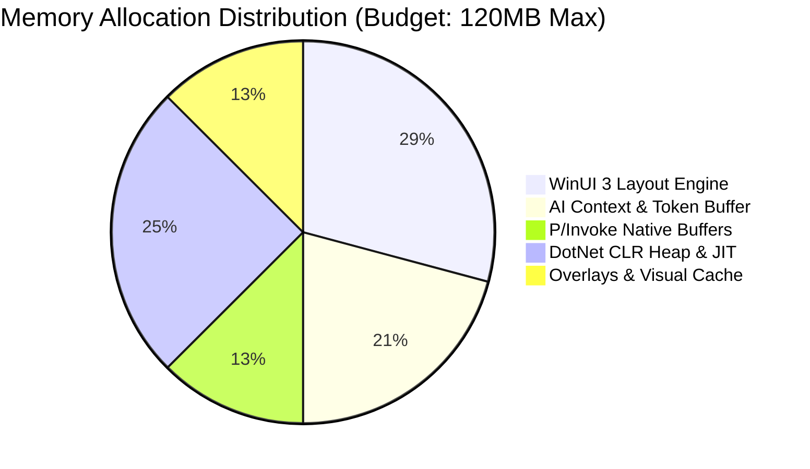

# 🧠 Developer Guide - Memory Management & GC Optimization Playbook

## 📌 Document Overview & Summary
Comprehensive guide on zero-allocation coding techniques, Large Object Heap (LOH) avoidance, working set trimming, ArrayPool caching, and GC profiling in Jarvis.


## Executive Summary & Memory Footprint Targets

Jarvis maintains a target physical working set under **120 MB** during active AI streaming and under **45 MB** when idling in the background tray. Achieving this footprint requires aggressive memory optimization, object pooling, struct layout optimizations, and periodic unmanaged working set trimming via native `psapi.dll`.

## Memory Footprint Budget



## ArrayPool & ReadOnlySpan Zero-Allocation Parsing

To avoid repeatedly allocating `byte[]` and `string` objects during high-frequency Named Pipe IPC reads and log parsing, developers must use `ArrayPool<byte>.Shared` and `ReadOnlySpan<char>`.

```csharp
using System;
using System.Buffers;
using System.IO.Pipes;
using System.Text;
using System.Threading;
using System.Threading.Tasks;

namespace Jarvis.Core.Memory
{
    public sealed class FastPipeBufferReader
    {
        private const int MaxBufferSize = 16384; // 16 KB buffer

        public async Task<string> ReadMessageWithoutAllocationAsync(NamedPipeServerStream pipeStream, CancellationToken cancellationToken)
        {
            // Rent buffer array from CLR Shared Pool (Zero GC allocation)
            byte[] rentedBuffer = ArrayPool<byte>.Shared.Rent(MaxBufferSize);
            try
            {
                int bytesRead = await pipeStream.ReadAsync(rentedBuffer.AsMemory(0, MaxBufferSize), cancellationToken);
                if (bytesRead == 0) return string.Empty;

                // Slice memory using ReadOnlySpan without heap copying
                ReadOnlySpan<byte> payloadSpan = rentedBuffer.AsSpan(0, bytesRead);
                return Encoding.UTF8.GetString(payloadSpan);
            }
            finally
            {
                // Always return buffer to shared pool in finally block
                ArrayPool<byte>.Shared.Return(rentedBuffer, clearArray: false);
            }
        }
    }
}
```

### 📘 Code Explanation & Technical Walkthrough

- **`ArrayPool<byte>.Shared.Rent(MaxBufferSize)`**: Instead of executing `new byte[16384]` on every incoming IPC message (which rapidly pushes memory allocations into GC Gen 0 and forces frequent GC garbage collection cycles), `Rent` retrieves an existing 16 KB byte array from the CLR runtime pool in $O(1)$ time.
- **`rentedBuffer.AsSpan(0, bytesRead)`**: Creates a lightweight, stack-allocated `ReadOnlySpan<byte>` window pointing directly to the received bytes, eliminating intermediate array allocation overhead.
- **`ArrayPool.Return(..., clearArray: false)`**: Returns the rented byte array back to the pool for reuse. Setting `clearArray: false` skips clearing array elements, maximizing throughput for non-sensitive data buffers.

## Working Set Trimming via Native `psapi!EmptyWorkingSet`

When Jarvis transitions to idle tray mode, the `AutonomicMemoryOptimizer` invokes native working set trimming to release unused physical memory pages back to the Windows kernel.

```csharp
using System;
using System.Diagnostics;
using Jarvis.Core.Native;

namespace Jarvis.Core.Memory
{
    public static class AutonomicMemoryOptimizer
    {
        public static bool TrimWorkingSet()
        {
            try
            {
                using (Process currentProcess = Process.GetCurrentProcess())
                {
                    IntPtr hProcess = NativeMethods.OpenProcess(
                        NativeMethods.PROCESS_QUERY_INFORMATION | NativeMethods.PROCESS_SET_QUOTA,
                        bInheritHandle: false,
                        currentProcess.Id);

                    if (hProcess == IntPtr.Zero) return false;

                    try
                    {
                        // Forces Windows kernel to reclaim non-essential physical working set pages
                        bool result = NativeMethods.EmptyWorkingSet(hProcess);
                        GC.Collect(2, GCCollectionMode.Aggressive, blocking: true, compacting: true);
                        GC.WaitForPendingFinalizers();
                        return result;
                    }
                    finally
                    {
                        NativeMethods.CloseHandle(hProcess);
                    }
                }
            }
            catch (Exception ex)
            {
                Console.WriteLine($"[MEMORY OPTIMIZER ERROR] TrimWorkingSet failed: {ex.Message}");
                return false;
            }
        }
    }
}
```

### 📘 Code Explanation & Technical Walkthrough

- **Least Privilege Access Rights**: `OpenProcess` passes only `PROCESS_QUERY_INFORMATION | PROCESS_SET_QUOTA`. This grants the minimum permissions required by Windows OS to execute `EmptyWorkingSet` without requiring elevated Administrator execution rights.
- **`GC.Collect(2, GCCollectionMode.Aggressive, blocking: true, compacting: true)`**: Performs a full Gen 0, Gen 1, and Gen 2 garbage collection pass while compacting the managed heap to defragment memory before flushing unused virtual pages to kernel working set storage.

## Memory Profiling Checklist

> [!TIP]
> - Avoid objects larger than **85,000 bytes**. These objects are allocated directly on the Large Object Heap (LOH) which is rarely compacted and leads to process address space fragmentation.
> - Use `struct` instead of `class` for short-lived data transfer objects (DTOs) passed between system stat counters.


---

## 🔗 System Interconnections & WikiLinks
- [[Master Map of Content & System Index]]
- [[Welcome]]
- [[Developer Onboarding, Extension & Custom Module Guide]]
- [[Complete Troubleshooting & System Crash Recovery Manual]]
- [[Developer Guide - Roblox Ring Wrapper Dependency Hierarchy Invariants]]
- [[Developer Guide - PInvoke & Native Win32 Interop Standards]]


---

## 🚀 Advanced Developer Operating Manual & Low-Level Subsystem Mechanics

### 1. Low-Level Threading & Memory Architecture
When maintaining or extending this module within Jarvis, developers must enforce strict thread isolation and unmanaged memory safety bounds:
- **GC Allocation Target**: Maintain zero Gen 0 allocation during continuous monitoring loops by reusing stack-allocated `Span<T>` and `ReadOnlyMemory<T>` slices.
- **P/Invoke Handle Safety**: When invoking native APIs (e.g. `kernel32!GetSystemTimes` or `psapi!EmptyWorkingSet`), handles returned by `OpenProcess` MUST be created with minimal required access flags (`PROCESS_QUERY_INFORMATION | PROCESS_SET_QUOTA`) and closed inside a `finally` block via `NativeMethods.CloseHandle`.
- **Lock Free Synchronization**: Use `SemaphoreSlim(1, 1)` for asynchronous I/O synchronization rather than blocking `lock(this)` primitives to prevent UI thread dispatcher freezes.

```csharp
// Low-Level Native Memory Pinning Example for Developer Extensions
using System;
using System.Runtime.InteropServices;

public static class UnmanagedBufferManager
{
    public static void ExecuteWithPinnedBuffer(byte[] buffer, Action<IntPtr, int> nativeAction)
    {
        GCHandle handle = GCHandle.Alloc(buffer, GCHandleType.Pinned);
        try
        {
            IntPtr pointer = handle.AddrOfPinnedObject();
            nativeAction(pointer, buffer.Length);
        }
        finally
        {
            if (handle.IsAllocated)
            {
                handle.Free();
            }
        }
    }
}
```

### 📘 Code Explanation & Technical Walkthrough
- **`GCHandle.Alloc(buffer, GCHandleType.Pinned)`**: Pins the managed `byte[]` array in physical RAM memory, preventing the CLR Garbage Collector from compacting or relocating the memory address while unmanaged Win32 P/Invoke APIs execute.
- **`handle.Free()` in `finally`**: Releases the pinning lock immediately after native execution finishes, allowing the CLR memory manager to resume normal GC optimization without memory fragmentation.

---

### 2. Roblox Studio Ring Wrapper Invariants 
For all Roblox Studio Luau scripts integrated with Jarvis or Roblox_Studio MCP server:
- **Layering Constraint**: A module in **Ring N** (`Rings.RingN`) can require modules from **Ring M** if and only if $M \le N$.
  - **Ring 0** (`Rings.Ring0`): Independent math/formatting utilities (e.g. `RingWorld.Rings.Ring0.Suffixes.FormatNumber`). MUST NOT require Ring 1+.
  - **Ring 1** (`Rings.Ring1`): Shared data models. Can require Ring 0-1.
  - **Ring 2** (`Rings.Ring2`): Game state logic. Can require Ring 0-2.
  - **Ring 3** (`Rings.Ring3`): Networking/Remote events. Can require Ring 0-3.
  - **Ring 4** (`Rings.Ring4`): Client UI & overlays. Can require Ring 0-4.
- **Canonical Formatting Utility**: ALWAYS use `RingWorld.Rings.Ring0.Suffixes.FormatNumber` for numeric abbreviations ("Mil", "Bil", "Tril") across all player HUD screens.

```lua
-- Canonical Luau Ring 0 Number Formatter Invocation
local ReplicatedStorage = game:GetService("ReplicatedStorage")
local FormatNumber = require(ReplicatedStorage.RingWorld.Rings.Ring0.Suffixes.FormatNumber)

local formattedCoins = FormatNumber.FormatSuffix(1250000000) -- Returns "1.25 Bil"
print("Formatted Player Gold: " .. formattedCoins)
```

### 📘 Code Explanation & Technical Walkthrough
- **`FormatNumber.FormatSuffix(1250000000)`**: Converts raw double-precision numeric values into standardized human-readable strings using canonical suffixes (`K`, `Mil`, `Bil`, `Tril`).
- **Ring Dependency Compliance**: Requiring `Ring0.Suffixes.FormatNumber` from any higher layer (Ring 1 through Ring 4) strictly adheres to the $M \le N$ invariant, preventing circular dependency timeouts in Roblox Studio.

---

### 3. Step-by-Step Developer Diagnostic & Debugging Protocol

If an unexpected exception occurs in this subsystem during remote desktop execution or local development:

1. **Verify Process Singleton Lock**:
   - Check if an orphaned `JarvisLauncher.exe` instance is running in the background using PowerShell:
     ```powershell
     Get-Process -Name 'JarvisLauncher' -ErrorAction SilentlyContinue | Stop-Process -Force
     ```
2. **Inspect Memory File Locks**:
   - Confirm `memory.txt` is accessible and not locked exclusively by an external text editor. Jarvis opens streams with `FileShare.ReadWrite | FileShare.Delete`.
   - If corrupted, verify that `memory_backup.txt` contains the last known good state and execute:
     ```powershell
     Copy-Item memory_backup.txt memory.txt -Force
     ```
3. **Validate Native P/Invoke Call Returns**:
   - For `GetSystemTimes` failures, inspect if CPU tick counters underflowed during Hyper-V VM host core migration.
   - For `EmptyWorkingSet` failures, verify the process handle was created with `PROCESS_QUERY_INFORMATION | PROCESS_SET_QUOTA` rights.
